# 完整的 Kotlin 教程:第 9 部分(使用循环)

> 原文：<https://medium.com/codex/complete-kolin-tutorial-part-9-playing-with-loops-aca47a70ddd1?source=collection_archive---------11----------------------->

> 如果你是这个系列的新手，从 [**这里**](https://ajitsahoo29.medium.com/complete-kotlin-tutorial-part-1-introduction-to-kotlin-a8868fd9c0b9) 开始
> 
> 上一篇帖子， ***第八部分*** 就是这里的[](https://ajitsahoo29.medium.com/complete-kolin-tutorial-part-8-mastering-strings-7727d9e85007)

**现在，让我们通过玩**循环**继续我们的旅程。**

****

**假设我想打印从 1 到 10 的所有数字。那么写代码的标准方式就是*println*(1)*println*(2)……等等这是一个重复的任务。在编程中，我们不重复我们的代码。这就是为什么**循环**被引入，以便用最少的代码行使程序不那么复杂。**

**当我们试图以连续重复的方式执行一些操作，直到达到某个条件时，我们在编程中使用**循环**。循环是迭代的基本方式。**

**为了在 Kotlin 中使用循环，我们有两种不同的方法，这两种方法在几乎所有编程语言中都很常见**

*   *****为*** 循环**
*   *****而*** 循环**
*   *****do-while*** 循环**

# **for 循环**

***for* 循环的典型语法如下所示**

```
for (<element> in <a collection>){ loop body
}
```

**现在，我将使用名为 ***到*** 的关键字，打印从 0 到 10 的数字，即 0 到 9。代码如下所示-**

**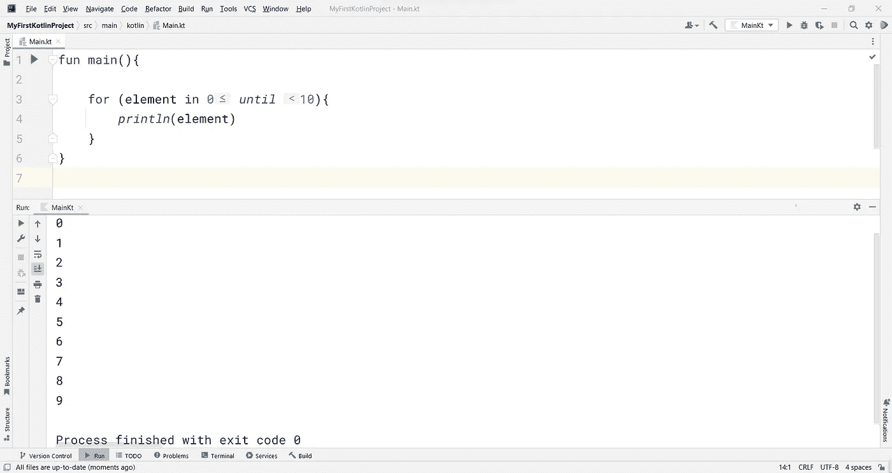**

```
fun main(){

    for (element in 0 *until* 10){
        *println*(element)
    }
}
```

**我们在每次迭代后获得的值存储在一个变量中。在上面的例子中，迭代值存储在 ***元素的*** 变量中。**

**你可以看到数字是从 0 到 9 打印出来的，因为我一直用到了 10。这里不包括上限 10。所以，一旦迭代器到达 ***元素*** 中的值 10，那么它就停止。**

****范围**是由一对点(起点和终点)定义的值的区间。**范围**的语法是-**

> **起点..终点**

**现在，我将使用 ***范围*** -为循环启动相同的**

***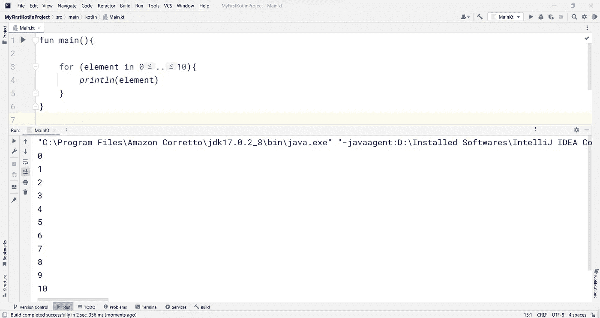***

```
*fun main(){

    for (element in 0..10){
        *println*(element)
    }
}*
```

***注意输出中的一件事，我们看到 10 也打印出来，不像在前面的代码中使用 ***直到*** 关键字。这是因为当我们在 Kotlin 中使用范围时，端点被包括在内。要排除端点，就少一个。***

***同样的事情可以通过使用一个 **rangeTo()** 函数来实现，如下所示***

***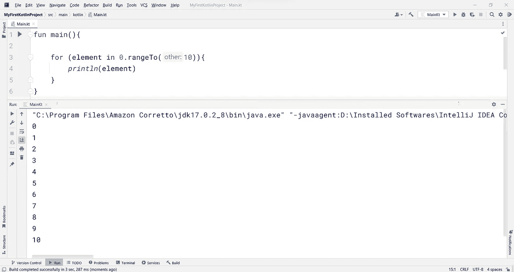***

```
*fun main(){

    for (element in 0.rangeTo(10)){
        *println*(element)
    }
}*
```

***所以记住这一点-***

> ****到*不包括终点(上限)，范围包括终点。***

> *****例 1*****

***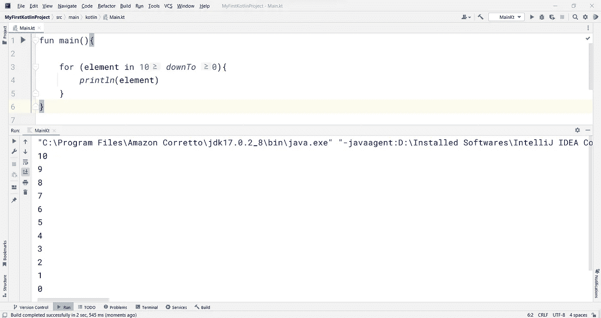***

```
*fun main(){

    for (element in 10 *downTo* 0){
        *println*(element)
    }
}*
```

******downTo*** 关键字用于反转范围。因此，上面的代码打印从 10 到 0 的数字。***

> *****例 2*****

******downTo*** 关键字做了什么，一个名为 **reversed()** 的函数也可以做同样的事情。***

***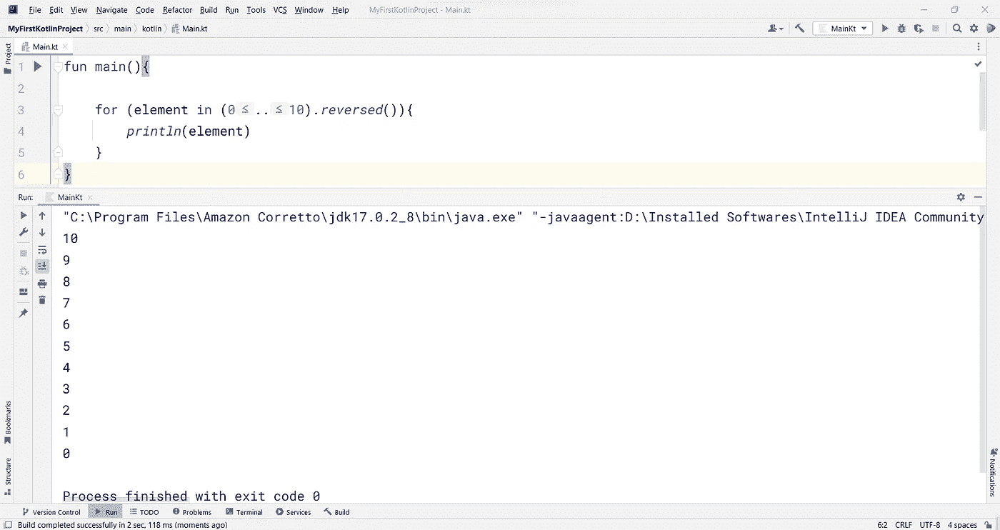***

```
*fun main(){

    for (element in (0..10).*reversed*()){
        *println*(element)
    }
}*
```

***请注意代码编写的格式…😠***

> *****例 3*****

***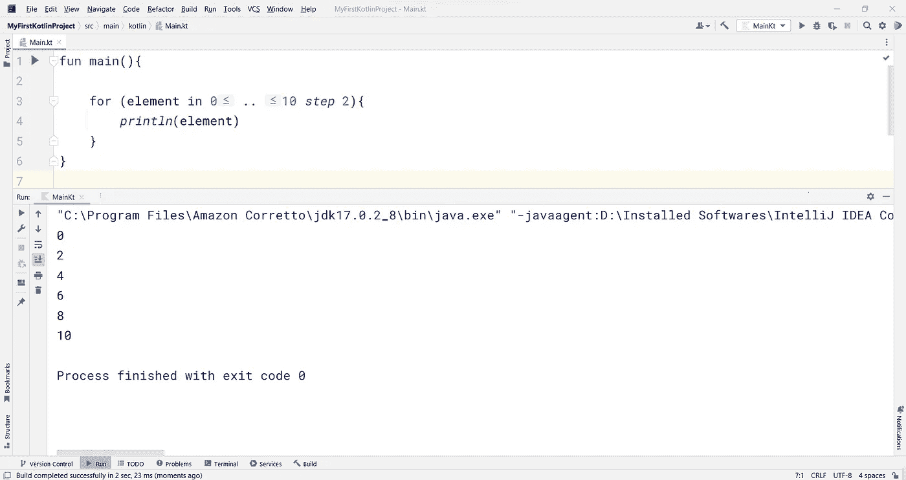***

```
*fun main(){

    for (element in 0 .. 10 *step* 2){
        *println*(element)
    }
}*
```

***在 for 循环中指定范围后，我们可以使用 ***步骤*** 关键字来提供每次迭代中两个值之间的差距(后跟一个数字)。***

> *****例 4*****

***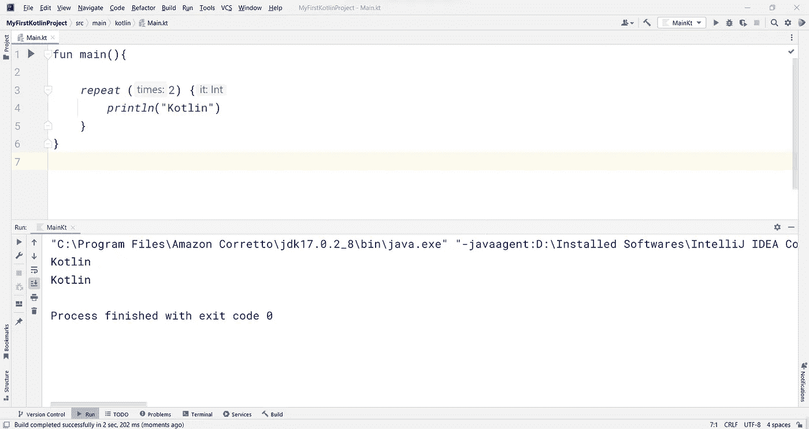***

```
*fun main(){

    *repeat* (2) {*println*("Kotlin")
    }}*
```

***我使用了一个 **repeat()** 函数将一个动作重复固定的次数。您可以看到，这是在没有使用循环的*的情况下实现的。****

> *****例 5*****

***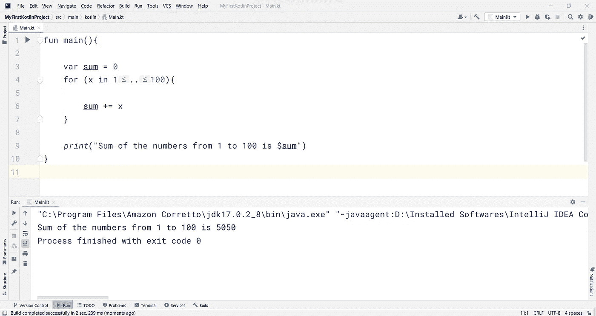***

```
*fun main(){

    var sum = 0
    for (x in 1..100){

        sum += x
    }

    *print*("Sum of the numbers from 1 to 100 is $sum")
}*
```

***这里我已经初始化了一个 sum 变量，我将在其中存储数字的 ***sum*** 。在 for 循环内部，范围被设置为从 1 到 100，并且随着每一次迭代，*得到一个值，并且该值被添加到 ***sum*** 变量(在代码中是- *sum += x* )中。最后，我移出循环(即在循环的花括号的*之外)并打印出 ***和*** 。*****

## ***何时使用 for 循环***

***通常，当您知道循环应该运行多少次时，应该对循环使用。换句话说，在开始循环之前，我们应该提前知道迭代的次数。***

# ***while 循环***

****while* 循环的典型语法如下所示***

```
*while (until condition is true){ execute loop body
         ...
         ... increment/decrement to make the condition false}*
```

***使用*用于*回路的任何可能也可以使用**而**回路。***

***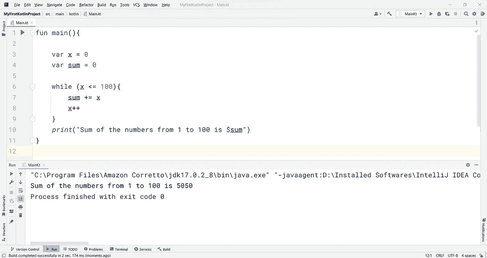***

```
*fun main(){

    var x = 0
    var sum = 0

    while (x <= 100){
        sum += x
        x++
    }
    *print*("Sum of the numbers from 1 to 100 is $sum")
}*
```

***在上面的代码中，我已经初始化了两个变量，分别是， ***x*** 和 ***sum*** 。***

******x*** 用于 while 循环，而 ***sum*** 用于存储从 1 到 100 的数字之和。***

***为了使 ***x*** 在每次迭代中前进一步，我将增量条件设置为- *x++* 在循环体的最后，这样它将在一个点穿过终点，即 100。此时，循环将停止，程序光标退出循环并打印出 ***sum*** 作为结果。***

> ***我给你们的任务是-练习创建示例程序，就像-***

*   ****打印一个范围内的质数****
*   ****显示给定整数的乘法表****
*   ****计算给定数字的阶乘****

## ***何时使用 while 循环***

***一般来说，当你不知道循环应该运行多少次时，你应该使用 *while* 循环。换句话说，在开始循环之前，迭代次数是未知的。***

# ***do-while 循环***

***同样的 while 循环可以用 Kotlin 的 **do-while** 循环以不同的方式表示。***

****do-while* 循环的典型语法如下所示***

```
*do { loop body}while (condition holds true)*
```

***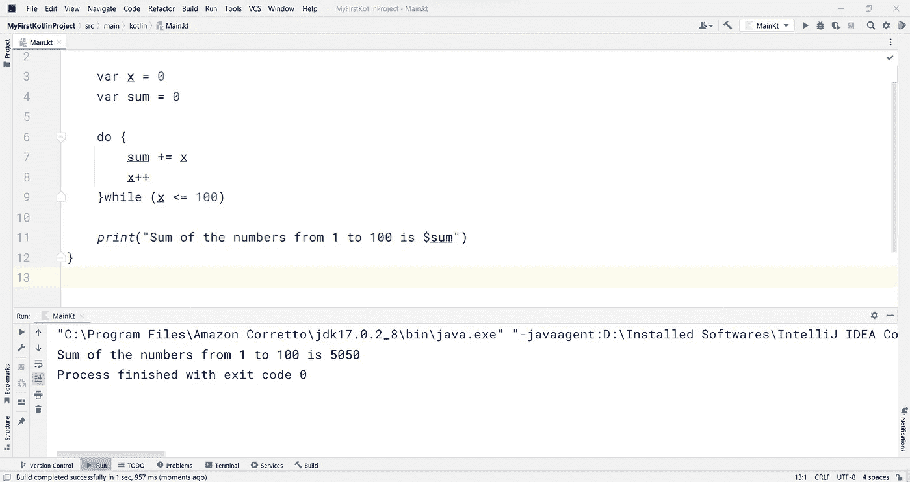***

```
*fun main(){

    var x = 0
    var sum = 0

    do {
        sum += x
        x++
    }while (x <= 100)

    *print*("Sum of the numbers from 1 to 100 is $sum")
}*
```

*****while** 和 **do-while** 循环的主要区别在于-***

> ****do-while* 循环将至少执行一次，即使条件最初评估为**假**。在 *while* 循环中，首先检查条件。然而，在 *do-while* 循环中，首先执行循环体，然后检查条件。***

# ***中断语句***

*****Break** 关键字用于当满足某个条件时，我们想要终止循环。***

***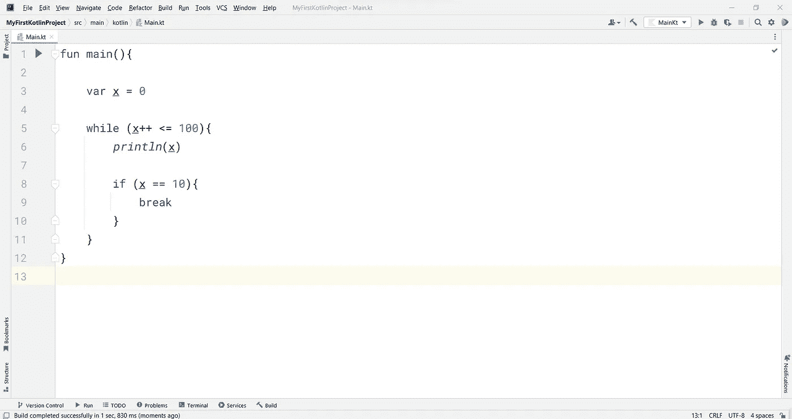***

```
*fun main(){

    var x = 0

    while (x++ <= 100){
        *println*(x)

        if (x == 10){
            break
        }
    }
}*
```

***在上面的代码中，我想打印所有的值 ***x*** 到 100。但是我的条件是，如果在任意一个时间点， ***x*** 等于 10，那么终止循环。所以，输出应该是这样的-***

***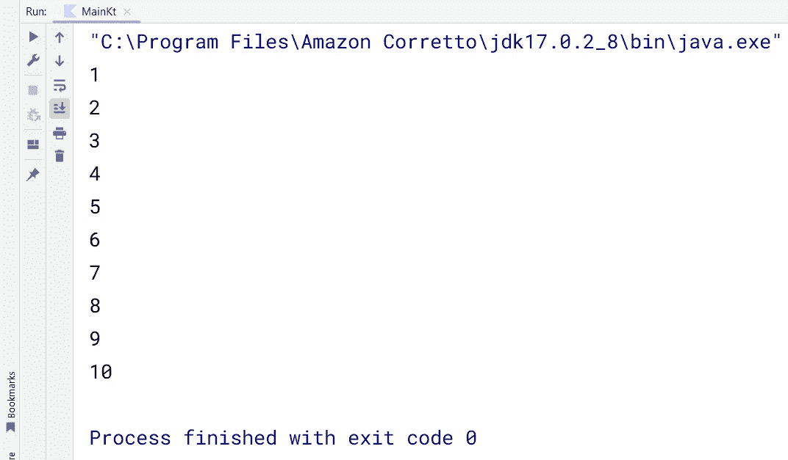***

# ***continue 语句***

*****Continue** 关键字将跳过当前迭代，继续循环中的下一次迭代。***

***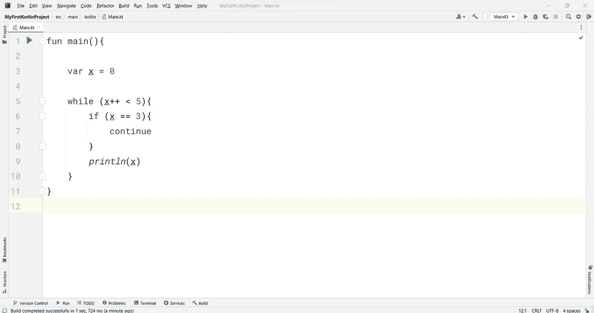***

```
*fun main(){

    var x = 0

    while (x++ < 5){
        if (x == 3){
            continue
        }
        *println*(x)
    }
}*
```

*****继续**之后的语句将不会针对该特定迭代执行。这就是为什么我把打印声明放在**之后继续**。这将打印从 1 到 5 的所有值，但不包括 3。所以，输出会是-***

***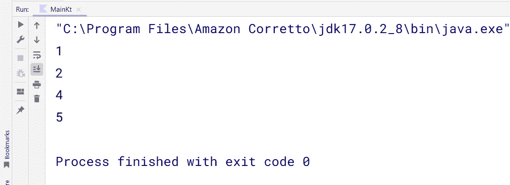***

# ***关键字中的***

****在上面的文章中，你一定注意到我们在 操作符中使用了 ***，而在*** a 范围中使用了 for 循环即 ***元素，这样做…*******

****同样的 ***在*** 操作符中可以用来检查一个元素在如下范围内的成员资格:-****

****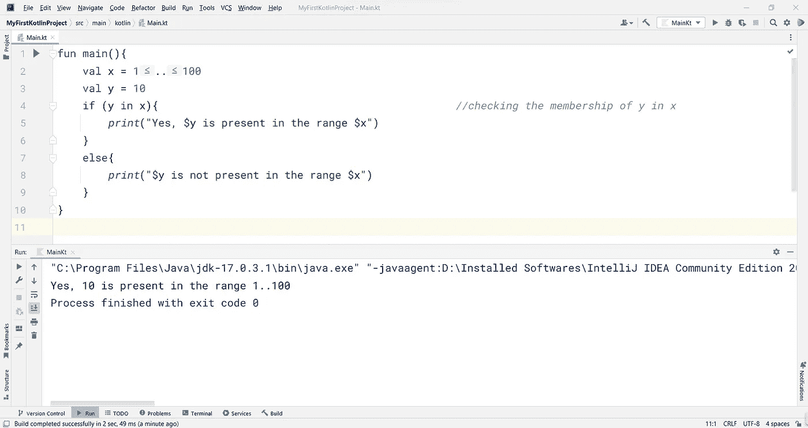****

```
**fun main(){
    val x = 1..100
    val y = 10
    if (y in x){ *print*("Yes, $y is present in the range $x")
    }
    else{
        *print*("$y is not present in the range $x")
    }
}**
```

****如你所见，我在 if 条件中使用了 运算符中的 ***来检查***y****=*10 的值是否在范围内。*******

> ****我们也可以使用 **not** 运算符和运算符中的**来检查一个值是否不在范围、列表等中。使用**！在**语法中。******

****这就是科特林循环的全部内容。唷…😮‍💨****

********

****照片由 [Cris Saur](https://unsplash.com/@crisaur?utm_source=medium&utm_medium=referral) 在 [Unsplash](https://unsplash.com?utm_source=medium&utm_medium=referral) 上拍摄****

> ****→继续旅程 [***第十部***](/codex/complete-kotlin-tutorial-part-10-more-on-functions-intermediate-2fb8b79c1616)****

******感谢迄今为止的阅读……******

****✍️ *阿吉特·库马尔·萨胡*****