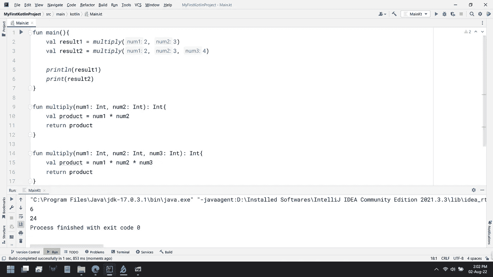
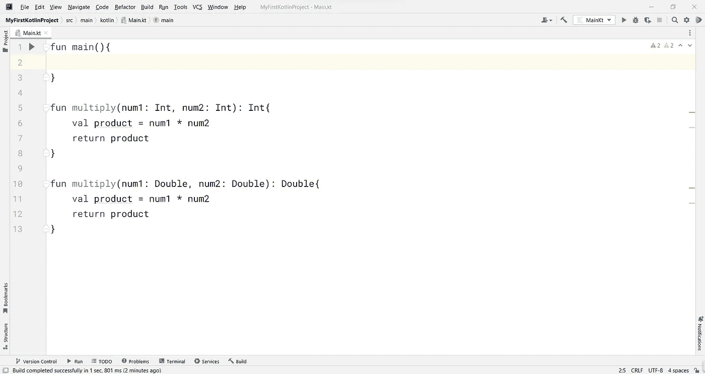
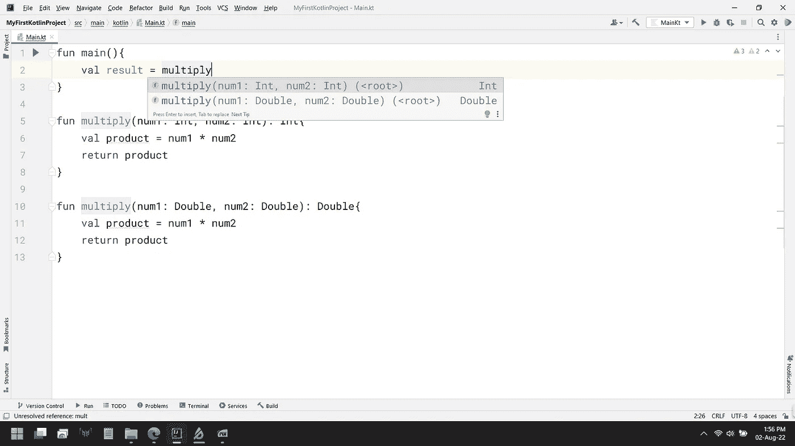
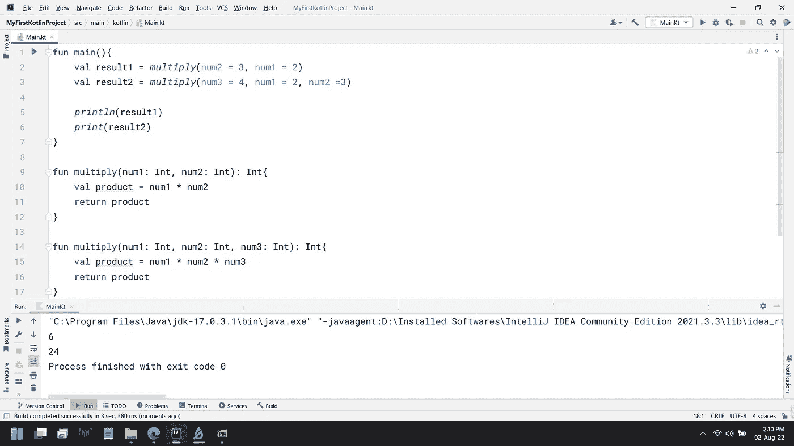
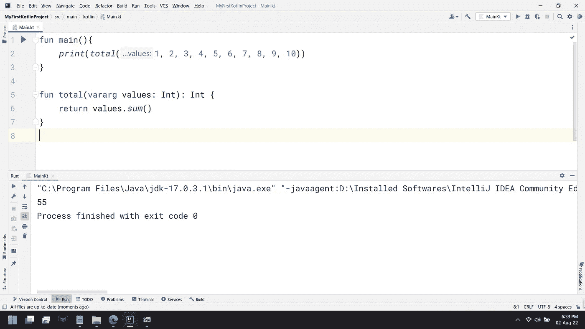

# 完整的 Kotlin 教程:第 10 部分(关于函数的更多内容:中级)

> 原文：<https://medium.com/codex/complete-kotlin-tutorial-part-10-more-on-functions-intermediate-2fb8b79c1616?source=collection_archive---------16----------------------->

> 如果你是这个系列的新手，从 [**这里**](https://ajitsahoo29.medium.com/complete-kotlin-tutorial-part-1-introduction-to-kotlin-a8868fd9c0b9) 开始
> 
> 上一篇帖子， ***第九部分*** 就是这里的[](/codex/complete-kolin-tutorial-part-9-playing-with-loops-aca47a70ddd1)

**现在，让我们继续我们的旅程，理解编程中一个叫做**函数重载**的概念。但在此之前，我们先讨论一下编程中的一些必备要素。**

****

**一个函数包含几个语句和表达式。我们来了解一下什么是语句和表达式。**

# **陈述和表达**

**大多数编程语言中最小的有用代码片段要么是一个**语句**要么是一个**表达式**。变量、值、函数调用(如果有的话)和操作符一起形成一个产生单个值的**表达式**。如果数据类型被添加到这个表达式中，那么它就变成了一个**语句**。**

**给变量赋值或声明变量不是表达式，它们是语句。但是如果让我们说，你正在写***a*******b***，其中 ***a*** 和 ***b*** 是两个变量并且这个 ***a*** 乘以 ***b*** 的结果给出的是一个单一值。这是一种表达方式。**

**在 Kotlin 中，表达式应该写在括号或花括号内。**

# **函数重载**

**当我们想要创建同名函数时，我们必须通过理解什么是**函数重载**来知道如何在 Kotlin 中创建它们。函数重载是一个围绕着这个想法的概念**

> **相同的函数名，但不同的参数**

**现在，问题出现了——我们如何使参数不同，但保持函数的名称相似？**

**有两种方法-**

## **1.要么我们改变参数的数量**

****

**通过改变参数数量实现函数重载**

```
fun main(){
    val result1 = *multiply*(2, 3)
    val result2 = *multiply*(2, 3, 4)

    *println*(result1)
    *print*(result2)
}

fun multiply(num1: Int, num2: Int): Int{
    val product = num1 * num2
    return product
}

fun multiply(num1: Int, num2: Int, num3: Int): Int{
    val product = num1 * num2 * num3
    return product
}
```

**在上面的代码中，我在第一个乘法函数中指定了 2 个参数，在第二个乘法函数中指定了 3 个参数。这两个函数不同，但名称相同。**

## **2.或者我们改变参数的数据类型**

****

```
fun main(){

}

fun multiply(num1: Int, num2: Int): Int{
    val product = num1 * num2
    return product
}

fun multiply(num1: Double, num2: Double): Double{
    val product = num1 * num2
    return product
}
```

**这里，我将参数的数据类型从第一个乘法函数中的 **Int** 更改为第二个乘法函数中的 **Double** 。这两个函数不同，但名称相同。**

****

**在上图中，注意 IntelliJ IDEA 在函数调用过程中是如何在建议中显示两个不同的函数的。**

****

**通过改变参数的数据类型实现函数重载**

```
fun main(){
    val result1 = *multiply*(2, 3)
    val result2 = *multiply*(2.0, 3.0)

    *println*(result1)
    *print*(result2)
}

fun multiply(num1: Int, num2: Int): Int{
    val product = num1 * num2
    return product
}

fun multiply(num1: Double, num2: Double): Double{
    val product = num1 * num2
    return product
}
```

**注意，我们从两个不同的函数得到两个输出。一种情况下，我们得到一个整数输出，另一种情况下得到一个浮点数输出。**

# **命名参数**

**如果一个函数中有多个参数，并且我不知道在创建该函数时指定的顺序，那么在函数调用过程中传递参数就是一个繁琐的过程。为了减少这种复杂性，Kotlin 使用了**命名参数**。**

****

**命名参数**

```
fun main(){
    val result1 = *multiply*(num2 = 3, num1 = 2)
    val result2 = *multiply*(num3 = 4, num1 = 2, num2 =3)

    *println*(result1)
    *print*(result2)
}

fun multiply(num1: Int, num2: Int): Int{
    val product = num1 * num2
    return product
}

fun multiply(num1: Int, num2: Int, num3: Int): Int{
    val product = num1 * num2 * num3
    return product
}
```

**请注意，我已经按照我想要的顺序传递了参数。但是要小心，除非函数中有一些默认参数，否则必须传递每个参数(即参数的名称和数量必须与参数匹配)。在上面的例子中，如果在第二个乘法函数中已经传递了 1 个默认参数，那么您可以在 main 方法的函数调用过程中传递 2 个参数。你不需要通过所有 3 个参数。您可以传递所有 3 个参数(因为乘法函数中有 3 个参数)，但这不是强制的。**

# **可变数量的参数**

**一个函数可以接受可变数量的参数。您可以在函数调用期间传递尽可能多的参数，但所有参数必须是参数中指定的数据类型。**

****

**可变数量的参数**

```
fun main(){
    *print*(*total*(1, 2, 3, 4, 5, 6, 7, 8, 9, 10))
}

fun total(vararg values: Int): Int {
    return values.*sum*()
}
```

**在上面的代码中，我使用了 ***vararg*** 关键字，并传递了一个名为 ***values*** 的参数，该参数属于**数组**类型(我们将在接下来的文章中了解数组)，它存储了 **Int** 数据类型的元素。然后我在 main 方法的 **total** 函数调用中传递了 10 个参数，我得到的输出是 55。**

> ****本帖到此结束……😏****

****

**照片由[沙哈达特·拉赫曼](https://unsplash.com/@hishahadat?utm_source=medium&utm_medium=referral)在 [Unsplash](https://unsplash.com?utm_source=medium&utm_medium=referral) 拍摄**

*****我会在*** **第十一部分**里见到你**

****感谢阅读到目前为止…****

**✍️ *阿吉特·库马尔·萨胡***