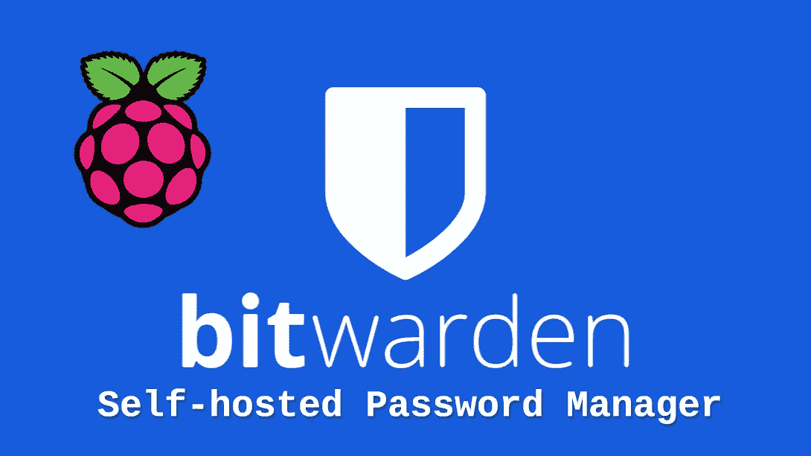

# 用于 Raspberry Pi 的完整自托管 Bitwarden

> 原文：<https://medium.com/codex/complete-self-hosted-bitwarden-for-raspberry-pi-24b59c3b02df?source=collection_archive---------0----------------------->

自托管现代密码管理器，具有 MFA、备份、DDNS、证书和增强的安全性

# 你为什么要这么做？

密码管理器是个好主意。我使用密码管理器已经超过十年了。但并不是所有的密码管理员都是平等的。我开始使用基于浏览器的密码管理器，然后很快迁移到 KeePass。十年了…