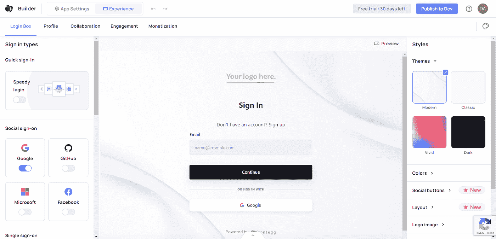
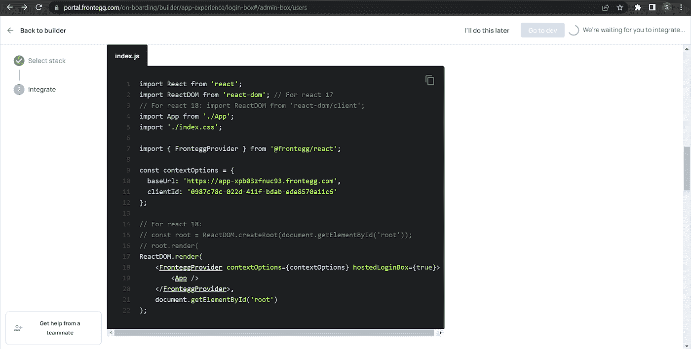

# 通过 Frontegg 实现 NodeJS 登录的合规优先开发

> 原文：<https://medium.com/codex/compliance-first-development-for-nodejs-logins-with-frontegg-28ec857f12c9?source=collection_archive---------16----------------------->


克里斯汀·休姆在 [Unsplash](https://unsplash.com/s/photos/user?utm_source=unsplash&utm_medium=referral&utm_content=creditCopyText) 上拍摄的照片

对无密码身份验证的需求正在增加，因为它比旧的身份验证系统有许多优势。用户不需要记住他们的密码，这是一种比需要密码的认证更安全的做法，因为它不太容易受到网络攻击。

在本文中，我将演示如何使用 Frontegg 通过 React 和 NodeJS 创建一个无密码的用户认证系统。

# 什么是用户认证？

[用户认证](https://www.techtarget.com/searchsecurity/definition/user-authentication)是一种用于验证试图访问系统的用户身份的系统。这是一个要求用户输入其凭证来证明他们所说的身份的过程。

系统需要知道用户的身份，以允许他们访问他们的系统功能并对其执行任务，同时监控用户的活动，以保护他们的利益并优化用户体验。

# 为什么需要用户认证？

用户身份验证确保只有经过授权的用户才能访问系统，从而防止未经授权的用户从数据库中窃取信息或损坏系统。

可以使用各种认证系统(如密码和无密码认证系统)进行用户识别。

在需要密码的认证系统中，用户必须输入他的用户名或电子邮件以及密码来验证他的身份。相比之下，在[无密码认证](https://www.onelogin.com/learn/passwordless-authentication#:~:text=Passwordless%20authentication%20is%20a%20means,safe%20for%20a%20long%20time.)系统中，用户必须通过 OTP(一次性密码)或验证链接之类的方式注册或登录系统，该链接在短期内到期，因此没有人可以使用它。

# 为什么无密码认证更安全？

无密码认证比有密码的认证系统更难被黑客攻破，因此更不容易受到网络攻击，这也是它们更安全的原因。

但是我们不能说这个系统是不可能被破解的，因为现在没有一个认证系统是不可能被破解的。当今世界黑客更高水平的经验和强大的 AI 智能，使得黑客攻击当今世界存在的任何系统成为可能。

# 使用 Frontegg 进行用户认证

[Frontegg](https://portal.frontegg.com/) 是一个免费的现代用户管理系统，帮助开发者整合各种功能，如安全用户认证、档案管理、登录等。它提供了许多现代功能，如注册/登录卡外观的定制，与各种编程语言的集成，以及与第三方应用程序的轻松集成。



因此，让我们开始学习如何使用 Frontegg 来实现这一切。

在我们开始我们的项目之前，我们必须在我们的系统中安装 [NodeJS 和 NPM](https://radixweb.com/blog/installing-npm-and-nodejs-on-windows-and-mac) 。

安装 NodeJS 和 NPM 之后，我们将在我们的系统上安装 React JS。在项目终端中运行以下命令，在系统上安装 React JS:

```
npx create-react-app frontegg_app
cd frontegg_app
```

通过运行以下命令，在应用程序目录中安装 react-router-dom(如果尚未安装):

```
npm i react-router-dom
```

接下来，我们需要安装 Frontegg npm 库:

```
npm i @frontegg/react
```

我们已经为我们的项目准备好了所有需要的东西。现在打开 React 应用程序的 index.js 文件，复制以下代码:

```
import React from ‘react’;
import ReactDOM from ‘react-dom’;
import App from ‘./App’;
import ‘./index.css’;
import { FronteggProvider } from ‘@frontegg/react’;
import {BrowserRouter} from “react-router-dom”;
const contextOptions = {
 baseUrl: “appURL”,
 clientId: ‘client-id’
};
ReactDOM.render(
 <**BrowserRouter**>
 <**FronteggProvider** contextOptions={contextOptions}>
 <**App** />
 </**FronteggProvider**>
 </**BrowserRouter**>,
 document.getElementById(‘root’)
);
```

看代码。这里我们用了一个宾语，`contextOptions`。该对象由基本 URL 和客户端 id 组成。你可以从点击上图所示的“发布到开发者”按钮时打开的页面中获得这些信息。这个基本 URL 对每个用户都是唯一的。



此外，用浏览器路由器包装 FronteggProvider 元素，以便您可以在页面之间平稳地导航。

打开 app.js 文件，复制以下代码:

```
import ‘./App.css’;
import { useAuth} from “@frontegg/react”;
function App() {
const { user, isAuthenticated } = useAuth();
 return (
 <**div** className=”App”>
 { isAuthenticated && (
 <**div**>
 <**img** src={user?.profilePictureUrl} alt={user?.name}/>
 <**span**>Logged in as: {user?.name}</**span**>
 <**div**>
 <**button** onClick={() => alert(user.accessToken)}>What is my access token?</**button**>
 </**div**>
 </**div**>
 )}
 </**div**>
 );
}
export default App;
```

现在我们已经完成了前端部分，我们可以在 localhost:3000/account/login 上测试我们的应用程序了。

现在，让我们开始用 NodeJS 制作我们的后端。

首先，我们将导入一些库来开始设置我们的后端。

```
const express = require(“express”);
const jwt = require(“jwt”);
const nodemailer = require(“nodemailer”);
const PORT = process.env.PORT || 5000;
const app = express();
app.use(cors());
app.use(express.json());
app.use(express.urlencoded({ extended: false }));
```

我们将设置我们的登录端点，向我们的用户发送一个链接来登录他们的帐户。

代码如下:

```
 app.post(“/login”, (req, res) => {
 const email = req.body.email;
 if (!email) {
 res.status(404).json({
 message: “There is no email address that matches this”,
 });
 }
 if (email) {
 const token = jwt.sign(
 {
 email,
 },
 process.env.JWT_SECRET,
 {
 expiresIn: “1h”,
 }
 );
 let transport = nodemailer.createTransport({
 host: “smtp.gmail.com”,
 port: 465,
 secure: true,
 auth: {
 user: process.env.EMAIL_USERNAME,
 pass: process.env.EMAIL_PASSWORD,
 },
 });
 const mailOptions = {
 from: “sender@gmail.com”, // Sender address
 to: “receiver@gmail.com”, // List of recipients
 subject: “Account log in”, // Subject line
 html: `
 <p>Hey ${username},
 Click on this link to log in to your account: http://localhost:5000/activate?token=${token}</p>
 `,
 };
 return transport.sendMail(mailOptions, function (err, info) {
 if (err) {
 console.log(err);
 return res.status(404).json({message: “Email not send”});
 } else {
 console.log(info);
 }
 });
 }
});
```

在上面的代码中，我们首先检查电子邮件是否存在。如果电子邮件存在，我们制作了一个 [JWT](https://jwt.io/) 令牌来存储用户电子邮件，有效期为 1 小时。

```
const token = jwt.sign(
 {
 email,
 },
 process.env.JWT_SECRET,
 {
 expiresIn: “1h”,
 }
 );
```

然后，我们使用 HTML 模板制作一个传送器来发送包含登录链接的电子邮件。

```
let transport = nodemailer.createTransport({
 host: “smtp.gmail.com”,
 port: 465,
 secure: true,
 auth: {
 user: process.env.EMAIL_USERNAME,
 pass: process.env.EMAIL_PASSWORD,
 },
 });
 const mailOptions = {
 from: “sender@gmail.com”, // Sender address
 to: “receiver@gmail.com”, // List of recipients
 subject: “Account log in”, // Subject line
 html: `
 <p>Hey ${username},
 Click on this link to log in to your account: http://localhost:5000/account?token=${token}</p>
 `,
 };
```

我们已经完成了登录部分。我们现在将关注我们的帐户端点，以验证包含用户信息的令牌。

```
 app.get(“/account”, (req, res) => {
 // get the token and check its details
 const { token } = req.body;
 if (token) {
 jwt.verify(token, process.env.JWT_SECRET, (err, decoded) => {
 if (err) {
 return res.status(403).json({
 errors: “Expired link. Signup again”,
 });
 } else {
 return res.status(200).json({
 message: “User identity has been verified”,
 });
 }
 });
 } else {
 console.log(“error in activation”);
 return res.status(403).json({
 message: “please try again later”,
 });
 }
});
```

在上面的代码中，首先，我们用从前端接收到的令牌初始化令牌变量。然后，我们检查令牌是否存在。如果令牌存在，我们使用`jwt.verify()`方法验证它的到期时间。如果在验证中出现任何错误，前端的用户将收到一个错误。否则，系统将授予用户访问其功能的权限。

# 结论

在本教程中，我们学习了如何使用带有 React 和 NodeJS 的现代用户管理系统 Frontegg 来创建无密码认证系统。

这种无密码认证系统也有利于不喜欢多步认证过程并且经常忘记密码的用户。它有助于优化用户体验，并使 SaaS 公司能够将重点从用户管理转移到产品开发和客户问题上。