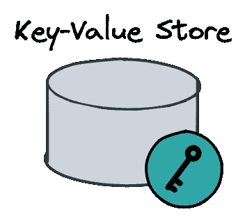
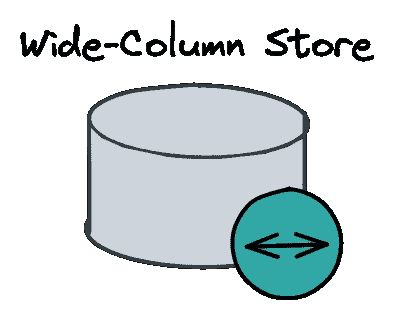
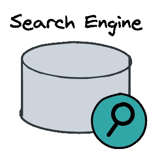
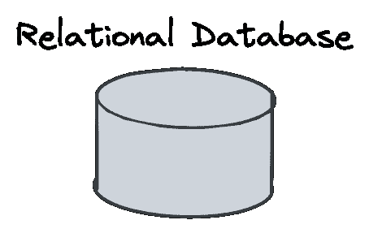
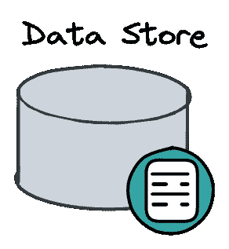
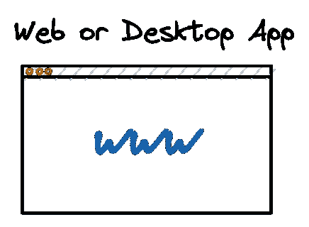
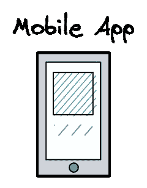

# 系统设计面试问题—您应该知道的组件

> 原文：<https://medium.com/codex/components-to-solve-system-design-interview-questions-752941aa3e56?source=collection_archive---------1----------------------->

## 系统设计面试

介绍起草强大系统设计解决方案的关键组件

让我们面对现实吧——进入大型科技公司很难。尤其是系统设计面试题，是出了名的。

在时间压力下设计一个分布式系统并不容易，尤其是因为这不是我们在日常工作中可以实践的。所以需要专门的练习来搞定这些面试。

如果你系统地处理这个挑战，这是学习现代系统的不同组成部分的第一步。

幸运的是，您需要了解的组件类型数量非常容易管理，可以勾勒出最常见的系统设计问题。

本文是对这些关键组件的介绍。为了帮助您练习系统设计技能，我创建了一个

[Excalidraw](https://excalidraw.com/) 组件库，可以在本文底部免费下载。

在开始学习具体组件之前，了解每个系统都需要执行四个高级任务是非常重要的。数据需要被传输、存储、处理和呈现。所有组件都属于这些类别之一:

## **交通数据**

1.  信息排队
2.  负载平衡器
3.  加拿大

## **商店数据**

1.  搜索引擎
2.  键值存储
3.  宽列存储
4.  关系数据库

## **过程数据**

1.  定制服务

## **呈现数据**

1.  网络/桌面应用程序
2.  移动应用程序

在你的面试中，勾勒出高层次的类别是至关重要的，一旦你清楚了这些类别，填写最合适的部分。

让我们开始了解“运输”数据。

# **运输数据**

任何系统都需要将数据从一个组件“传输”到另一个组件，尤其是在微服务架构中。

有三种组件类型，它们对于设计系统的数据传输功能至关重要。

## **消息队列**

消息队列支持服务之间的异步通信，因此发送服务不需要等待接收服务的回复。

从而提高了系统的容错性和弹性。

消息队列由消息代理管理，消息代理实现发布/订阅模式来简化服务的连接。

这允许通过将服务添加为发布者或订阅者来处理越来越多的服务，从而动态地扩展系统。

**用它做什么？**

异步工作流非常棒，有几个原因。所有系统都受益于它们所包含的服务的解耦。

它允许不同的部分独立发展，用不同的语言编写，和/或由不同的团队维护。受益最大的用例是电子商务或金融环境中的订单和支付处理。消息代理能够增强容错能力，并保证消息只被使用一次，这使它们成为一种自然的选择。

*   任何微服务架构
*   电子商务网站(订单处理)
*   支付系统(支付处理)

**流行的实现方式**

*   [RabbitMQ](https://www.rabbitmq.com/)
*   [卡夫卡](https://kafka.apache.org/)
*   [Redis](https://redis.io/)
*   [Azure 服务总线](https://docs.microsoft.com/en-us/azure/service-bus-messaging/service-bus-messaging-overview)
*   [AWS SQS](https://aws.amazon.com/sqs/)
*   [谷歌云发布/订阅](https://cloud.google.com/pubsub)

## **负载平衡器**

负载平衡器是一个充当反向代理的组件，它在几个服务器之间分配网络或应用程序流量。它用于增加应用程序的容量(并发用户)和可靠性。

一旦系统的负载增加，负载平衡器确保负载有效地分布在可用的服务器上，而不会出现单个服务器堵塞的情况。负载平衡器是基本上每个想要高度可伸缩的系统都需要的通用组件。

**用它做什么？**

任何具有相同服务的多个实例并且负载高且不稳定的系统。通常，您只需在任何面向客户端的服务器之前添加它们。

**流行的实现方式**

*   [云闪](https://www.cloudflare.com/en-gb/load-balancing/)
*   [胶囊内](https://www.imperva.com/products/load-balancer/)
*   [数字海洋](https://m.do.co/c/19f529e8be49)
*   [Azure 负载均衡器](https://docs.microsoft.com/en-us/azure/load-balancer/quickstart-load-balancer-standard-public-portal)
*   [WS 负载平衡器](https://docs.aws.amazon.com/AmazonECS/latest/developerguide/load-balancer-types.html)
*   [谷歌云](https://cloud.google.com/load-balancing)

## **CDN**

内容交付网络(CDN)是一组地理上分布的服务器。它在网络边缘缓存各种内容。

由于 CDN 的分布式特性，它可以处理更多的流量，并比许多原始托管服务器更好地承受硬件故障。

因此，cdn 增加了网络内容的可用性和冗余性。这些内容包括 HTML 页面、javascript 文件、样式表、图像和视频。今天，大部分网络流量都是通过 cdn 服务的，因为访问者越来越倾向于点击一个加载缓慢的网站。

**用来做什么？**

因此，CDN 应该是你正在绘制的每个高级系统图的一部分，它有一个面向客户端的网站或应用程序。

*   电子商务
*   流媒体应用
*   社交网络

**流行实现**

*   [快速](https://www.fastly.com/)
*   [Cloudflare CDN](https://www.cloudflare.com/en-gb/cdn/)
*   [Azure CDN](https://azure.microsoft.com/en-us/services/cdn/#overview)
*   [AWS CloudFront](https://aws.amazon.com/cloudfront/)
*   [谷歌云 CDN](https://cloud.google.com/cdn)

# **存储数据**

持久化数据的能力是任何系统的核心。但是，这取决于哪种数据最适合数据库。除了列出的数据库之外，一些专门的数据库超出了本文的范围。

## **键值存储**

键值存储是数据库管理系统的最简单形式。它允许在内存中存储成对的键和值，并在知道一个键时检索值。

简单性确实使这些系统对特定的用例有吸引力。

**用它做什么？**

通常，键值存储用于缓存小块的任意数据，如数据库调用、API 调用或页面呈现产生的字符串或对象。

因此，键值存储有助于通过减轻数据库负载来加速动态 web 应用程序。如果非常频繁地调用数据库，或者系统需要远程调用高延迟的独立服务，那么性能的提高尤其显著。

**流行的实现方式**

*   [Redis](https://redis.io/)
*   [Memchanced](https://memcached.org/)
*   危险广播
*   [天蓝色桌子储物](https://docs.microsoft.com/en-us/azure/storage/tables/table-storage-overview)
*   [AWS 发电机 DB](https://aws.amazon.com/dynamodb/)
*   [谷歌云内存商店](https://cloud.google.com/memorystore/)

## **宽栏店**

宽列存储是一种 NoSQL 数据库。它使用表、行和列，但是与关系数据库不同，在同一个表中，列的名称和格式可以因行而异。

您可以将宽列存储视为二维键值存储。许多实施都提供了高级功能，可以跨多个云可用性区域分发数据，并进行线性扩展。对于 ACID 事务，最好使用关系数据库。

**用来做什么？**

*   电子商务网站(产品目录、推荐引擎)
*   即时信使(实时聊天服务)
*   流媒体应用(用户偏好引擎)

**流行的实现方式**

*   卡桑德拉
*   [锡拉](https://www.scylladb.com/)
*   [阿帕奇 HBase](https://hbase.apache.org/)
*   [蔚蓝宇宙数据库](https://docs.microsoft.com/en-us/azure/cosmos-db/introduction)
*   [AWS 键槽](https://aws.amazon.com/keyspaces/?c=db&sec=srv)
*   [谷歌云大查询](https://cloud.google.com/bigquery)

**搜索引擎**

搜索引擎是 NoSQL 数据库管理系统，用于在大型数据集中搜索内容。您可以将搜索引擎用于许多不同的用例:“经典”全文搜索、分析存储、自动补全、拼写检查、警报引擎，以及作为通用文档存储。

从系统设计的角度来看，允许分布式搜索的搜索引擎实现尤其有趣。

**用它做什么？**

*   即时消息(聊天记录搜索服务)
*   社交网络(用户搜索)

**流行的实现方式**

*   [弹性搜索](https://www.elastic.co/)
*   [阿尔戈利亚](https://www.algolia.com)
*   [Solr](https://solr.apache.org/)
*   [类型感](https://typesense.org/)
*   [Azure 认知搜索](https://azure.microsoft.com/en-us/services/search/)
*   [AWS 云搜索](https://aws.amazon.com/cloudsearch)

**关系数据库**

关系数据库是最常见的数据库。它们支持面向表的数据模型。

表的模式由表名和具有固定数据类型的固定数量的属性定义。如果您要存储结构化信息，或者可以用表格格式表示的信息，关系数据库是您的自然选择。

此外，它允许原子的、一致的、隔离的和持久的(ACID)事务。

**用它做什么？**

几乎所有类型的高级系统都至少有一个关系数据库用例。一些常见的例子有:

*   电子商务网站(用户服务)
*   乘车共享应用程序(乘车服务)
*   酒店预订应用程序(住宿服务)

**流行的实现方式**

*   [MySQL](https://www.mysql.com/)
*   [甲骨文数据库](https://www.oracletutorial.com/getting-started/)
*   [Azure SQL Server](https://www.microsoft.com/en-us/sql-server)

## **数据存储**

传统的数据库被设计用来存储可以被查询和聚集的信息。但是，如果您想要存储不同的二进制数据，例如音频、视频或文本，数据存储解决方案是首选。称为 blob、文件、块或对象存储的数据存储有不同的实现方式。每一种都有独特的属性，我将在另一篇文章中介绍。

**用它做什么？**

通常，数据存储解决方案用于处理媒体文件或提供文件系统的系统，作为用户的接口。

*   流媒体应用(视频服务)
*   文件存储和共享系统(文件服务)
*   图像板(图像服务)

**流行的实现方式**

*   [数字海洋空间](https://m.do.co/c/19f529e8be49)
*   [山葵](https://wasabi.com/hot-cloud-storage/)
*   [天蓝色斑点存储](https://docs.microsoft.com/en-us/azure/storage/blobs/storage-blobs-introduction)
*   [亚马逊简单存储服务(S3)](https://aws.amazon.com/s3/)
*   [谷歌云存储](https://cloud.google.com/storage)
*   [阿里巴巴对象存储服务](https://www.alibabacloud.com/product/oss)

# **加工数据**

任何系统的用户价值都是由处理数据的独特组件创造的。

## **定制服务**

定制服务是系统中实现定制逻辑的组件。根据您的运输和存储组件，您有几个选项来实施您的定制服务。

**用它做什么？**

在任何系统中都能找到的定制服务。

**流行实现**

*   [休息服务器](https://en.wikipedia.org/wiki/Representational_state_transfer)
*   [无服务器功能](https://blog.hubspot.com/website/serverless-functions)
*   [火花作业](https://techdocs.broadcom.com/us/en/ca-enterprise-software/intelligent-automation/ca-workload-automation-de-web-client/12-1/scheduling/job-types/big-data-jobs/define-a-spark-job.html)
*   [卡夫卡消费者](https://dzone.com/articles/kafka-consumer-overview)

# **当前数据**

任何高级系统设计问题的解决方案草图都包括某种组件，它将您的工作成果呈现给最终用户。

该组件还可能允许用户与您的系统进行交互，并触发所显示数据的变化。

## **网络或桌面应用**

大多数专业软件应用程序都提供了一个集中的 web 或桌面界面，有时还提供了一个功能有限的移动应用程序，用于快速交互和通勤。

Github 是这种应用程序的一个很好的例子。

然而，典型的系统设计问题大多以最终用户为中心，因此期望 web 和移动应用程序共享完整的功能集是合理的。

**用它做什么？**

*   文件存储和共享系统
*   流媒体应用
*   社会化媒体

**流行的实现方式**

*   [做出反应](https://reactjs.org/)
*   [Vue](https://vuejs.org/)
*   [有角度的](https://angular.io/)
*   [电子](https://www.electronjs.org/)
*   [express.js](https://expressjs.com/)
*   [nest.js](https://nestjs.com/)

## **移动应用**

对于大多数以生活方式为中心的产品来说，原生移动应用是获得出色用户体验的关键。然而，移动开发带来了自身的挑战，如不同的平台、有限的屏幕尺寸、不太可靠的网络连接等。

**用它做什么？**

*   乘车共享
*   即时消息
*   应用商店

**流行的实现方式**

*   [离子](https://ionicframework.com/)
*   [飘起](https://flutter.dev/)
*   [反应原生](https://reactnative.dev/)
*   [Xamarin](https://dotnet.microsoft.com/apps/xamarin)

# **为您的系统设计面试做好准备！**

了解你的组成部分是很重要的，但是如果没有实践，你将会在真实的面试中遇到困难。

为了帮助你，我创建了一个 [Excalidraw](https://excalidraw.com/) 系统设计组件库！

可以 [**在这里免费下载库**](https://bigtechcoach.gumroad.com/l/excalidraw-system-design-symbols) ！

使用 Excalidraw，您可以方便地勾画出您的系统设计，并使用其协作功能进行同行评审和模拟面试！

它也是免费的，不需要任何注册。感谢阅读这篇文章！如果你想和我联系。

> *你可以在*[*LinkedIn*](https://www.linkedin.com/in/fabianhinsenkamp/)*[*Twitter*](https://twitter.com/hinsencamp)*上与我联系，或者通过访问我的* [*youtube 频道*](https://studio.youtube.com/channel/UCbCdMtFXZ7zy-3TFbKHEOqQ) *。**

*这个故事最初发布在 [bigtech.coach](https://bigtech.coach/blog/system-design-interview-questions-components-you-should-know/) 上。*