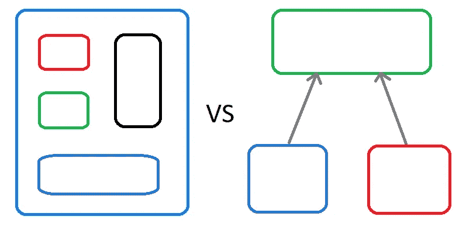

# 现实世界中的组合与继承(带 Java 示例)

> 原文：<https://medium.com/codex/composition-vs-inheritance-in-the-real-world-with-java-examples-89761b64efb8?source=collection_archive---------1----------------------->



图片由:我。我是程序员，不是平面设计师…

## [法典](http://medium.com/codex)

作为一个目光炯炯、思维敏捷的大学毕业生，进入了软件工程的世界，我已经准备好停止学习，开始行动。当然是开玩笑啦！每一个有一点真实世界经验的开发人员都知道一半的工作——如果不是更多的话——是学习。行业的语言和工具不断完善；开源库的出现，消除了为常见问题维护内部解决方案的必要性；新的硬件经常改变工程师们在可维护性、可读性、可伸缩性和性能之间权衡的话题。在这个不断变化的技术世界中，学习不仅仅是保持领先的必要条件，学习*就是*游戏。

# "你必须忘掉你学过的东西。"-尤达

尽管不断发展的技术占据了程序员日常学习的很大一部分，但我们通常认为理所当然的抽象概念和设计哲学需要像我们的教育程序一样受到重视。如果不强化抽象工具集，代码的味道和过时的模式将不可避免地进入人们的工作中。即使在团队中，也很容易熟悉彼此的风格并满足于坏习惯，这样，尽管定期进行代码审查或使用源代码分析(SCA)工具，他们仍然会出现在主代码库中。正如绝地大师尤达告诉卢克·天行者的那样，我们也应该抛弃我们已经学到的东西，避免以某种方式做事，因为历史上我们就是这样做的。这将确保我们总是编写具有表现力和可读性的代码。

# 那么这些和*构图 vs 传承*有什么关系呢？

在回答这个问题之前，我们需要定义我们的术语。当我们在面向对象编程中谈论*组合*时，我们指的是 [*对象组合*](https://en.wikipedia.org/wiki/Object_composition) :一个对象由其他对象组成的概念。相反，我们有*继承*。假设我们有两个对象:Droid A 和 Droid B。说 Droid B *从 Droid A 继承了*就是说 Droid B 明确地表达了与 Droid A 的关系，使得 Droid B 具有与 Droid A 相同的所有属性和功能，但是 Droid A 不一定具有 Droid B 的额外属性和功能。如果这些是不熟悉的术语，那么它们就不是您要找的机器人。

好了，足够的星球大战参考。

认识到坏习惯并抛弃它们与正确使用组合和继承特别相关。这种滥用不仅会导致相关代码的可读性和可维护性差，也会导致其继承者和创作者的可读性和可维护性差。当然，基本的多态原理通常被正确地应用在像*数据类*(即那些主要目的是[紧密耦合](https://en.wikipedia.org/wiki/Coupling_(computer_programming))一组相关的属性——数据)和基本的应用程序流中，然而(也许并不令人惊讶)在学术和技术博客中发现的理论和这些概念的真实世界实现之间存在明显的脱节。我们试图用组合和继承来解决的现实世界的问题，往往与我们在文学作品中可能找到的简单例子相去甚远。许多 Java 开发人员都见过类似下面的例子:

```
public class Animal {
  . . .
}public class Dog extends Animal {
  . . .
}public class Bird extends Animal {
  . . .
}
```

这样的例子可能包括与动物的腿的数量或它是否能飞有关的属性(我们可以争论这些是否是好的属性，但那是另一篇文章)。然而，现实是，软件工程师经常遇到没有明显层次关系的对象，如动物、汽车或任何其他陈词滥调的例子。

看看下面的 Java 代码:

```
public interface TaskScheduler { schedule(Runnable runnable, CronTrigger cronTrigger);}public abstract class AbstractTask implements Runnable { private final Logger logger = . . .; private final String taskName;
  private final TaskScheduler taskScheduler;
  private Future taskFuture; public AbstractTask(String taskName, TaskScheduler taskScheduler) {
    this.taskName = taskName;
    this.taskScheduler = taskScheduler;
  } @Override
  public final void run() {
    logger.info("Running Task: " + getTaskName());
    runTask();
    logger.info("Completed Task: " + getTaskName());
  } protected abstract void runTask(); public String getTaskName() {
    return taskName;
  } public void schedule(String cronExpression) {
    // code to validate cronExpression
    CronTrigger cronTrigger = new CronTrigger(cronExpression);
    taskFuture = taskScheduler.schedule(this, cronTrigger);
  }

  public void unschedule() {
    if (taskFuture != null) {
      taskFuture.cancel();
    }
    taskFuture = null;
  }}
```

这个例子的灵感来自我最近参与的一个开源项目。对某些人来说，这个类可能看起来不错——它很短，只包含几个字段，方法也不太复杂——然而，它体现了多态性的优点和缺点。

让我们一次看一种方法:

1.  `run()`方法继承自`Runnable`接口。稍后我们看到对`taskScheduler.schedule(this, cronTrigger)`的调用，因此我们可以推断出`AbstractTask`实现`Runnable`的原因很可能是因为它本该被`TaskScheduler`消费。`run()`还有另外一个目的。因为它是一个`final`方法，所以它为所有实现者创建了一致的行为:在任务执行的开始和结束时进行日志记录。
2.  跟随`run()`的是`runTask()`方法。它被声明为`abstract`，因此留给实现者来编写，但是它与`run()`的关系展示了继承在现实世界中的强大用途。`run()`方法向它的子类保证，在调用`runTask()`之前的最后一个操作和之后的第一个操作都会记录一致的消息。无论`runTask()`是如何实现的，当`AbstractTask’s` `run()`方法被多态调用时，`runTask()`会被准确地调用到需要的地方。虽然在这个例子中，一致的行为是日志记录，并且`runTask()`没有参数，但是这段代码的精神展示了继承的优点，因为它为所有子类创建了一致性，从实现者那里移除了责任(日志记录)，并且它没有偏离类的目的(作为`Runnable`)。
3.  `getTaskName()`可能看起来是一个无害的 *getter* ，但是它作为`public`会在`AbstractTask's`目的上产生歧义。通常， *getter* 是在*数据类*中找到的方法，但是这个类是`Runnable`，这意味着它不仅仅存储数据。在`run()`方法中`getTaskName()`方法被调用了两次，这是我们在这个例子中看到的唯一用法，但是它还能有什么其他用法呢？如果已经声明了`protected`，我们可以假设`AbstractTask`的作者认为子类访问可能是有用的，但是为什么它可能是有用的仍然不清楚。`TaskScheduler::schedule`是外部定义的并且消费`Runnable`的事实表明它与`getTaskName()`无关。这展示了继承和类本身的缺点:`AbstractTask`包括 getter 和`Runnable‘s` `run()`作为其*公共 API* 的一部分，使得类的目的不明确。这是数据类还是应该运行的东西？
4.  接下来是`schedule()`法。它获取它的`String`参数，验证它(尽管为了简化示例忽略了代码)，基于`String`构造一个新的`CronTrigger`，然后将那个`CronTrigger`连同`AbstractTask` ( `this`)的实例传递给`taskScheduler`的`schedule`方法。这应该会引发一些危险信号。首先，我们已经确定了`AbstractTask`的主要目的是成为`Runnable`，因此让`public`方法做其他事情应该受到质疑。第二个也是更重要的问题是，我们将一个`AbstractTask`的实例传递给一个不知道什么是`AbstractTask`的外部库。既然没有明确使用`AbtractTask`的东西，为什么还要费力去创建它呢？当然，有些情况下这可能是有意义的，我们讨论了由`run()` / `runTask()`串联创建的日志一致性，但在这种情况下，`AbstractTask`似乎想要被某个东西(即`TaskScheduler`)消费，但这种意图的表达从其 API 中并不清楚。总之，定义如何运行任务和如何调度任务可能是两个独立的问题，至少需要两个对象。此外，在自己的私有方法中使用`AbstractTask`削弱了它需要成为自己的对象的理由。把这个记为老虎钳。
5.  虽然`unschedule()`并不与所有与`schedule()`相同的物体互动，但它的哲学目的是撤销时间安排。同样，它在`AbstractTask`中的出现也是一种多态的恶习。

我们对这些方法的分析分为两条规则:利用机会从子类中抽象出冗余代码，避免通过公共 API 表达多种目的。

# 公共、受保护、最终、抽象

所有优秀的开发人员都应该努力避免重复代码。当你是一个存储库的唯一维护者时，这看起来很容易，但是很难做到。对于已经在同一个代码库上花费了数百个小时的人来说似乎显而易见的事情可能会迷惑代码库的新手，即使这个新手是一个经验丰富的程序员。为了避免这种情况，我们必须小心编写表达性 API，其目的对于必须使用它们的任何人来说都是不言而喻的。幸运的是，Java 给了我们四个强大的工具，当它们经过深思熟虑地结合在一起时，就可以做到这一点。

当设计一个抽象类时，通常有一些功能是所有实现类都必须以相同的方式执行的。这就是`public`和`final`发挥作用的地方。`public`方法定义你的 API 他们回答这个问题，“这个类*是用来做什么的？”方法上的`final`关键字用于表达在每个子类中应该一致的东西。*

`protected`和`abstract`也经常配合得最好。通常，一个类是抽象的原因是因为我们知道我们希望*做某事，但是我们不知道*如何做。抽象类声明`abstract`方法来把*如何*留给别人。尽管我们有时不知道任何细节*如何*执行一个任务，并且必须求助于`public abstract`方法，但更多时候子类最终会共享许多相同的步骤来完成一个给定的任务。这就是`protected`方法的闪光之处。**

以创建一个抽象概念`DocumentCreator`为例，它接受`DocumentParts`(一个数据类)的`List`，并返回一个`String`，表示以特定方式格式化的文档(例如 HTML、Markdown、PDF 等)。).

```
public class DocumentPart { public final int fontSize;
  public final boolean bold;
  public final boolean italic;
  public final String text;
  . . . 
}public interface DocumentCreator { /**
   * Creates a document by first italicizing (if necessary),
   * emboldening (if necessary), and finally resizing each 
   * DocumentPart's text.
   */
  String createDocument(List<DocumentPart> documentParts);}
```

为了这个例子，我们假设所有的文档都必须按照以下顺序格式化:斜体、加粗、调整大小。(我知道……也许不是最现实的例子，但也不是完全不合理。)而不是把这个接口的全部留给未来的维护者，让我们写一个有表达力的抽象类来清楚地说明一个实现需要提供什么功能。

```
public abstract class DocumentCreator { public final String createDocument(List<DocumentPart> documentParts) {
    StringBuilder documentBuilder = new StringBuilder();
    for (DocumentPart part : documentParts) {
        String formattedText = formatDocumentPart(part);
        documentBuilder.append(formattedText);
    }
    return documentBuilder.toString();
  }

  private String formatDocumentPart(DocumentPart part) {
    String formattedText = part.text;
    if (part.italic) {
        formattedText = italicize(formattedText);
    }

    if (part.bold) {
        formattedText = embolden(formattedText);
    }

    return resize(formattedText, part.fontSize);
  }

  protected abstract String italicize(String text);

  protected abstract String embolden(String text);

  protected abstract String resize(String text, int fontSize);

}
```

现在，实现者不需要考虑操作的顺序，甚至不需要考虑样板字符串的构建，它只需要知道如何接受一个`String`并输出一个斜体、加粗或调整大小的版本的`String`。让我们来看看它的实际应用:

```
public class HTMLDocumentCreator extends DocumentCreator {

  protected String italicize(String text) {
    return String.format("<i>%s</i>", text);
  }

  protected String embolden(String text) {
    return String.format("<b>%s</b>", text);
  }

  protected String resize(String text, int fontSize) {
    // We'll use px in this simple example
    return String.format("<span style="font-size: %dpx;">%s</span>", fontSize, text);
  }

}
```

这看起来比每个子类都必须编写一个带有循环的方法、执行自己的字符串构建、*和*无论如何都需要定义那些格式化方法要好得多。此外(假设超类中没有错误)，子类不需要担心在字符串连接逻辑中出错，而任何`DocumentCreator`都希望一致地执行字符串连接逻辑。这说明了正确使用几个基本概念可以缩小误差范围，并为代码库的维护者提供更清晰的 API。

尽管这些规则中的许多对经验丰富的 Java 程序员来说应该是显而易见的，但令人惊讶的是我经常遇到它们被滥用的情况。

# 单一责任

说到设计原则的滥用，你可能认为我们上一个例子中的设计看起来还是不太对。如果你这么想，你就有所发现了。再次查看我们的`HTMLDocumentCreator`，我们注意到在实现中实际上没有任何文档创建代码。即使直觉告诉我们，我们将在超类中发现这一点，但这仍然不能解释为什么这个类似乎是关于字符串格式的，尽管它应该是创建文档的。尽管我们的例子仍然正确地抽象出了*不常见的逻辑*，但是它这样做的方式产生了一个问题:`DocumentCreator`不仅负责将文档的片段放在一起，还负责格式化这些片段。我可以懒洋洋地把这归因于它是一个不完美的例子(不可否认它是)，但它实际上是我们从分解`AbstractTask`例子得出的第二个结论的完美延续。

我们在`AbstractTask`中发现的第二个问题是它含糊不清的公共 API。`DocumentCreator`演示了其受保护 API 的类似问题。公共 API 表示类和它的消费者之间的契约，而受保护的 API 表示类和它的子类之间的契约。通过定义仅仅基于*格式*而不是*文档创建*的`abstract`方法，`DocumentCreator`在正确委派其职责方面有所欠缺。现在从概念上讲，格式化是文档创建的一个必要部分——特别是在我们的例子中——但是它有两个特点，这使它在当前的实现中显得格格不入。首先，它的实现不影响创建文档的步骤；这使它成为抽象的候选，但并不意味着它在`DocumentCreator`中不合适。然而决定性的品质是第二个:格式化可以完全独立。正是这个事实让`HTMLDocumentCreator`显得“关”了。如果你还没有猜到，这就是构图发挥作用的地方。

上述两个品质是*单一责任原则*的基础。从第一个例子开始，我就一直在暗示这个原则。它本质上声明了一个类在一个应用程序的功能(或者甚至是一个应用程序的一个子部分)中应该只有一个职责。让我们把这个想法应用到`DocumentCreator`中:

```
public abstract class DocumentPartFormatter {

  public final format(DocumentPart part) {
    String formattedText = part.text;
    if (part.italic) {
        formattedText = italicize(formattedText);
    }

    if (part.bold) {
        formattedText = embolden(formattedText);
    }

    return resize(formattedText, part.fontSize);
  }

  protected abstract String italicize(String text);

  protected abstract String embolden(String text);

  protected abstract String resize(String text, int fontSize);

}public class DocumentCreator { private final DocumentPartFormatter formatter;

  public DocumentCreator(DocumentPartFormatter formatter) {
    this.formatter = formatter;
  } public final String createDocument(List<DocumentPart> documentParts) {
    StringBuilder documentBuilder = new StringBuilder();
    for (DocumentPart part : documentParts) {
        String formattedText = formatter.format(part);
        documentBuilder.append(formattedText);
    }
    return documentBuilder.toString();
  }

}
```

这还差不多。使用 composition，`DocumentCreator`单独负责将列表`DocumentParts`转换成列表`String`，而`DocumentPartFormatter`单独负责实际的格式化。虽然格式化有三种形式(由抽象方法定义)，但这三个概念应该紧密耦合到一个格式化程序中(我们不希望文档使用 HTML 的格式进行斜体显示，使用 Markdown 的格式调整大小)。现在让我们看看`DocumentPartFormatter`的实现会是什么样子。

```
public class HTMLDocumentPartFormatter extends DocumentPartFormatter {

  protected String italicize(String text) {
    return String.format("<i>%s</i>", text);
  }

  protected String embolden(String text) {
    return String.format("<b>%s</b>", text);
  }

  protected String resize(String text, int fontSize) {
    return String.format("<span style="font-size: %dpx;">%s</span>", fontSize, text);
  }

}
```

它看起来几乎与`HTMLDocumentCreator`的实现相同，但是在“格式化程序”中使用*斜体、*加粗和*调整*大小比在“文档创建程序”中更有意义。现在我们已经完善了我们的实现，让我们看看如何使用它。

1.  标准使用案例:

```
DocumentPartFormatter htmlFormatter = new HTMLDocumentPartFormatter();
DocumentCreator htmlCreator = new DocumentCreator(htmlFormatter);
```

2.在某些情况下，比如一个 Spring 框架应用程序，使用一个`HTMLDocumentCreator`类作为 Spring 组件可能仍然有意义(这是一个如何使用 Spring 的简单例子):

```
@Component
public class HTMLDocumentPartFormatter extends DocumentPartFormatter {
  . . .
}

@Component
public class HTMLDocumentCreator extends DocumentCreator {

  @Autowired
  protected HTMLDocumentCreator(HTMLDocumentPartFormatter formatter) {
    super(formatter);
  }

}
```

组合不仅在我们的`DocumentCreator`实现中提供了更多的灵活性，它还给我们的应用程序提供了一个新的工具`DocumentPartFormatter`，现在可以单独使用(和测试)。

# 结论

即使对于有经验的软件工程师来说，对代码气味的自满也会导致坏习惯。反过来，坏习惯会导致对基本开发原则的偶尔滥用，膨胀成不可维护的代码库。在面向对象编程中，这些问题通常表现为组合和继承这两个最重要的设计工具的不恰当使用。Java 开发人员在实现这些模式时必须保持警惕，并在误用开始渗入他们的工作时重新学习它们。

正确使用的话，继承和组合可以创建非常有表现力的 API，并显著提高应用程序的可读性和可维护性。如果使用不当，他们会通过制造大量的技术债务来拖垮代码库，并使责任纠缠不清，以至于必须重写大量代码才能使事情回到正轨。

我希望上面的例子和分析可以用来展示组合和继承的好与坏——优点和缺点——以帮助您设计出更好的代码，让其他人乐于维护。