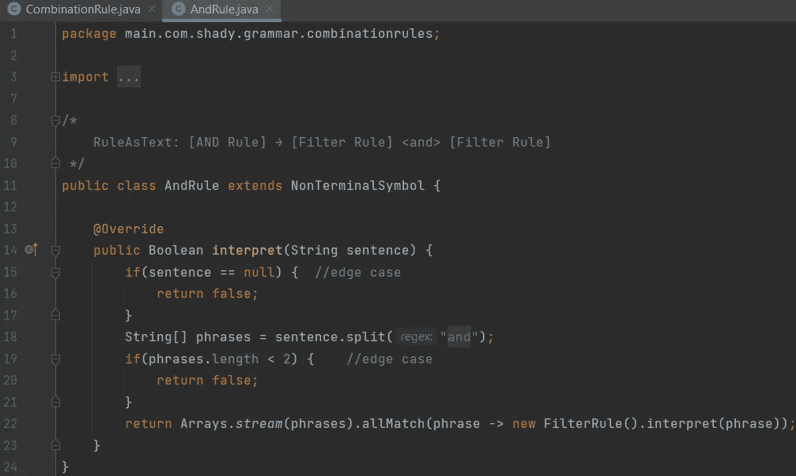

# 复合模式系列:访问者和解释者(上)

> 原文：<https://medium.com/codex/compound-pattern-series-visitor-and-interpreter-part-1-31dc22140bf0?source=collection_archive---------14----------------------->

# 介绍

复合模式是形成解决方案的模式组合，可以在重复出现的用例中使用。基本上，它是一个由模式组成的模式。复合模式最经典的例子是 MVC。MVC 是建立在观察者、策略和复合模式之上的。我们将看看**访问者**和**翻译**是如何结合在一起的，然后进一步延伸到责任链。

完整的代码可从以下链接获得。

Github 资源库:[https://github.com/Mustehssun/interpreter-visitor-compound](https://github.com/Mustehssun/interpreter-visitor-compound)

# 方案

我在两个地方应用了这种复合模式。但是出于保密的目的，我将提出一个玩具用例，它并不特定于它们中的任何一个。我们希望实现一个过滤器，或者说，一个规则的组合，这样规则是可扩展的，并且可以按照用户希望的方式进行组合。以下是可以合并的规则列表:

1.  是必须的
2.  比赛
3.  具有最小长度
4.  具有最大长度
5.  始于
6.  结尾为

用户可以这样组合规则:**是必需的，是一个字符串，以 auto 开头，以 bots 结尾，最小长度为 2，最大长度为 10** 。

并且用户将该规则应用于文本**汽车人**。

我们计划的任务是 2:

1.  验证规则是否符合特定的语法。
2.  验证规则是否适用于输入文本。

第一个要求是规则应该符合一定的语法。这意味着用户基本上可以输入任何内容，但这并不意味着这将是一个有效的句子。所以我们必须有一个用户可以遵守的特定语法。第二个要求很简单:将规则应用于输入文本。

在博客的这一部分，我们将实现第一部分。

# 应用模式

好，所以我们有一种，基本上我们有一个实际的语法！我们有 6 个基本规则，它们可以用像**和**和**或**这样的词连接起来。我现在提到的是连接器。那么，什么样的模式最适合这个场景呢？

**解释器**！:)

**解释器模式**

你可以找到解释器模式的详细解释，但是在这里我将给出一个简单的概述，这样如果你不了解它，你将足够了解这个博客并实现它。

解释器模式是一种用于实现语法结构的模式。基本上就是在那里解读语法(不开玩笑！).它为我们提供了一个可以用来解释任何语法的结构。我们是这样做的:

为了有一个令人耳目一新的上下文，现在就制定我们的语法会很有帮助。

[过滤规则]→[组合规则]|[基本规则]

[组合规则]→[与规则]|[或规则]

[与规则]→[过滤规则]<and>[过滤规则]</and>

【或规则】→【过滤规则】<or>【过滤规则】</or>

[基本规则]→[必需规则]|[字符串规则]|[数字规则]|[匹配规则]|[最小长度规则]|[最大长度规则]|[前缀规则]|[后缀规则]

【必选规则】→

【匹配规则】→<equals></equals>

【最小长度规则】→<has><minimum><length></length></minimum></has>

【最大长度规则】→<has><maximum><length></length></maximum></has>

【前缀规则】→<starts><with></with></starts>

【后缀规则】→<ends><with></with></ends>

这是同一个类图:

抽象表达式代表一个简单的语法规则。我们语法中的每一行都是一个抽象表达式。并且在任何语法中都可以有两种类型的表达式: **TerminalExpression** 和 **NonTerminalExpression** 。每个表达式类将获取一个上下文，它基本上是一个句子，并使用 interpret(context)方法来解释它，以确定句子的该部分是否符合语法。如果是的话，那就做点什么。如果我们在这个结构上表示我们的语法，那么所有递归组合的表达式将解释任何句子。这是所谓的**递归下降解析**的一个实现。

这就是解释器模式的思想。但是为了应用它，我们需要做的是造一个句子，这个句子可以传递给终端表达式。如果你知道编译器的构造，在解析之前有一个阶段——我们必须首先执行标记化。将标记化和解析分开几乎总是必不可少的。用一点面向对象的方法，很容易让它工作起来。然而，出于我们的目的，为了简洁起见，我们可以操作字符串而不是标记，因为我们的语法非常简单。

**实施**

Github 提供了完整的代码(博客开头的链接)。

以下是包装结构:

所有的抽象父类是**符号**。我们可以互换使用符号和表达这两个词。

有两个扩展符号的类，**终端符号**和**非终端符号**。在我们的实现中，正如你将看到的，我们在方法层实现了抽象符号对非终结符号的依赖，因此非终结符号和终结符号是相同的。但是为了更好的抽象，它们的创建方式是不同的，如果需要的话，可以给它们添加特定的行为。

我们语法的开始符号是 **FilterRule** 。所以我们来实施吧。:)

记住，当实现递归下降解析(我们正在做)时，重要的是首先解析基本案例——或者像在本课程中一样，解析导致基本案例的案例。如果我们先实现递归的情况，会导致无限循环。就像在递归中，如果我们先写递归的 case，就会陷入无限循环。这基本上是递归。:)

**基本规则**如下:

展示所有六个基本规则的实现是很麻烦的，所以我将展示两个基本规则— **RequiredRule** 和 **MatchesRule** 。

现在我们有足够的实现来写出我们的**组合规则**。

CombinationRule 的定义规定它应该是一个 **AndRule** 或者是一个**或 Rule** 。

所以让我们来实现它。

现在我们有了一个可行的和可测试的语法。:D

我写了一些测试。您可以在 Github 资源库中找到完整的测试。每一个规则，事实上，每一个符号都是可以单独测试的。这就是它的美妙之处。在这里，我将向您展示的测试，检查几乎一切→一个可扩展的和规则。:)

如果你认为我在撒谎:(在这里，他们都工作:)

所以现在我们完成了第一部分。我们已经实现了验证用户是否键入了符合我们语法的可扩展规则所需的功能。有了这个用于解析的结构，其他部分就容易多了——我们将重用这个结构将规则应用于输入字符串。但在此之前，我们必须将所有这些逻辑转移到 visitor。这时候就变成复合模式了。我们将在这个博客的下一部分做所有的事情。:)

**Github 库**:[https://github.com/Mustehssun/interpreter-visitor-compound](https://github.com/Mustehssun/interpreter-visitor-compound)