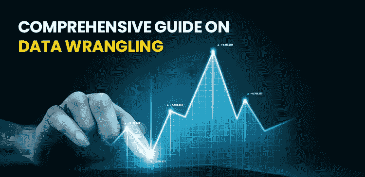
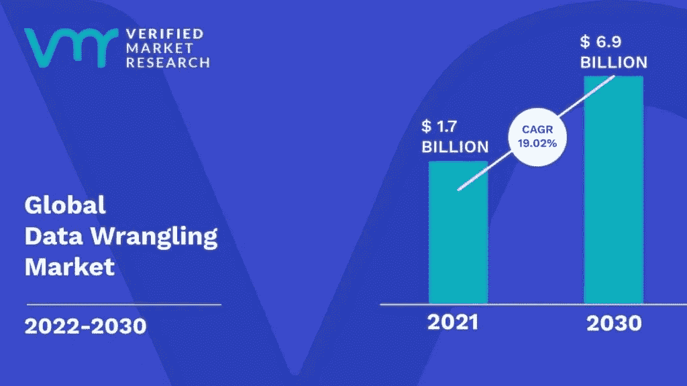
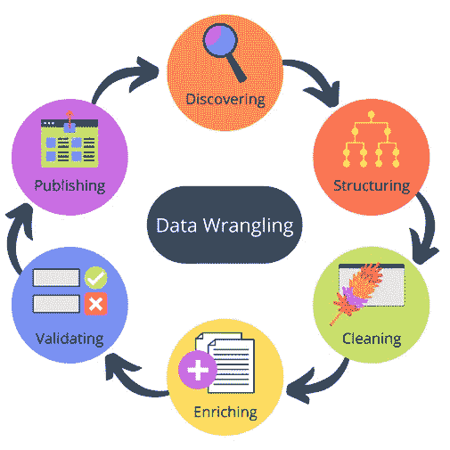

# 关于数据争论的综合指南

> 原文：<https://medium.com/codex/comprehensive-guide-on-data-wrangling-role-benefits-tools-and-steps-involved-126f4daeccb0?source=collection_archive---------9----------------------->

## 角色、优势、工具和涉及的步骤

随着数字化趋势的兴起，银行和金融机构已经开始通过在线门户网站对其银行服务进行数字化，从而更方便地接触消费者。

> 在另一份报告中，*预计在 2021-26 预测年度，北美将主导数据争论工具的采用。由于数据争论市场预计到 2026 年将达到 22.8 亿美元，从 2021 年开始以 9.56%的 CAGR 增长*。

这一分数为专家在提供高相关性数据见解时练习数据辩论工具的需求升级提供了完美的舞台。随着大量数据和我们筛选数据的智能方式的惊人增长，对擅长处理如此庞大数据集的 [**数据科学专业人士**](https://www.usdsi.org/data-science-certifications/certified-data-science-professional) 的需求也在不断增加。数据辩论技术使这一点变得很方便，它使商业企业能够利用关键的洞察力来明智地做出未来的决策。根据经过验证的市场研究，下图显示了对全球数据争论市场的另一个预测，该市场到 2030 年将增长到 69 亿美元。

在这些关键的统计数据之后，让我们直接进入数据争论到底是怎么回事。

# **什么是数据角力？**

您一定遇到过诸如数据清理、数据修复或数据操纵之类的术语——它们都有相同的意思。数据争论是一个更大的术语，包含所有列出的名称，并用作这些名称的同义词。*数据争论*简单来说，指的是将原始数据转换成更易于使用的格式的过程。这些程序和方法根据所涉及的项目和预期目标而有所不同。

# **我们为什么需要数据争论？**

"*争论数据就像审问犯人。仅仅因为你争论了一个供词并不意味着你争论了答案*。Brad Schneider*的这句名言描述了数据争论过程在使难以管理的数据成为一个美丽的工作网站中的关键作用。让数据成形是关键。如果预测是可信的，一个**认证的数据科学家**会花大约 45%的时间争论数据，这构成了更大过程的关键部分:*

因为数据争论有助于确保数据的质量

通过准确的数据洞察支持快速决策

它有助于建立透明高效的数据管理系统

# **数据扯皮有什么好处？**

数据争论的主要好处可以通过以下事实来衡量:

o *通过将数据转换成系统兼容的格式，帮助提高数据的可用性*

o *在直观的用户界面中构建数据流，并帮助自动化数据流流程*

o *允许轻松处理大量数据并共享数据流技术*

# **关于数据角力工具:**

在将数据输入分析和 BI 应用程序之前，有多种工具可用于收集、构建和清理数据。在处理超大数据集的企业中，自动化数据清理变得至关重要。根据数据，您可以使用自动和手动工具。

*电子表格/ Excel 超级查询* -用于基本的手动数据争论

*OpenRefine* -用于需要编程技能的自动化数据清理

*白板* -完全适合所有数据类型

Google DataPrep -一种帮助探索、清理和准备数据的数据服务

数据清理和转换工具*数据牧马人*

# **有效数据争论的 6 个快速步骤:**

通过链图以更简单的格式总结，*数据争论*是在 [**最佳数据科学认证计划**](https://www.usdsi.org/data-science-certifications) 中学习的最基本技能之一，它允许您掌握该技能，并通过有洞察力的数据准备确保更好的业务决策。每个业务项目都需要一个专门的数据辩论方法，以使数据集可靠并可供进一步使用。作为一名博学的**数据科学专业人员，**您将采取以下 ***步骤*** 来简化数据争论的过程，以提供关键的业务洞察力:

**1。** **发现**

这是一个重要的步骤，包括让自己熟悉数据，以便它变得容易理解和概念化。这也有助于清除空气，并确定关键趋势和模式。

**2。** **结构**

数据结构化意味着以这样一种方式塑造数据，使其易于支持未来的使用。它的最终形式或形状取决于对它进行解释的装置的分析模型。

**3。** **净化**

顾名思义，这个阶段包括剔除数据中的固有错误，这些错误可能会扭曲未来的分析。

**4。**充实**充实**

此阶段要求您分析转换后的数据是否足够健康，可以使用，否则，您必须选择通过包含来自其他数据集的值来丰富或扩充数据。

**5。** **验证**

这包括验证数据的一致性和高质量。

**6。** **发布**

验证成功后，数据就可以发布了。这意味着让组织中的其他人可以使用您的数据进行分析。

## 虽然我们知道数据争论过程可能会变得耗时费力；从长远来看，这是值得的。它降低了任何基于错误或不可靠数据集的见解贬值的风险；在没有数据争论程序的情况下。