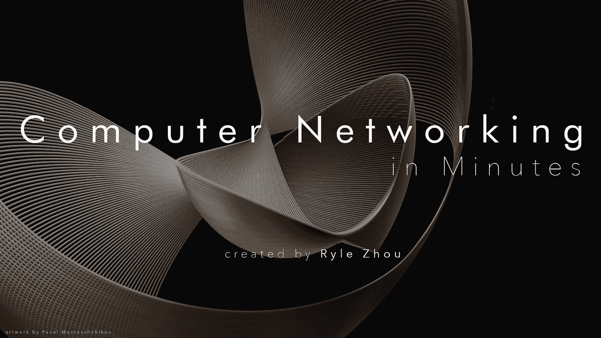

# 关于计算机网络你需要知道的最重要的事情

> 原文：<https://medium.com/codex/computer-networking-in-minutes-4aa85824ee24?source=collection_archive---------0----------------------->

## [法典](http://medium.com/codex)

掌握计算机网络领域相当于理解网络协议的内容、原因和方式。

赖尔·周创造的计算机网络。Pavel Mostovshchikov 的作品。CC0 1.0 公共领域。

本文旨在将大量的计算机网络概念分解成小块，采用分而治之的方法，帮助人们在几分钟内学会互联网的基本知识。