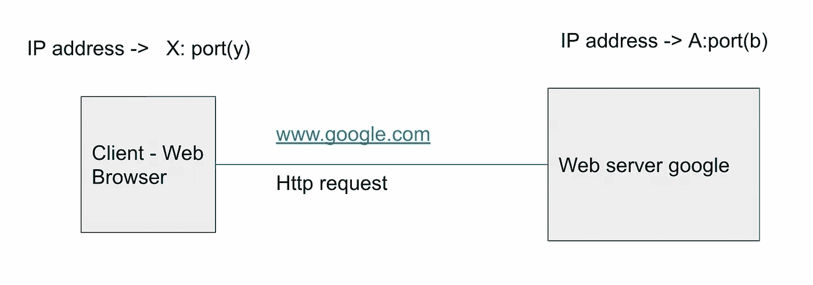
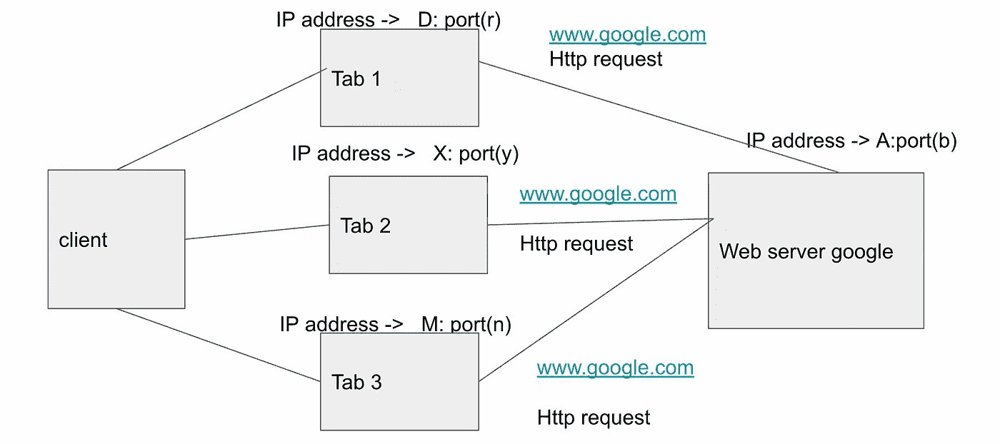

# 电脑端口！结束讨论！！！

> 原文：<https://medium.com/codex/computer-ports-end-the-discussion-419c62fb2b6?source=collection_archive---------12----------------------->

嗨嗨！欢迎再次参加一些真正简单明了的讨论。这次是关于计算机端口的。

在 [Unsplash](https://unsplash.com?utm_source=medium&utm_medium=referral) 上由 [Ritupon Baishya](https://unsplash.com/@clynt?utm_source=medium&utm_medium=referral) 拍摄的照片

娜 **娜娜！！！**我们将不讨论物理端口。此讨论将针对虚拟或逻辑端口。

> 我们将首先解决三个基本问题。
> 1。什么是港口？2.你为什么需要港口？3.你能创建自己的端口吗？

稍后，我们将深入探讨与拥有端口的网络调用相关的一些基本问题。

## **那么什么是港口呢？**

想一想与你的手机号码有关的事情。如果你想给某人打电话，你就拨那个人的手机号码给他/她打电话。

## **手机号在这里做什么？**

1.它是你知道存在的东西，给那个人打电话。

2.这不是他的身份证明，但你知道，有了手机号码，你就可以确保在这个电话用户数量中，你可以拨打这个特定的号码，它会将你重定向到那个人。

*类似地，端口是分配有协议的逻辑或软件端点，有助于连接两个网络并将数据从一端传输到另一端。*

**您为什么需要港口？** *这是因为它有助于服务器减少和整理它们接收的网络流量。*

你能创建自己的端口吗？
*如果你认为你的应用或协议需要一个套接字、端口等。您可以向 IANA(互联网号码分配机构)申请协议分配*

*例如:*
-端口 *80* 被分配给 http
-端口 *443* 被分配给 https
-端口 *21* 被分配给 ftp

这样说并不意味着 *80，443，21* 是分配给各个协议的固定数字。这是由 IANA 分配的号码，万维网通常使用它来遵循相同的规则并在相同的页面上:)

*让我们以一些有趣的方式* *来了解港口；)*

假设我们正在从谷歌 chrome 发送一个打开
***www.google.com 的请求。*** 我们客户端的 IP 地址是 X，google 服务器是 a。

那么你认为***y 和 b*** 的值一般可以是多少呢？

类似地，假设你在谷歌浏览器中打开了三个标签，这里的 IP 地址 *(D，X，M)* 是相同的，即你的客户端 IP 地址。现在从每个选项卡你发送请求打开 www.google.com 的 ***。***

我的问题是 ***r，y，n，b 的一般值能是多少？***

所以如果你稍微思考一下。让我们深入研究一下。

> 对于第一个问题*如果 google load balancers 为 http 请求设置了端口 80，那么 b 将会是 80，而 y 将会被你的操作系统动态分配端口。*
> 
> 对于第二个问题 *b 将再次 80 同样的原因，r，y，n 将由 OS 动态分配。(动态端口)*
> 
> 这让我们讨论了三种类型的端口:
> **系统端口:**0–1023->示例 80、21、443
> 
> **用户或注册端口** : 1024-49151。这些端口被公司用于特定的服务。
> **动态或私有端口** : 49152- 65535。客户端端口和免费使用

所以，以上的回答是你的请求成功的原因，即使我们多次向同一个端口发送请求。这基本上是因为每个连接都是相互独立的。

如果以下任何一项有所不同，每个连接都会被视为不同:

> 客户端 ip 地址
> 
> 客户端端口
> 
> 服务器 ip 地址
> 
> 服务器端口

# **结论:**

*   端口实际上是分配给协议的逻辑编号，用于分配网络流量。
*   这些都不是固定的数字。我们可以为 ftp 设置 80 端口，为 http 设置 21 端口。但是我们遵循一些规则和条例，每个人都在使用 www。

> 讨论到此结束。谢谢大家，继续学习！直到我们提出另一个有趣的话题:)