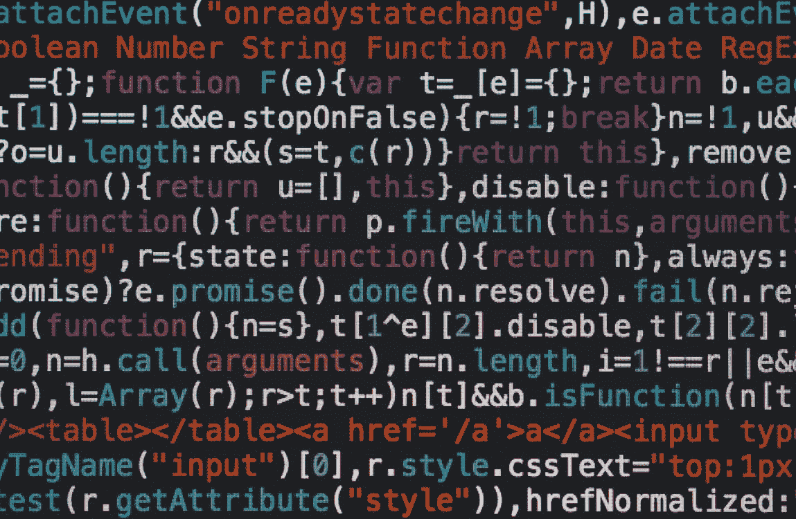

# 计算机编程和精神错乱

> 原文：<https://medium.com/codex/computer-programming-and-insanity-d330d4adfa16?source=collection_archive---------19----------------------->

*免责声明:所有观点都是我自己的*

[照片](https://www.pexels.com/photo/coding-script-965345/)来自 Pexels 的 Markus Spiske

[听播客版本！](https://devblabs.podbean.com/e/software-engineering-and-insanity/)

> 疯狂是一遍又一遍地做同样的事情，却期待不同的结果

我发誓我第一次听到这句话是在迪士尼频道的原创电影中:[天才](https://www.imdb.com/title/tt0193187/?ref_=ttqt_qt_tt)，但是引用部分和一些快速的谷歌搜索既不能证实也不能否认这个事实。