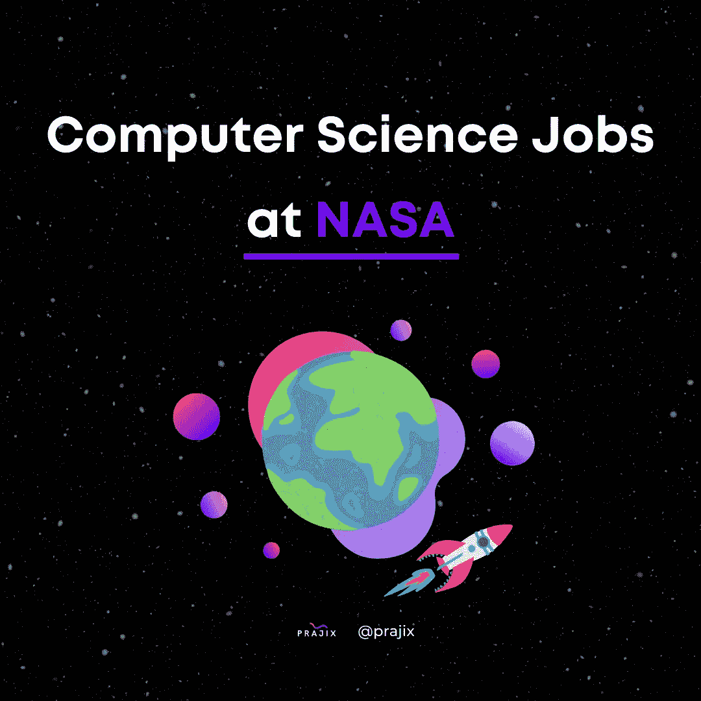

# 美国宇航局的计算机科学工作

> 原文：<https://medium.com/codex/computer-science-jobs-at-nasa-588777bd9f4c?source=collection_archive---------12----------------------->

许多美国和世界各地的孩子梦想成为一名宇航员或为美国国家航空航天局工作，但许多人甚至从未迈出第一步。幸运的是，对于软件程序员和其他与计算机科学相关的领域来说，在美国国家航空航天局可能会有一份职业等着他们。NASA 是 STEM 领域一些最不可思议的头脑的家园，从任务控制专家到航空航天工程师甚至软件开发人员。软件程序员对美国宇航局的运作越来越重要，从地球上检查我们的大气层到探索宇宙最外层空间的职业。一旦你有了足够的经验，这里有几个你渴望得到的专业职位:

# [**软件工程师——入门级**](https://www.linkedin.com/jobs/nasa-programming-jobs?currentJobId=3009000785&position=3&pageNum=0)

从美国国家航空航天局(NASA)起步的软件工程师可以期待以潜在的方式创新计算机系统，从而改变我们的世界以及我们作为居住在宇宙中的人类看待自己存在的方式。在美国宇航局喷气推进实验室(JPL)，你将帮助开发特定任务的软件，为航天器，科学仪器，任务控制系统，科学分析管道和 IT 服务设计和编码安全的软件应用程序。您必须熟悉将算法和模型集成到软件组件中，以记录和分析任务和企业数据。

您知道吗，大多数软件开发人员都实践着一系列特定的习惯，这些习惯让他们在自己选择的职业生涯中成为最好的人。你可以肯定地告诉自己，作为一名软件工程师，在 NASA 工作肯定不是一件容易的事情。我们发现，对于那些希望在职业生涯中提升自己的软件开发人员来说，一个简单的清单，仅仅是 ***5 个习惯*** 就能产生 10 倍的效果。有兴趣知道怎么做吗？[点击此处](/codex/5-habits-of-successful-software-developers-fdd4e65471d4)阅读列表。

# [**数据科学家**](https://www.linkedin.com/jobs/nasa-programming-jobs?currentJobId=3019706499&position=11&pageNum=0)

作为一名数据科学家，你将处于获取 NASA 地球和宇宙发现新信息的最前沿，以帮助你的同事理解科学和天文学的新概念。数据科学家与美国宇航局掌握的最前沿的人工智能和自主系统合作。美国宇航局的人工智能、观测规划和分析小组目前正在寻找一名数据科学家，为航天器自主性、科学数据分析、任务操作自动化和实时决策的机载分析等独特软件应用的基础研究问题做出贡献。

项目包括通信枢纽、太空任务、海上交通工具和空中交通工具的地面和飞行操作的自动化。

# [**飞行软件工程师**](https://www.glassdoor.com/job-listing/embedded-flight-software-engineer-iii-jpl-nasa-JV_IC1146850_KO0,37_KE38,46.htm?jl=1007821741847&pos=101&ao=1283572&s=21&guid=000001809ab298fdaaeb91c1a92504c3&src=GD_JOB_AD&t=ESR&vt=w&cs=1_d5e1438f&cb=1651862837918&jobListingId=1007821741847&jrtk=3-0-1g2db56ef383j001-1g2db56f5pvuc800-a59d405ffce47a9e-&ctt=1651862854109&srs=EI_JOBS)

通常，飞行软件工程师开发和实现控制和监控飞机/航天器的飞行软件。NASA 的飞行软件工程师测试与激光和光学参考腔子系统相互作用的关键控制、遥测和信号处理算法。你将加入一个由硬件、固件、研究电子和光学工程师组成的高技能团队，开发激光测距干涉仪(LRI)性能。

# [**网络安全工程师**](https://www.linkedin.com/jobs/view/cybersecurity-engineer-entry-level-at-nasa-jet-propulsion-laboratory-3010107692)

作为一名网络安全工程师，你将为保护世界上最受尊敬的太空探索机构的安全做出贡献，并保护其免受试图破坏整个网络系统的黑客的攻击。网络安全工程师负责研究和开发计算机科学、软件、硬件工具和技术的新能力，以增强当前和未来网络系统的防御和弹性。该职位与项目管理，项目管理和一系列科学和工程学科合作，了解核心任务目标，以识别和管理最脆弱的风险领域。

# [**软件系统工程师**](https://www.glassdoor.com/job-listing/software-systems-engineer-iii-tms-jpl-nasa-JV_IC1146850_KO0,33_KE34,42.htm?jl=1007691850956&pos=101&ao=1283572&s=21&guid=000001809ac7de9996842e8bbb8d9c0b&src=GD_JOB_AD&t=ESR&vt=w&uido=57050C0D3346406ACB51088FEC368C47&cs=1_df8c7845&cb=1651864232068&jobListingId=1007691850956&jrtk=3-0-1g2dcfo01q0t4801-1g2dcfo11joq9800-3ded9927167df05e-&ctt=1651864258292&srs=EI_JOBS)

软件中的系统工程与传统的软件工程师略有不同。这个学科关注软件工程项目在整个开发生命周期中的整体管理。软件工程师通常关心开发过程的特定阶段。

在 NASA，软件系统工程师应该定义和管理操作概念、需求、体系结构、设计、接口规范和各种变更请求。他们还必须为整个技术团队提供技术领导。

# **结论**

上面列出的职位要求在每个领域都有多年的经验和熟练的技能。明天你可能不会开始为美国国家航空航天局工作，但这些杰出的职业可能会改变世界和我们看待自己在宇宙中的位置的方式。在 Prajix，我们相信在职业抱负方面，一切皆有可能。有了正确的实践、决心和指导，你很可能成为下一个做出突破性宇宙发现的程序员。

**什么是 Prajix？**

对你来说，掌握编码世界的最好方法是把这个世界放在你的指尖。我们的使命是让世界各地的开发者通过在线协作来彻底改变我们希望拥有的未来。

我们允许开发人员在我们的平台上创建或加入项目想法，他们可以在我们的协作室中找到志同道合的个人进行团队合作。

我们正努力将全世界最有价值的程序员、编码员和开发人员的网络集中到一个地方，创建一个技术发电站，帮助全球的个人和社区。

如果你对此感兴趣或者想了解更多，请访问我们的网站:[https://www.prajix.com](https://www.prajix.com)