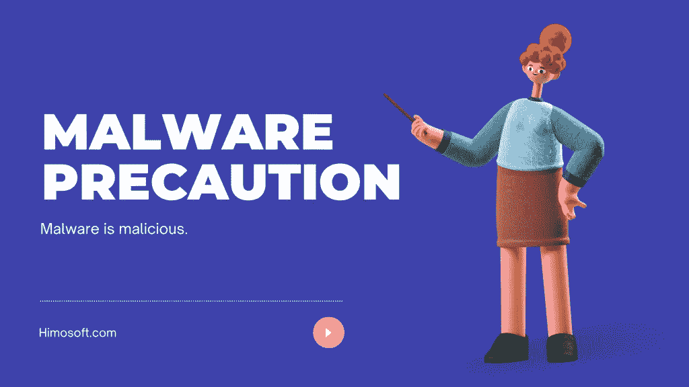
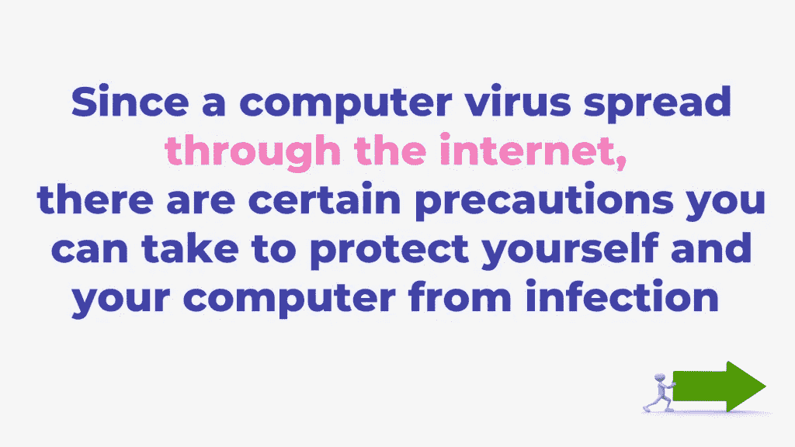
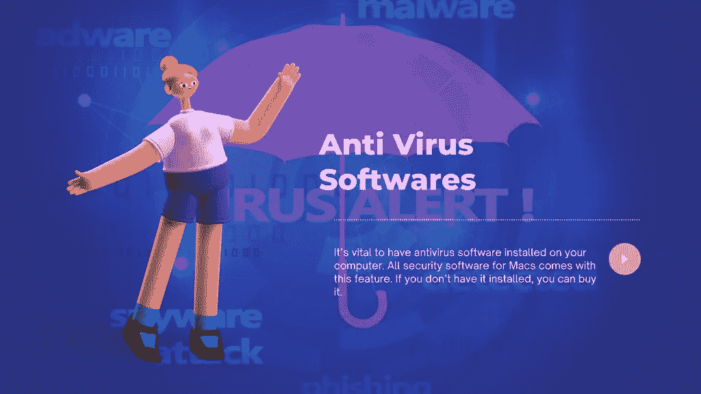
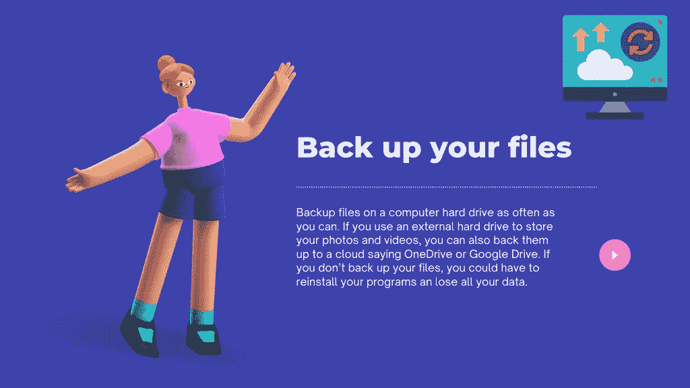
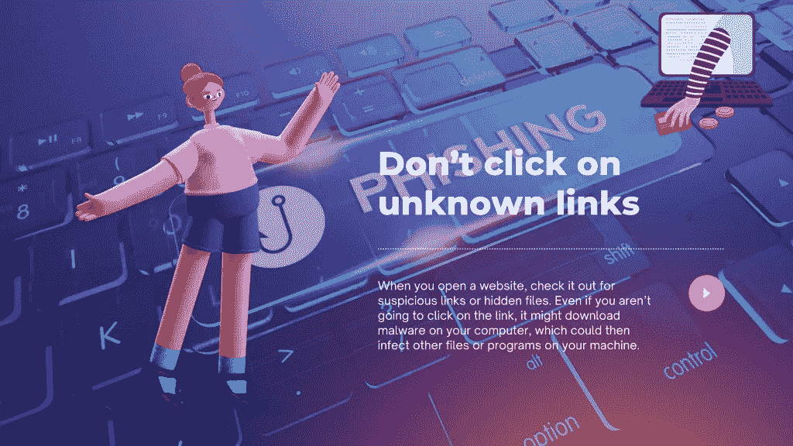
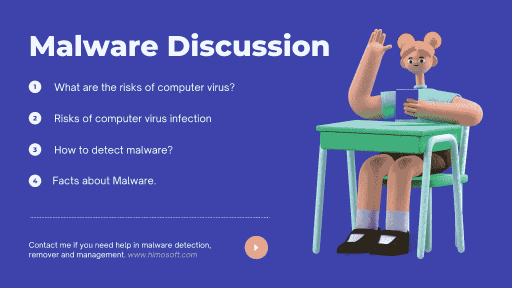
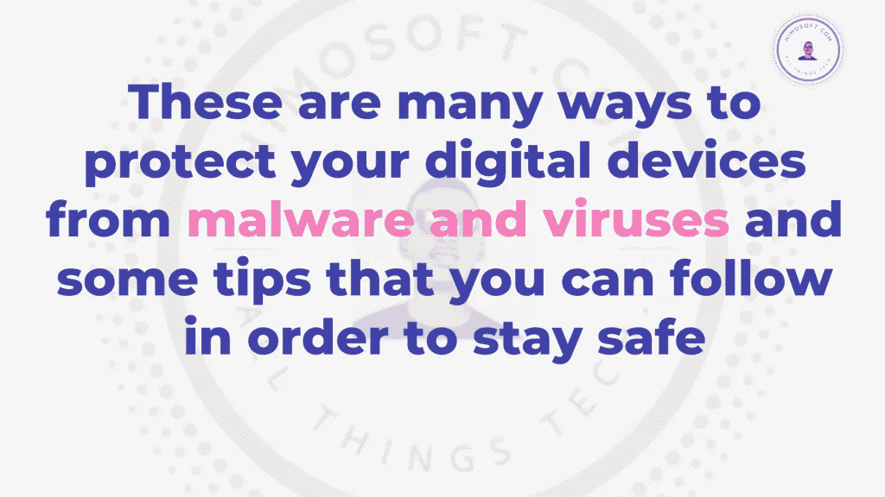
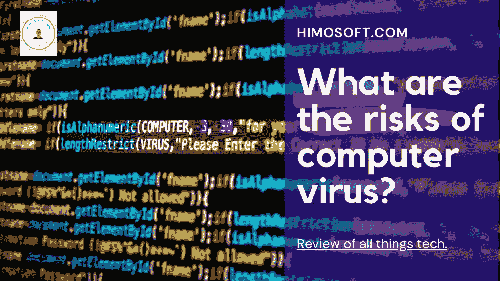
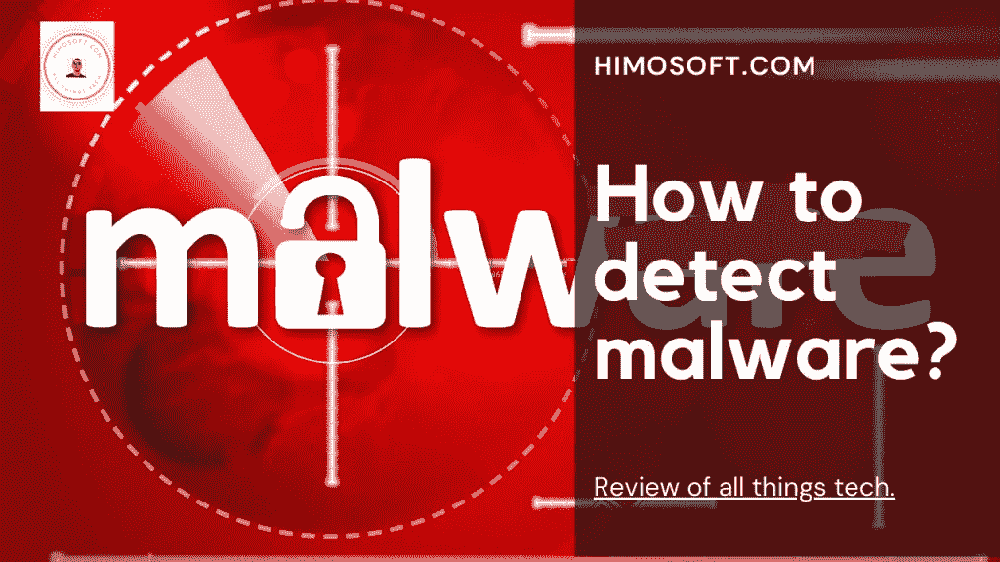
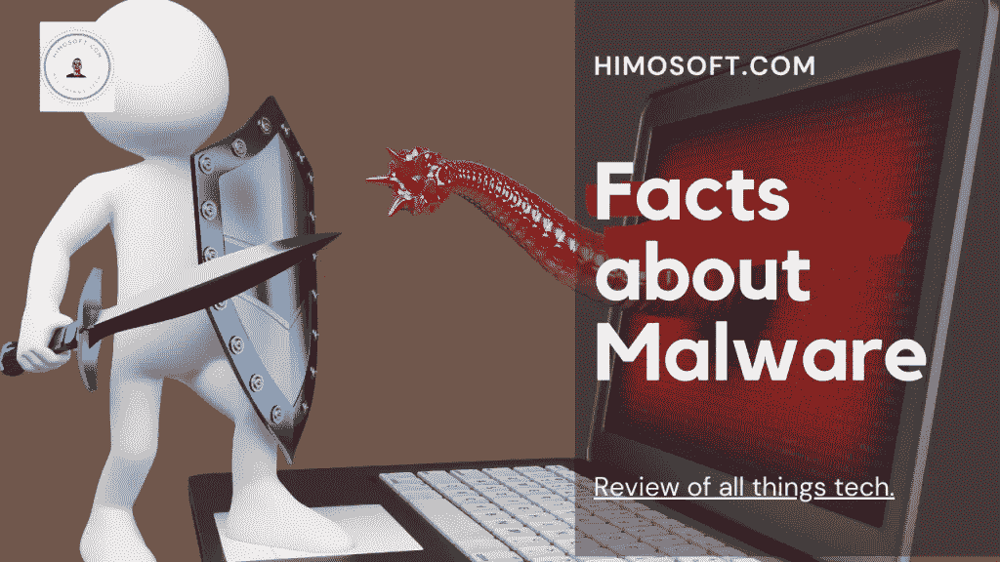

# 计算机病毒和恶意软件:如何保护自己免受其害

> 原文：<https://medium.com/codex/computer-viruses-and-malware-how-to-protect-yourself-from-them-2c60aadaa0eb?source=collection_archive---------22----------------------->

计算机病毒和恶意软件是一种恶意软件，它可以感染你的计算机并做各种坏事，从删除文件到显示讨厌的消息。本文提供了有关什么是恶意软件、病毒和其他类型的恶意软件以及它们如何影响计算机的信息。它还提供了帮助抵御这些网络威胁的提示。

互联网是一个广阔的、尚未开发的领域。这是寻找新信息、与志趣相投的人交流以及网上购物的好方法。互联网也可能是你的电脑最危险的地方之一。恶意软件、病毒、网络钓鱼攻击、身份盗窃——不胜枚举。没有一件是漂亮的。

如何在数字时代保持安全？您可以遵循哪些基本做法来降低病毒或恶意软件的风险？你会在这里找到你所有的答案！

计算机病毒是一种旨在破坏计算机程序或数据库的软件代码。它们还会导致您正在使用的文件或系统变得不可用。

病毒会导致勒索软件，该软件会加密文件，使您无法访问这些文件，直到您向黑客或网络罪犯支付赎金。它们还会导致程序或文件出错，迫使你重启它们。

由于计算机病毒通过互联网传播，您可以采取一些预防措施来保护自己和您的计算机免受感染，例如:

-防病毒软件:在电脑上安装防病毒软件至关重要。所有 MAC 电脑的安全软件都有这个功能。如果没有安装，可以购买。备份文件:尽可能频繁地在电脑硬盘上备份文件。如果你使用外置硬盘存储照片和视频，你也可以将它们备份到云 OneDrive 或 Google Drive。如果你不备份你的文件，你可能不得不重新安装程序并丢失所有数据。

——经常更改密码:确保你的电脑密码不同于你的其他网上账户和 pin 码。此外，更改脸书和推特等社交媒体账户的密码。

——不要点击不明链接:当你打开一个网站时，检查一下是否有可疑链接或隐藏文件。即使你不点击这个链接，它也可能会在你的电脑上下载恶意软件，然后感染你电脑上的其他文件或程序。

## 计算机病毒和恶意软件的风险是什么？

任何计算机病毒在被恶意使用时都会对个人计算机造成损害。通常，病毒只攻击那些不遵循一些软件开发者给出的预防建议的人。

## 计算机病毒和恶意软件感染的风险

病毒可能使系统的许多进程变得无用；这给那些不想失去对存储在他们 PC 中的文件的访问的人带来了很大的问题。

常见的病毒危害不大，但在 PC 间感染和传播的病毒危害很大。为了防止病毒这样做，建议人们使用适当的防病毒软件。

拥有病毒或感染你的电脑会造成伤害。Windows/Linux/Apple 具有使用反病毒和反恶意软件工具的功能，这些工具将检测并删除您的计算机可能感染的任何病毒和有害程序。要使您的电脑免受感染，请在必要时更新其软件。

## 如何检测计算机病毒和恶意软件

任何类型的程序，试图锁定你的电脑，让它做它所说的，被视为恶意软件程序。要确定您是否遇到了与计算机相关的问题，或者您的计算机是否感染了病毒，您可以使用防病毒扫描程序。

同样，反恶意软件工具可以确定您的系统是否感染了恶意软件或病毒。如果你发现你的电脑活动变慢了，那么你的系统就有可能中了病毒。

安全公司依靠基于网络的入侵检测系统(NIDS)等工具来确定计算机和移动设备是否被恶意软件感染。他们可以使用基于签名的程序来捕获避开其他反病毒工具的恶意软件。

也许可以使用自动化工具来扫描大量扫描数据中的异常，但识别与防病毒软件特征不匹配的恶意软件是很棘手的。

NIDS 设备将扫描网络上设备的日志，这有助于检测高比例的新的未知恶意软件。

## 检查您的浏览器扩展和插件是否有任何可疑活动

浏览器扩展本质上是一个免费的在线应用程序，可以帮助你在线完成某些任务。扩展对我们很多人都有好处，比如突出显示文本、添加到网站页面的底部，或者听流式音频或视频。

有些扩展添加了额外的功能，在决定安装哪些扩展时应该谨慎，尤其是当您在多个设备上使用同一个浏览器时。例如，如果你在 Android 手机上安装了一个浏览器扩展，它突然开始在 Windows PC 上工作。

我们都知道黑客想接管我们的在线账户，但是他们也想窥探我们的浏览器吗？曾经，黑客利用易受攻击的应用在智能手机上植入间谍软件，现在，似乎一些善意的网络开发者正在通过发布浏览器扩展和插件来启用这种后门。

这种新策略正被用于收集浏览器信息，如登录历史、搜索查询、浏览历史以及我们使用的语言。这些敏感数据可以与广告商或政府机构共享，然后他们使用这些数据来创建个人在线行为的详细资料。

但是，您可以阻止这些泄漏。您应该定期监控您的浏览器扩展和插件的任何可疑活动。请记住，没有所谓的“安全扩展”

## 关于计算机病毒和恶意软件的事实。

恶意软件是一种程序，它被设计成在未经您允许的情况下执行某些操作。换句话说，恶意软件改变你电脑的设置，诱骗你给它一些时间或金钱。

恶意软件还可以窃取或访问您的个人信息和其他重要细节。

计算机病毒可以通过最常见的方式控制计算机，例如:

*   在线泄露您的计算机信息，窃取您的身份或信用卡信息
*   将有关您系统的信息传输到远程位置(例如以便其他人可以控制您的系统)
*   它还可以阻止计算机正常运行，如果它试图尽一切努力，它有时会使系统过载或损坏系统。

令人震惊的是，大多数病毒和恶意软件通过电子邮件和打开的附件传播。许多人认为 Windows Defender 是一种补救措施，这是一个很难改变的事实。

最常见的病毒是蠕虫。这种病毒能够通过向未被感染的计算机或其他设备发送消息来感染计算机并使其存活。蠕虫通常被称为 rootkits。

一些病毒能够改变计算机设置。病毒是一种设计用来在用户不知情的情况下实施恶意操作的程序。

恶意软件通常在计算机的隐藏区域被发现。这个区域没有标注任何术语来告诉用户它包含什么，但是，有几个指示性的标志。其中包括:

*   出现错误信息或文件无法打开，或者系统性能下降。
*   安装的程序有些可疑。它们与您的电脑或设备附带的不同。
*   它包含类似文件名的内容，其中包含您不认识的单词。

然而，主要的迹象是，你的电脑或设备似乎比平时工作得更慢更长，或者发出奇怪的噪音。

受影响的计算机似乎无法从硬盘启动。受感染的计算机必须脱机，并彻底清理和修复。

一旦你的电脑或设备被清除任何恶意软件，受感染的电脑将正常工作，你将能够访问你的文件没有任何问题。如果您在恶意软件检测、移除和管理方面需要帮助，请联系我。感谢您今天访问 [Himosoft](http://www.himosoft.com) 。为阅读干杯！