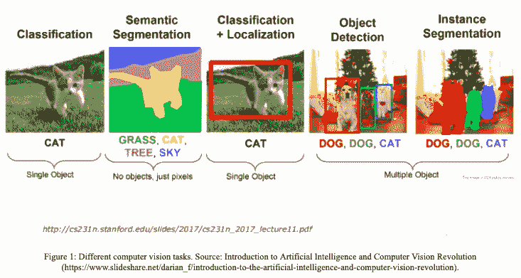

# 计算机视觉

> 原文：<https://medium.com/codex/computer-vision-893fb7f89df0?source=collection_archive---------9----------------------->

来源:Simplilearn

> 到 2022 年，计算机视觉市场预计将超过 486 亿美元，使其成为一项非常有利可图的 UX 技术。

## 什么是计算机视觉？

计算机视觉是计算机科学的一个分支，旨在开发能够像人一样处理、分析和解释图形输入(图像或视频)的信息技术。计算机视觉的概念集中在训练计算机在像素级别上分析和理解图像。

## 计算机视觉是如何工作的？

模式识别是当今计算机视觉算法的基础。我们在大量的视觉数据上训练计算机——计算机分析照片，识别照片上的东西，并在这些图像中寻找模式。例如，如果我们给计算机输入一百万张花的照片，它将分析这些照片，识别所有花的共同趋势，并在阶段后构建一个模型“花”。因此，每当我们给它们输入图像时，计算机就能够正确地判断某个视觉对象是否是一朵花。

简而言之，机器将图片解释为像素的集合，每个像素都有自己的一组颜色值。在图片中，每个像素的亮度都与一个范围从 0(黑色)到 255 的 8 位整数相关联。(白色)。这些是程序在您输入图片时看到的数字。这些信息被发送到计算机视觉算法中，该算法负责进一步的处理和确定。

## 计算机视觉技术:

1.  **图像分类:**系统分析视觉内容，并将照片或剪辑中的实体分配到适当的类别
2.  **目标检测:**在图像中定义目标的任务通常包括输出单个目标的边界框和标签。
3.  **目标跟踪:**在给定场景中跟踪感兴趣的特定目标或多个目标的过程。
4.  语义分割:分割技术是计算机视觉的基础，它将整个图片分割成像素组，这些像素组随后可以被标记和分类。

来源:R 博客

**计算机视觉的应用:**

**汽车:**

特斯拉的自动驾驶功能负责一些最知名的计算机视觉应用。该制造商在 2014 年首次推出了驾驶辅助系统，只有一些功能，如车道居中和自动停车，但它计划到 2018 年实现完全自动驾驶汽车。

**医疗保健:**

Gauss Surgical 正在开发一种实时血液监测器，以解决创伤和手术期间失血测量不正确的问题。该监视器包括一个简单的软件，该软件采用一种算法来分析手术吸收物的图像，以精确估计手术期间释放了多少血液。每年，这项技术可以在不必要的血液治疗中节省大约 100 亿美元。

**农业:**

**一个土壤平台**:他们创造了有助于收集田间数据和监测植物的技术。更重要的是，该技术可能有助于完成定期和耗时的操作，如种植、收获和评估植物生长和健康。

**零售:**

在全国 1000 个站点，沃尔玛正在使用计算机视觉来监控结账欺诈并防止减少。他们已经推出了一个错过扫描检测工具，使用相机来快速检测扫描错误和失败。当发现问题时，系统会通知结帐经理，以便他们可以纠正问题。该计划有助于减少“缩水”，包括盗窃、扫描错误和欺诈。

**制造:**

FANUC 的 ZDT 软件是一个预防性服务程序，从安装在机器人上的相机中收集图片。然后对这些数据进行分析，以帮助排除故障并发现任何可能的问题。

> “人工智能比我们的智能小吗？”—斯派克·琼斯