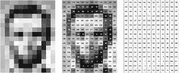
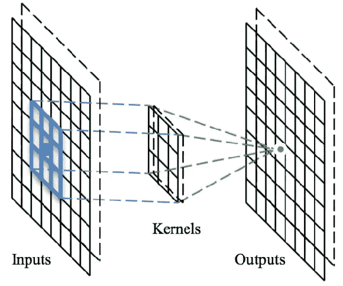
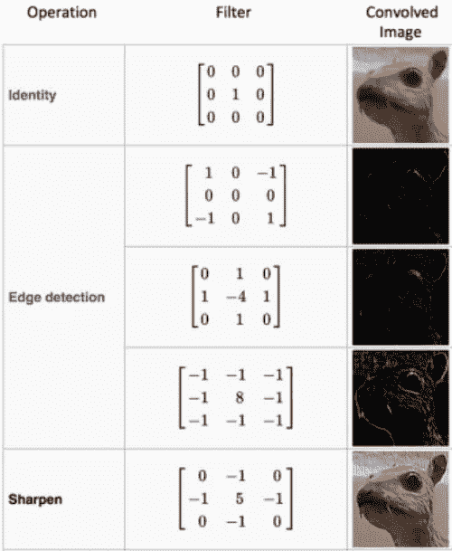
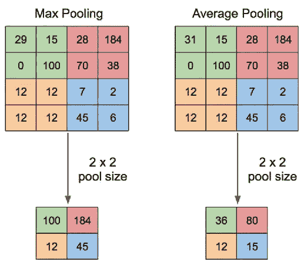
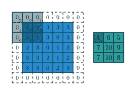
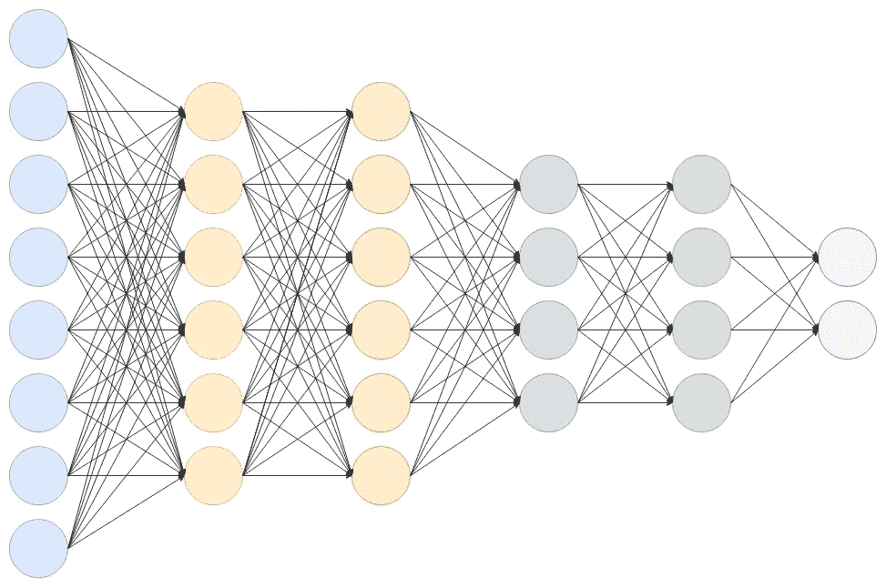
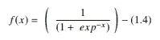
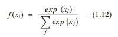
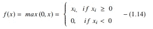

# 计算机视觉-基本积木和一步一步的建模初学者指南。

> 原文：<https://medium.com/codex/computer-vision-basic-building-blocks-and-step-by-step-beginner-guide-for-model-building-c98ce994eca9?source=collection_archive---------5----------------------->

计算机视觉越来越受欢迎！它使计算机能够像人类一样观察、分析和处理图像/视频中的对象。目标检测广泛应用于机器人、文本提取、自动驾驶汽车、盗窃检测、卫星分析等领域。在本文中，我们将重点介绍图像基础知识、卷积神经网络的构建模块以及一步一步的建模方法。

# **图像基础和操作**

像素是数字图像的最小元素。它的取值范围从 0 到 255，其中 0 代表黑色，1 代表白色。

**图 1:像素格式的图像**

图像有不同的通道，如 RGB(红绿蓝)、BGR(蓝绿红)和灰度。图像过滤用于通过锐化、平滑和边缘增强等操作传输图像。一些图像变换技术是旋转，镜像，识别，反射，缩放。

在上面这段代码中，scikit-image 读取并显示在每个 RGB 通道图像中。

# **从图像中提取特征**

这可以通过 SIFT & HOG 方法等开放 CV 技术或卷积来解决。这里我们将重点讨论卷积。

卷积是使用**内核**从图像中提取图层的过程。这个过程类似于**人类** **眼睛的视网膜，**它的意思是视网膜逐层看到 2D 的图像。卷积提供了很好精度，但是计算量很大。

**图 2:卷积运算**

# **内核**

内核是一个矩阵，通过**步长**值和对输入数据的子区域执行点积。它有不同的类型，如身份，边缘检测和锐化，如图 3 所示。

具有不同核的卷积用于图像变换，但是边缘检测核主要用于从图像中提取像边缘这样的高级特征。

**图 3:应用不同类型内核后的卷积图像。**

# **联营**

不是应用多个内核，而是将池应用于模型。它会将输入数据的大小减少一半。

池化不会改变输入的深度，但会影响长度和宽度。

**联营层的好处**:

*   减少过度拟合
*   通过减少模型计算来提高效率。

**汇集层的类型**:

*   **最大汇集:**从特征图的每个区域中选择最大值。
*   **平均池:**计算特征图每个区域中所有元素的平均值。

**图 4:联营**

# **填充**

填充是向输入数据对称添加零的过程，如图 5 所示。例如，如果您正在训练一个自动编码器，自动编码器结果图像的输出大小应该与输入大小相同。在这里，填料开始发挥作用。填充会在输入数据中添加“额外空间”,以避免空间维度的损失。

**图 5:填充**

# **全连接层**

图 6:完全连接的层

> 什么是全连接层？
> 
> 也被称为“前馈神经网络”。全连接层是来自一层的所有输入都连接到下一层的每个激活单元的层。它有三层，**输入层**表示输入向量的维数，**隐含层**取一组加权输入，用激活函数处理输出，**输出层**表示神经网络的输出。

来自最终汇集或卷积层的输出将是全连接层的输入。这些输出被展平，即将其所有值展开成一个向量，然后馈入全连接层。

**激活功能**

激活函数通过计算加权和来决定一个神经元是否应该被激活。它还应用非线性来避免输出图层成为一次多项式的线性函数。

**激活功能的类型**

**1。乙状结肠功能**:

sigmoid 函数用于深度学习模型的输出层，用于预测基于概率的输出。sigmoid 函数表示为:

**2。双曲正切函数:**

Tanh 的范围在-1 到 1 之间，它是一个更平滑的零中心函数。双曲正切函数表示为:

**3。整流线性单元(ReLU)功能:**

这是一个流行的激活功能。与 sigmoid 和 tanh 等其他函数相比，此函数的性能更好。当 z <0, which allows to have an average output closer to 0\. The ReLU function performs a threshold operation on each input element where all values less than zero are set to zero. The ReLU function represented as:

**4 时，ReLU 通过取负值来帮助解决消失梯度问题。SoftMax 功能:**

SoftMax 输出范围在 0 和 1 之间，概率之和等于 1。该函数将在多类分类问题中用作最终层。SoftMax 函数表示如下:

# **卷积神经网络架构**

**图 6:卷积神经网络架构**

> 如何计算 CNN 的输出形状？
> 
> CNN 的输出波形由公式**[(W K+2P)/S]+1**计算。其中 **W=输入大小，K =内核大小，P =填充，S =步距**。

图 6 总结，

*   **卷积层**:给定图像的输入大小为 28*28*1，其中 1 代表图像的通道&应用的内核大小为 5*5。输出大小确定为(28–5)+1 = 24 * 24 * n1(应用 n1 通道)。
*   **池层:**此处使用最大池层。输入大小=24*24*n1(n 通道)，输出大小确定为 24/2=12*12*n1
*   **卷积层**:给定图像的输入尺寸为 12*12*n1(n 通道)&应用的内核尺寸为 5*5。输出大小确定为(12–5)+1 = 8 * 8 * n2(应用 N2 通道)。
*   **池层:**此处使用最大池层。输入大小=8*8*n2(应用 n2 通道)，输出大小确定为 8/2=4*4*n2
*   展平输出(即 4*4*n2)并将其传递给激活函数为 ReLU 的全连接层，并对图像进行分类。

# **用计算机视觉解决问题**

我们从 MNIST 数据集开始。MNIST 数据集是用于图像分类的最常用数据集之一，它包含从美国人口普查局员工和美国高中生收集的 60，000 幅训练图像和 10，000 幅测试图像。TensorFlow 和 Keras 允许我们直接导入和下载 MNIST 数据集。

以下代码显示了如何从 MNIST 数据集导入数据，以及如何将数据混洗、拆分为训练集和测试集。

> 如何安装 TensorFlow？
> 
> ！pip 安装张量流

**图 7**

接下来，可视化来自训练集和测试集的数据。

**图 8**

在将数据输入模型之前，需要对数据进行预处理，如图 9 所示。

*   输入数据需要重新整形，因为模型需要特定格式的输入(数据的数量、高度、宽度、数据通道)。
*   归一化是神经网络中预处理/特征工程的必需步骤，因为我们更喜欢[0，1]范围内的数据。它是通过将数据除以 255 得到的，因为数据的整个范围在[0，1]中。在规范化之前，所有值都需要是浮点数据类型，这样我们就可以在除法运算后得到小数点。

**图 9**

一键编码将类别向量转换为二进制类别矩阵。因为我们处理的是多类分类数据集，所以需要像步骤 8 中那样将标签转换为分类。现在数据已经准备好输入到模型中了。

从模型构建开始，从 keras.model 导入顺序模型，从 keras.layers 导入层，如步骤 9 所示。

**图 10**

*   定义顺序模型
*   添加一个卷积层，其具有 32 个滤波器、3*3 内核大小、作为 ReLU 的激活层以及 28*28*1 的输入大小，其中 1 表示灰度通道。输出形状将是(28–3)+1 = 26 * 26 * 32
*   添加一个最大池层。输出形状将是(26/2) = 13*13*32
*   在构建完全连接的图层之前，向 1D 阵列添加展平 2D 阵列的展平图层。
*   增加密集层，神经元数为 128，激活函数为 ReLU。
*   添加神经元数量为 10(即输出类的数量)且激活函数为 SoftMax 的密集层。最终的密集层应该包含输出类的数量作为神经元的数量。

**图 11**

使用分类交叉熵作为损失函数，度量定义为准确性，Adam 用作优化器来编译模型。

用 x，y，批量大小为 32，时期为 5(即 5 个周期的模型序列)和验证分割为 0.2(即 80:100)来拟合模型

**图 12**

训练和测试准确率都在 95%以上。步骤 13 中显示的预测输出。

**图十三**

# 资源

1.  张量流:[https://pypi.org/project/pyod/](https://www.tensorflow.org/)
2.  TensorFlow keras 模型:[https://www.tensorflow.org/api_docs/python/tf/keras/Model](https://www.tensorflow.org/api_docs/python/tf/keras/Model)
3.  tensor flow keras Layer:[https://www . tensor flow . org/API _ docs/python/TF/keras/layers/Layer](https://www.tensorflow.org/api_docs/python/tf/keras/layers/Layer)
4.  TensorFlow keras 损失:[https://www.tensorflow.org/api_docs/python/tf/keras/losses](https://www.tensorflow.org/api_docs/python/tf/keras/losses)
5.  TensorFlow keras 优化器:[https://www . tensor flow . org/API _ docs/python/TF/keras/optimizer](https://www.tensorflow.org/api_docs/python/tf/keras/optimizers)

我希望听到一些关于我第一部作品的反馈。感谢您的宝贵时间！