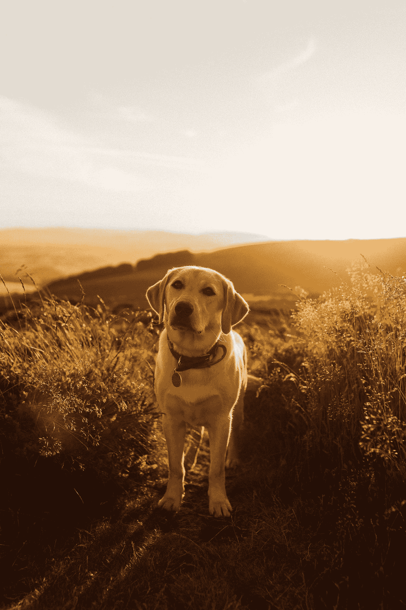
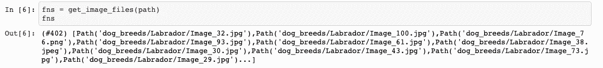
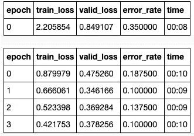
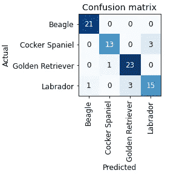
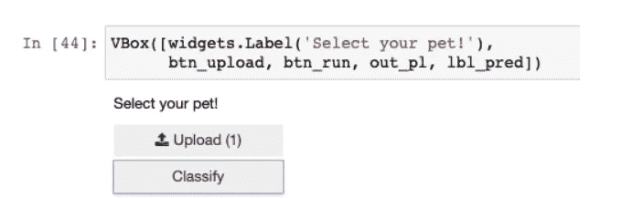

# 计算机视觉:品种检测器

> 原文：<https://medium.com/codex/computer-vision-breed-detector-6994e13cc7f3?source=collection_archive---------12----------------------->

## 使用 fast.ai 对宠物店进行图像分类

这个博客有一个独特的目的，那就是帮助宠物店老板[理论上]使用深度学习/计算机视觉来识别进入他们商店的狗的品种。在这篇文章的最后，由于有了 [fast.ai](https://www.fast.ai) ，人们应该能够毫不费力地建立一个图像分类模型。为了简单起见，这个模型用[兵](https://pypi.org/project/bing-image-downloader/)训练 4 个不同的品种:可卡犬、比格犬、拉布拉多和金毛猎犬。

照片由[塞缪尔·汤普森](https://unsplash.com/@samuelthomps0n?utm_source=medium&utm_medium=referral)在 [Unsplash](https://unsplash.com?utm_source=medium&utm_medium=referral) 拍摄

事不宜迟，让我们直接进入代码。我们需要做的第一件事是导入必要的库，并从 bing 搜索中下载训练图像。我们将使用“bing-image-downloader”来完成这项工作。见下文:

一旦我们运行下载器，我们将有 100 个图像每个品种[限制=100]来训练模型。这可以根据我们希望如何训练模型来增加/减少。我们总共有大约 400 张图片，由于差异，有些图片可能会被过滤掉。为了验证图像是否已经下载到我们的目录中，我们运行下面的代码。

其思想是验证图像是否有效，并取消链接/删除失败的图像。正如你在下面看到的，我们从 bing 下载的图片已经被保存在指定的路径中，属于每个类(品种)的图片都在各自的文件夹结构下(在这个例子中是拉布拉多)。

存储在相应类别文件夹下的图像

## 数据块和数据加载器

一旦我们在指定的路径中有了图像，就该利用数据块 API 了(如下)。我们基本上试图告诉 fastai 四件事来将下载的图像转换为 DataLoaders 对象——识别模型必须处理的数据类型，递归地获取模型的项目列表，标记项目并启动验证集。为此，我们使用数据块 API。

第一个元组“块”由用于进行预测的自变量和作为目标的因变量组成。在我们的例子中，图像是独立变量，品种是目标/类别。第二部分是底层项目集，它将是文件路径。“get_image_files”就是通过递归返回该路径中的图像来做到这一点的。“RandomSplitter”进行训练和验证分割，留下 20%用于验证，并随机种子，确保每次运行时验证集保持不变。至于标记，fastai 使用“parent_label”函数根据父文件夹(品种名称)来标记图像。

由于我们下载的图像可以有不同的大小和形状，我们应用“调整大小”转换来指定图像大小为 128 像素。数据块对象几乎充当了我们的数据加载器的模板。数据加载器由成批的训练集和验证集组成。在上面的例子中，我们正在运行' dls.valid.show_batch(max_n=8，nrows=1)'，所以我们在一行中从验证集中获得 8 个图像。【在[这里](https://github.com/a-walk-in-the-spark/pytorch_computerVision)输出样本，单元格 11。]

## 挤压/填充/微缩图像

未经训练的模型通常不知道图像何时轻微旋转或弯曲，因此有时使用由轻微弯曲、压扁的图像组成的图像数据来训练神经网络可能是有用的。然后是 min_scale，它告诉模型每次需要选择多少图像。这些概念中的大部分，如果不是全部，都是有问题的。例如，挤压的图像可能导致不真实的形状，填充的图像可能导致空的空间，这在计算方面基本上是浪费。此处的[和](https://github.com/a-walk-in-the-spark/pytorch_computerVision)，单元格 12、13、14【使用 unique=False 以不同的形式查看相同的图像】显示了一个示例，以及图像在挤压、填充和使用 min_scale 时的外观:

这给了我们一点关于这些特征如何影响图像形状/大小/质量的直觉。这些都很重要，因为模型需要理解图像组成的基本概念以及图像的表现方式。

## 数据扩充

沿着这些思路，另一个有用的概念是数据扩充。这基本上是在不改变图像含义的情况下，随机改变图像的过程。可以增加数据的一些方法是“旋转”、“翻转”、“亮度变化”等等。我们可以在我们的图像上应用这些增强，看看模型如何从图像本身的不同形式中学习。

我使用了“unique=False ”,所以我的输出返回不同图像的不同放大效果。随意使用“unique=True”来试验在同一张图像上看到不同的放大效果。

## 模特培训

我们现在准备训练我们的图像分类器。我们使用带有“resnet18”参数的学习器来训练模型。我们将模型调整到 4 个时期，并使用混淆矩阵来解释我们预测标签的结果。

模型历元将返回历元编号、训练损失、验证损失、错误率以及每个历元所用的时间。下面显示了一个输出示例，其中包含模型返回的混淆矩阵的快照。

纪元 0–4 结果

4 个标签的混淆矩阵

正如我们从两张快照中看到的，我们的训练损失和错误率在每个时期都下降得相当好，并且混淆矩阵在大多数情况下都成功地准确预测了每个标签。让我们来看看最大的损失(模型做出的一些不正确的预测)。正如我们在单元格 19 中看到的[这里的](https://github.com/a-walk-in-the-spark/pytorch_computerVision)所示，模型在第一幅图像中预测的是“拉布拉多”,而不是“可卡犬”,在第二幅图像中预测的是“金毛猎犬”,而不是“拉布拉多”,尽管第二幅图像也是由一个人组成的，因此它不是最佳的代表性图像。

对于这些不想要的图像，我们可以做一些很酷的事情。我们可以使用一个名为“ImageClassifierCleaner”的 GUI 来清理数据，这让我们可以从不同的集合中清除脏图像(按类别)。我们去看看。

确保只有在使用小工具删除图像时才运行“cleaner.delete”。这里显示的是[的小部件](https://github.com/a-walk-in-the-spark/pytorch_computerVision)。

## 模型推理

我们现在有了一个训练好的模型，可以进行推理了。让我们继续运行一个应用程序，根据上传到小部件的图像对狗的品种进行分类。

应用:品种分类器

我们走吧。我们有自己的应用程序，可以预测一只狗是否属于我们训练模型中的四个品种之一。这个博客很酷的一点是，你可以通过下载不同的图片，将整个模型用于完全不同的目的。例如，一个有趣的用例可能是下载健康皮肤与不健康皮肤的图像，并让模型根据这些数据进行训练。还有其他各种各样的例子可以让你自己做一些很酷的事情，所以亲自尝试一下吧。你可以在这里找到 GitHub 回购。