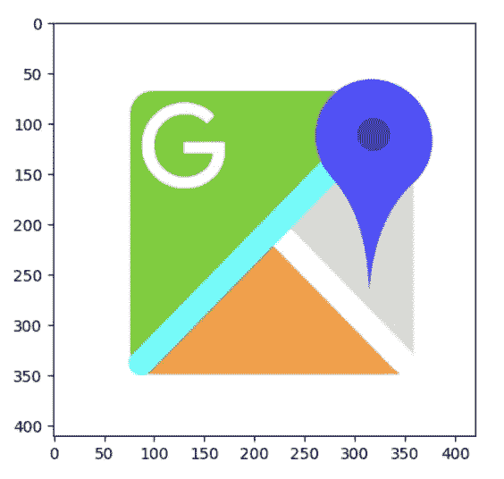

# 计算机视觉🤖OpenCV 基础知识📒

> 原文：<https://medium.com/codex/computer-vision-fundamentals-with-opencv-9fc93b61e3e8?source=collection_archive---------3----------------------->


图片由 [Placidplace](https://pixabay.com/users/placidplace-25572496/) 来自 [Pixabay](https://pixabay.com/)

# 什么是计算机视觉？

人类是天生的视觉动物。我们看，我们听，我们学。 ***计算机视觉*** 是受人类视觉系统启发的 ***人工智能*** 的子集，它使计算机能够模仿人类视觉系统从数字图像、视频和其他视觉输入中获取有意义的信息，并根据这些信息采取行动或提出建议。如果说 AI 使计算机能够思考，那么计算机视觉则使它们能够看到、观察和理解。计算机视觉使用图像处理将图像与预先存在的图像数据库进行比较，然后使用该信息推断图像中的内容。

计算机视觉可用于多种目的，包括**但不限于**:

> - **识别图像中的物体。**
> 
> **-检测图像中的特定颜色或图案。**
> 
> **-识别图像中的人、动物或物体。**
> 
> **-检测物体是运动还是静止等。**

# 计算机视觉是如何工作的？

计算机视觉技术倾向于模仿人脑的工作方式。但是我们的大脑是如何解决视觉物体识别的呢？一个流行的假设是，我们的大脑依靠模式来解码单个物体。这个概念被用来创建计算机视觉系统。

我们今天使用的计算机视觉算法是基于模式识别的。我们在大量的视觉数据上训练计算机——计算机处理图像，在图像上标记对象，并在这些对象中找到模式。例如，如果我们发送一百万幅花的图像，计算机将分析它们，识别与所有花相似的图案，并在这个过程结束时，创建一个模型“花”因此，每当我们向计算机发送图片时，计算机将能够准确地检测出特定图像是否是花朵。

今天，我们不缺乏计算机能力。云计算，配合强大的算法，可以帮助我们解决甚至是最复杂的问题。但推动计算机视觉技术向前发展的不仅仅是配有复杂算法的新硬件(我们将在下一节回顾它们)；我们每天生成的令人印象深刻的大量公开可用的视觉数据是这项技术最近发展的原因。据福布斯报道，用户每天在网上分享超过 30 亿张图片，这些数据被用来训练计算机视觉系统。

# 图像基础

## 什么是像素？

像素又名图片元素(pix =图片，el =元素)是图像的原子元素。像素组合在一起形成完整的图像、视频、文本或计算机显示器上的任何可见事物。

在任何显示屏上，一个像素都由一个点或正方形来表示。每个图像是一个矩阵/网格，网格中的每个方块包含一个像素。

## 什么是图像？

图像表示为像素网格(图像是 3D 场景的 2D 投影)。它是图像平面中两个坐标的连续函数；通常表示为(I，j)或(列/宽，行/高)或有些容易混淆的(y，x)。

假设一幅图像的分辨率为 100 x 200，这意味着我们的图像被表示为像素网格，具有 100 行和 200 列，宽度被表示为列数，行数表示图像的高度。总的来说，我们的图像中有 100 x 200 = 30，000 个像素。


犹他大学[的二进制像素艺术](http://www.math.utah.edu/)

任一点的像素值对应于撞击该点的光子强度。每个像素都有一个唯一的逻辑地址，大小为八位或更多，这取决于颜色系统的灰度或颜色。在灰度图像中，每个像素的值在 0 到 255 之间，其中 0 对应“黑色”，255 对应“白色”。0 到 255 之间的值是不同的灰度，越接近 0 的值越暗，越接近 255 的值越亮。


作者图片—使用 Streamlit 制作

## 色彩空间的类型

对于彩色图像，像素是一组代表各个颜色通道强度的数字。常见的颜色表示有 **RGB(红、绿、蓝)、HSL** ( **色相、饱和度、明度**)、 **HSV** ( **色相、饱和度、明度)** a.k.a **HSB(色相、饱和度、明度**)。


不同颜色的型号。来源:[维基媒体](https://commons.wikimedia.org/wiki/File:Color_solid_comparison_hsl_hsv_rgb_cone_sphere_cube_cylinder.png)

这三种颜色中的每一种都由 0 到 255 范围内的整数表示，这表示颜色的“多少”。


RGB 色域。来源:[维基百科](https://en.wikipedia.org/wiki/HSL_and_HSV#To_RGB)

根据颜色系统，可以分配不同数量的字节来指定像素的每个颜色分量。例如，在 8 位颜色系统中，每个像素仅分配一个字节，将调色板限制为仅 256 种颜色。在用于几乎所有 PC 显示器和智能手机显示器的常见 24 位颜色系统中，分配了三个字节，每个字节用于 RGB 标度的一种颜色，导致总共 16，777，216 种颜色变化。

然后，我们将这些值组合成一个 RGB 元组(红色、绿色和蓝色)，这个元组代表我们的颜色。例如，为了构造一个白色，我们将完全填满红色、绿色和蓝色的桶，就像这样:(255，255，255)。我们可以通过将其他颜色通道的值设置为 0 来隔离每个颜色通道。


作者图片

滑块控制每个颜色分量的饱和度，范围从 0(无)到 255(完全饱和)。每个参数(红色、绿色和蓝色)用一个在`0`和`255`之间的值定义颜色的强度。这意味着有`256 x 256 x 256 = 16777216`种可能的颜色！


作者图片

现在我们已经有了一个基础，所以让我们开始学习 OpenCV 基础知识。

# OpenCV 是什么？

OpenCV(开源计算机视觉库)是一个开源的计算机视觉和机器学习软件库。该库拥有超过 2500 种优化算法，包括一套全面的经典和最先进的计算机视觉和机器学习算法。

OpenCV 原生是用 C++编写的，但它有 Python、Java 和 MATLAB 接口，并支持 Windows、Linux、Android 和 Mac OS。OpenCV 的主要目标是实时图像处理。

## 安装 OpenCV

## 加载库并读取图像



不，你不是色盲！！！

图像已经被 openCV 正确地加载为 NumPy 数组，但是每个像素的颜色已经被排序为 ***BGR，而不是 RGB*** 。这是因为当 OpenCV 在许多年前首次开发时，标准是 BGR 指令。多年来，标准现在已经变成了 RGB，但是 OpenCV 仍然保持着这种 ***【传统】*** BGR 顺序，以确保现有代码不会被破坏。

好吧，好吧，好吧，我知道这是令人困惑的，所以没有进一步的麻烦，让我们玩像素来可视化和理解。

## 改变色彩空间，裁剪图像的感兴趣区域

图像矩阵的大小= 411*420，图像有许多白色边框，在所有三个通道中的值都是 255。因此，我们需要裁剪图像，或者从技术上对图像进行切片，以获得我们的 ROI(感兴趣区域)。由于每个图像都是一个 NumPy 数组，因此我们可以利用 NumPy 数组切片来裁剪图像。


NumPy 索引和切片:[来源](http://scipy-lectures.org/intro/numpy/array_object.html)

首先，我们需要记住

1.  ***高度*** 是*行的**数。***
2.  ***宽度*** 是*列的**号。***

屏幕分辨率通常表示为**(水平像素/宽度)x(垂直像素/高度)**。比如 **1920x1080** 又名 **FHD** ，最常见的桌面屏幕分辨率，是指屏幕水平显示 1920 像素，垂直显示 1080 像素。

在 OpenCV 中，当我们运行 ***image.shape*** 时，它会返回数组维数的元组，通常是单通道的 ***行 x 列*** ，即 ***高 x 宽。***

所以对于切片图像来说:

> **img[height _ start:height _ stop，width _ start:width _ stop]= img[x1:x2，y1:y2]= img[rows _ start:rows _ stop，column_start : colmn_stop]**


Numpy 数组的形状:[来源](https://www.freecodecamp.org/news/exploratory-data-analysis-with-numpy-pandas-matplotlib-seaborn/)

在 OpenCV 中，`**cv2.cvtColor()**`方法用于将图像从一个颜色空间转换到另一个颜色空间。根据使用情况，OpenCV 中有许多可用的颜色空间转换方法。这里我们需要从 BGR 转换到 RGB，我们将看到像素如何在数组中交换它们的位置。

让我们对图像中除白色像素外的部分进行切片。请注意，坐标系从左上角开始，到底部—高度，右—宽度。

```
**gmap[100:300, 76:350]**
```


z

为了将图像从 BGR 的 ***转换成 RGB 的*** ，我们需要运行以下程序

```
**rgb_gmap = cv2.cvtColor(gmap, cv2.COLOR_BGR2RGB)**
```

让我们将图像中除白色像素之外的部分切片，比较像素的交换。

```
**plt.imshow(gmap[100:300, 76:350])****plt.imshow(rgb_gmap[100:300, 76:350])**
```


BGR(左)，RGB(右)

现在看一下阵列本身，这里发生了什么

> 毕竟，数字从来不会说谎:它们只是根据出纳员的数学来讲述不同的故事—路易斯·阿尔贝托·乌雷亚，《魔鬼高速公路:一个真实的故事》

```
**gmap[100:300, 76:350]** >> array([[[238, 244, 230],
           [155, 218,  92],
           [105, 204,  10], 
           ...,
           [217, 217, 217],
           [217, 217, 217],
           [217, 217, 217]]], dtype=uint8)**rgb_gmap[100:300, 76:350]** >> array([[[230, 244, 238],
           [ 92, 218, 155],
           [ 10, 204, 105], 
           ...,
           [217, 217, 217],
           [217, 217, 217],
           [217, 217, 217]]], dtype=uint8)
```

它在矩阵中清晰可见。第三列和第一列交换它们在数组中的值，R← →B

## 旋转图像

OpenCv 中的图像旋转是使用方法`**getRotationMatrix2D().**` 完成的，它需要三个参数:

```
**1\. Center of the image (To act as a pivot).****2\. The angle of rotation in degrees. +ve for anti-clockwise, -ve for clockwise.****3\. An isotropic scale factor which scales the image up or down according to the value provided.**
```

然后，我们使用上一步中的旋转矩阵，对图像应用`**warpAffine()**`函数。[阅读更多](https://docs.opencv.org/3.4/d4/d61/tutorial_warp_affine.html)。让我们把它应用到我们的图像中。


旋转图像

## 调整 B **对和对比度**

现在我们知道，当我们在 RGB/灰度色彩空间中接近 255 时，光的强度会更高。为了增加亮度，直观上我们只需要在每个通道中加入常量值，使其接近 255。**但是，如果我们检查一个亮度为 *250* 的像素，并尝试给它加上 25，会发生什么呢？**

在正常的算术规则下，我们最终得到的值是 *275* 。然而，由于我们将 RGB 图像表示为 8 位无符号整数，该整数只能取范围*【0，255】*内的值， **275 是*而不是*有效值。那么接下来呢？**好消息是 **OpenCV 将执行裁剪并确保像素值不会超出范围*【0，255】****又名* ***图像算法*。**

```
**x = np.uint8([250])
y = np.uint8([25])
print(cv2.add(x,y) ) # 250+25 = 275 => 255
>>** [[255]]**x = np.uint8([250])
y = np.uint8([255])
print( cv2.subtract(x, y) ) # 250–255 = -5 => 0
>>** [[0]]
```

让我们继续增加亮度:

```
**brighter = np.ones(rgb_gmap.shape, dtype = “uint8”) * 100** 
# 100 --> can be any value 0-255
**plt.imshow(cv2.add(rgb_gmap, brighter))**
```


增亮图像

实际上，由于每个通道的像素强度增加了 100，图像看起来更“褪色”，比原始图像亮得多。在减法运算中会出现它的对映体。

```
**lighter = np.ones(rgb_gmap.shape, dtype = “uint8”)*100** # 100 --> can be any value 0-255
**plt.imshow(cv2.subtract(rgb_gmap, lighter))**
```


暗图像

恭喜你！！！现在我们知道了 CV 和图像的基本原理。下一步是使用 OpenCV 执行图像处理，我将在下一篇博客中分享。

我会试着提出更多机器学习/数据科学的概念，并试着把听起来花哨的术语和概念分解成更简单的。

我希望你喜欢这篇文章！你可以**关注我** [Afaque Umer](https://medium.com/u/430bc504f9d9?source=post_page-----ffbeb5f76a92--------------------------------) 获取**更多**这样的文章。

感谢阅读🙏继续学习🧠继续分享🤝保持敬畏🤘