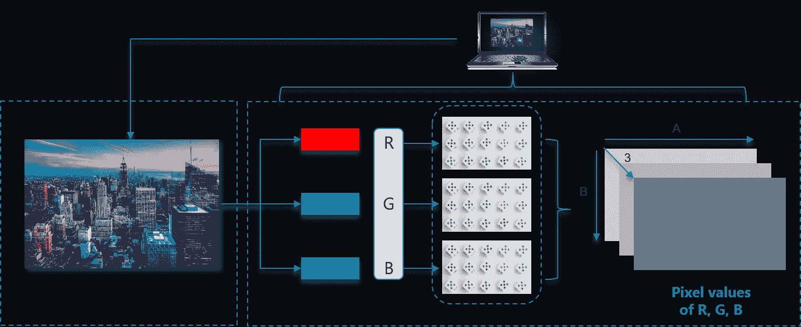
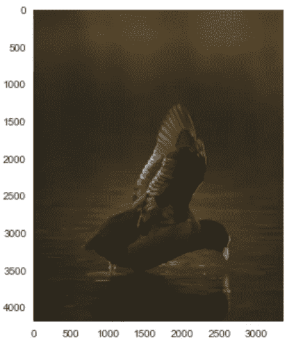
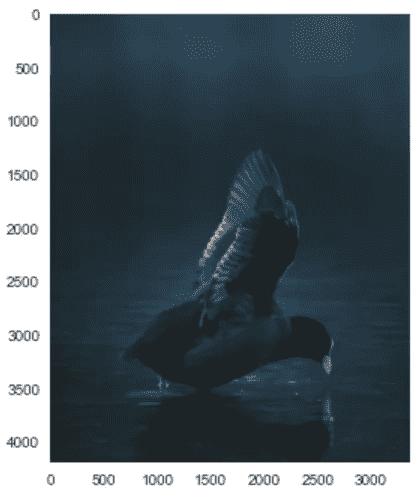

# 计算机视觉:OpenCV

> 原文：<https://medium.com/codex/computer-vision-opencv-c871fc8a840a?source=collection_archive---------3----------------------->


雅利安·迪曼在 [Unsplash](https://unsplash.com?utm_source=medium&utm_medium=referral) 上拍摄的照片

你有没有想过 Instagram 或脸书是如何帮助我们标记人的？它如何识别不同的人？所以，这个自动标记功能在计算机视觉上起作用。

简单地说，计算机视觉帮助我们像人类一样识别物体！！

**但是计算机真的能读取图像吗？**

其实答案是否定的！

对于彩色图像，有三个通道——红色、绿色和蓝色。每种颜色都有一个矩阵，我们看到的图像是这些通道的组合。在黑白图像的情况下，只有一个具有特定长度和高度的通道。



# OpenCV

OpenCV 是一个 python 库，用于 Python 中的图像和视频处理。它被用于许多实时应用中。

## 安装 OpenCV

```
pip install opencv
```

## **导入 OpenCV**

```
import cv2
```

读取图像

```
img = cv2.imread(‘simon.jpg’)
```

我们可以从 BGR 转换到 RGB 或任何其他颜色模式

```
new_img = cv2.cvtColor(img,cv2.COLOR_BGR2RGB)
```

现在让我们看看我们的形象是什么样的！

```
plt.imshow(img)
plt.grid(False)
plt.show()
```



```
plt.imshow(new_img)
plt.grid(False)
plt.show()
```



下面的代码启动一个有两帧的摄像机，一帧是彩色的，另一帧是黑白的。

当您按下“q”时，您的程序将停止执行！

```
import cv2cap = cv2.VideoCapture(0)while(True):
    ret,frame = cap.read()
    gray_frame = cv2.cvtColor(frame,cv2.COLOR_BGR2GRAY)
    if ret==False:
        continue

    cv2.imshow("Video Frame",frame)
    cv2.imshow("Black White",gray_frame)
    # Wait For user input
    key_pressed = cv2.waitKey(1) & 0xFF

    if(key_pressed == ord('q')):
        break
cap.release()
cv2.destroyAllWindows()
```

以下代码使用了 haar cascade 预写算法。

它编写了一个 Python 脚本，可以从你的网络摄像头视频流中捕捉图像。然后从图像帧中提取所有人脸(使用 haar 级联)
最后将人脸信息存储到 numpy 数组中。

```
import cv2
import numpy as np#Init Camera
cap = cv2.VideoCapture(0)# Face Detection
face_cascade = cv2.CascadeClassifier("haarcascade_frontalface_alt.xml")skip = 0
face_data = []
dataset_path = './data/'
file_name = input("Enter the name of the person : ")
while True:
 ret,frame = cap.read()if ret==False:
  continuegray_frame = cv2.cvtColor(frame,cv2.COLOR_BGR2GRAY)faces = face_cascade.detectMultiScale(frame,1.3,5)
 if len(faces)==0:
  continue

 faces = sorted(faces,key=lambda f:f[2]*f[3])# Pick the last face (because it is the largest face acc to area(f[2]*f[3]))
 for face in faces[-1:]:
  x,y,w,h = face
  cv2.rectangle(frame,(x,y),(x+w,y+h),(0,255,255),2)#Extract (Crop out the required face) : Region of Interest
  offset = 10
  face_section = frame[y-offset:y+h+offset,x-offset:x+w+offset]
  face_section = cv2.resize(face_section,(100,100))skip += 1
  if skip%10==0:
   face_data.append(face_section)
   print(len(face_data))cv2.imshow("Frame",frame)
 cv2.imshow("Face Section",face_section)key_pressed = cv2.waitKey(1) & 0xFF
 if key_pressed == ord('q'):
  break# Convert our face list array into a numpy array
face_data = np.asarray(face_data)
face_data = face_data.reshape((face_data.shape[0],-1))
print(face_data.shape)# Save this data into file system
np.save(dataset_path+file_name+'.npy',face_data)
print("Data Successfully save at "+dataset_path+file_name+'.npy')cap.release()
cv2.destroyAllWindows()
```

1.读取和显示视频流，捕捉图像
2。检测人脸并显示包围盒(haar cascade)
3。展平最大的面部图像(灰度)并保存在 numpy 数组
4 中。对多人重复上述操作，以生成训练数据

现在，使用这些数据，我们可以使用 KNN 算法来识别人！！

感谢阅读…