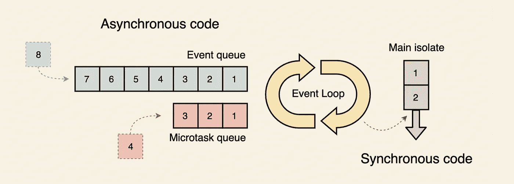

# Dart 中的并发性—第一部分

> 原文：<https://medium.com/codex/concurrency-in-dart-part-i-d20bf5fcb250?source=collection_archive---------9----------------------->

dart 和一般情况下的并发性介绍。

如果您来自并行进程或线程语言的世界，如 Java/C++/Kotlin 等，那么在开始时，您可能很难理解 JS/Dart 单线程方法。您可能听说过 Javascript 和 Dart 是单线程的，让我们深入研究一下这种方法。我将帮助您很好地理解这里的基本概念。

## 并行和并发

当多个任务在一台机器的多个内核上执行时，这被称为并行。这可以通过操作系统上的线程或进程来完成。

另一方面，并发指的是任务在单核上轮流执行的情况。这就像一个人从人群队列中接受命令一样。

要点:

1.  在 Dart 这样的单线程环境中，异步任务之间不会发生争用情况，因为在任何时间点都只有一个任务在运行。
2.  在只需要输入一次异步函数而其他函数必须等待上一次调用完成的地方，您仍然需要一种方法来强制序列化。我们将在后面用一个[例子](https://tarunengineer.medium.com/concurrency-in-dart-part-iii-2086329d82a2)来讨论这个问题。
3.  在并行的情况下，多个线程可以同时访问内存，为了管理竞争情况，我们必须使用像互斥这样的系统来加强指令的原子性。
4.  Dart 有一种通过隔离创建线程的方法，但它们不与其他隔离共享内存，只能通过消息传递进行通信。

## 同步与异步代码

同步意味着以逐步的方式执行代码。在异步执行中是无序的，这里某些任务被重新安排在将来运行。如果你在下面的例子中看到，在异步的情况下输出的实际顺序不同于书写的顺序。

镖靶:【https://dartpad.dev/?id=b4bcb85f09ec9c2252f819757f36e860 

输出:

```
First
Second
third
```

镖靶:【https://dartpad.dev/?id=36bed4d762b48673310d901d2a872485 

输出

```
Third
Second
First
```

## 事件循环

在 dart 中，单线程运行在所谓的**隔离**中。dart 本身使用的分离株被称为**主分离株**。它有自己分配的内存区域，任何其他 dart 隔离都无法访问该内存。Dart 使用一个**事件循环**来执行之前被推迟的任务。dart 有两个队列:一个**微任务队列**和一个**事件队列**。微任务队列主要由 Dart 内部使用。事件队列用于事件，如用户触摸屏、击键、来自数据库、文件或远程服务器的数据等。



*   主隔离中的同步任务总是立即运行。你不能打断他们。
*   如果任何长期运行的任务需要推迟，Dart 会将它们放入事件队列中。
*   一旦同步任务完成，事件循环就检查微任务队列中的任务，并将它们放在主隔离上执行。这是连续的，直到微任务队列为空。
*   如果微任务队列和同步任务队列为空，则事件循环开始从事件队列中选取任务。
*   如果有任何新任务进入微任务队列，那么事件循环在从事件队列中选取任何进一步的任务之前先选取它们。
*   这个过程一直持续到所有队列都为空。

## 在我们结束第一部分之前，有一点很重要

虽然 dart 是单线程的，但这并不意味着您不能让任务在另一个线程上运行。

1.  一个例子是，当我们请求读取一个文件时，该工作实际上在系统中自己的进程上发生，一旦该工作完成，它就通过事件队列将结果传递回 dart。来自 *dart: io* 库的很多 dart I/O 工作都是这样进行的。
2.  在其他线程上执行工作的另一种方法是创建一个新的 Dart 隔离。不同的隔离可以通过消息传递相互交谈。内部隔离是通过操作系统方法(如线程和进程)实现的，但内部实现细节对应用程序程序员是隐藏的。

进一步阅读:

1.  [*Dart 中的并发:第二部分*](https://tarunengineer.medium.com/concurrency-in-dart-part-ii-e67ec0f110c4)
2.  [*Dart 中的并发:第三部分*](https://tarunengineer.medium.com/concurrency-in-dart-part-iii-2086329d82a2)