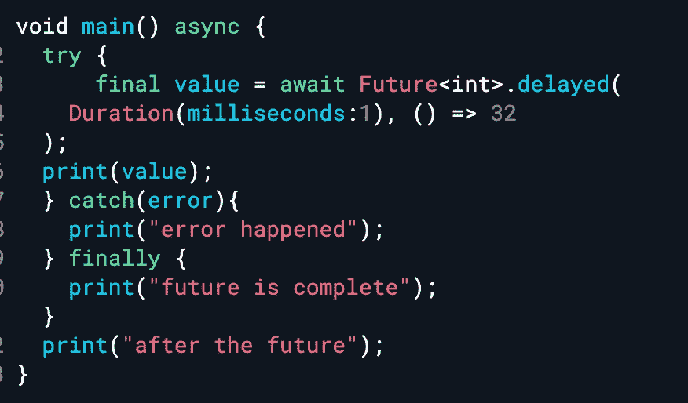

# Dart 中的并发性—第二部分

> 原文：<https://medium.com/codex/concurrency-in-dart-part-ii-e67ec0f110c4?source=collection_archive---------12----------------------->

dart 中的异步、未来、等待和完成。



# 将来的

Dart 有一个 Future 类型，它是一个稍后返回某个特定类型的值的承诺。

```
Future<int> countTheStars();
```

Future 本身是通用的，可以提供任何类型。如果你调用这个函数，那么它会立即返回一个*Future<int>。这个未来可以被倾听或等待。在后台，它将调用 ISRO/美国宇航局的 HTTP APIs(如果这些可用的话)，并返回几个星或错误(由于一些问题)。假设你在听未来，因此结果会传递给你。*

一旦数星机从美国宇航局/ISRO 返回，它就会来到 Dart 并告诉它把它放回**事件队列**。正如我们所知，**事件循环**处理事件队列中的任务，最终，一旦从事件队列中挑选出结果，将会通知将来收听结果的人。

**未来可以是这些状态中的任何一种**

1.  未完成。
2.  用一个值完成。
3.  已完成，但有错误。

例如:

```
final myFuture = Future<int>.delayed(
  Duration(milliseconds:1),
  () => 42,
);
```

**Future.delayed** 是一个返回未来值的函数。它接受一个 **Duration** 对象和一个返回值的函数(基于未来类型，这里是 int)。Dart 在 duration 对象提到的持续时间之后运行这个函数。

# 从未来中获取价值

如果你试着打印我的未来，你会得到这个结果:

```
print(myFuture)
**Result:** Instance of 'Future<int>'
```

## 通过回调获得结果

有三个回调:**然后是**、 **catchError** 和 **whenComplete** 。

[https://dartpad.dartlang.org/?id = 0846789 ef 19 a 19 ca 6037 ab 52046 e 0010](https://dartpad.dartlang.org/?id=0846789ef19a19ca6037ab52046e0010)

```
**Output**
After the future
32
Future completed
```

如果你读了最后一篇[文章](https://tarunengineer.medium.com/concurrency-in-dart-part-i-d20bf5fcb250)，你就会知道为什么这是打印声明的顺序。print()是同步函数， **Future.delayed** 是异步函数。

> 这里要注意的有趣的事情是，即使持续时间是 0 毫秒，未来的代码也将被推到事件队列中，同步代码将首先运行。

## 用 async-await 获取结果

回调很容易理解，但是很难阅读和实现。我相信我们的大脑顺序思考会更好。同样，如果你嵌套它们，那就更困难了。只要在谷歌搜索一下**回拨地狱**你就会得到答案。

[https://dartpad.dartlang.org/?id = 9d 3966358 DDC 76 E8 b 8c 5379 B1 ba 6 f 242](https://dartpad.dartlang.org/?id=9d3966358ddc76e8b8c5379b1ba6f242)

**wait**在 then & catchError 之上充当语法糖。在这里，整个异步功能被视为未来的**。任何使用 await 的函数必须是一个**异步**函数。当您正在等待的被调用的 future 函数完成时，它会告诉 dart 将它放回事件队列，然后像前面一样被选取。每次等待调用时都会发生这种情况。使用 try-catch，您可以看到如何捕捉错误以及了解未来何时完成。**

**在这里，由于 await 使流在逻辑上同步，因此“在未来之后”仅在未来完成之后打印。**

```
**Output**
32
future is complete
after the future
```

# **完成者**

**好了，现在你明白了未来和异步等待。现在，您正在为 rest APIs 使用一个 HTTP 库，它完全基于回调(非未来的 dart API ),并且您希望向您的消费者呈现一个 Dart facade。在这种情况下，**完成者**前来救援。**

**在第 4 行中，我们创建了一个**完成符**，它在完成时返回一个字符串。Completer 有一个 future 属性，它有一个 Future 类型，你通常可以使用上面讨论的不同方法从中获取一个值。如果你看到 getHttpData 接收两个匿名函数:onComplete 和 onError。在这些匿名函数中，我们可以使用我们的完成器实例来完成它，未来的侦听器将根据 HTTP 库的结果接收值或错误。**

****进一步阅读:****

1.  **[*Dart 中的并发:Part — I.*](https://tarunengineer.medium.com/concurrency-in-dart-part-i-d20bf5fcb250)**
2.  **[*Dart 中的并发:第三部。*](https://tarunengineer.medium.com/concurrency-in-dart-part-iii-2086329d82a2)**