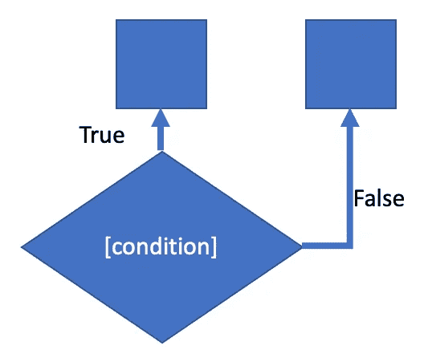

# Python 中的条件语句

> 原文：<https://medium.com/codex/conditional-statements-in-python-c10ece3ef84?source=collection_archive---------5----------------------->

python 条件语句，或称 *if 语句*的目的是根据某个条件是真还是假来帮助指导程序的行为。举一个真实世界的例子，假设是晚上 7 点，我们正在决定是否需要为考试而学习。如果我们需要学习，我们就会打开抽认卡应用程序，开始制作抽认卡！否则，如果我们不需要学习，我们会去做…