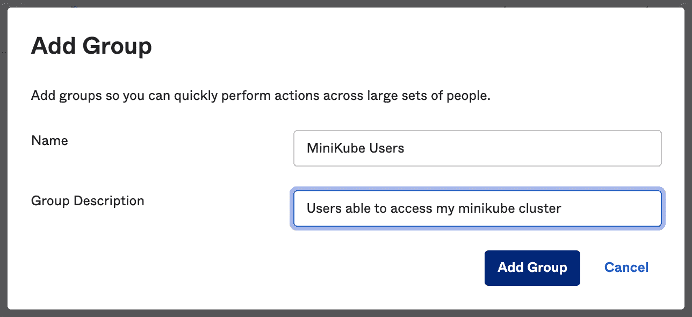
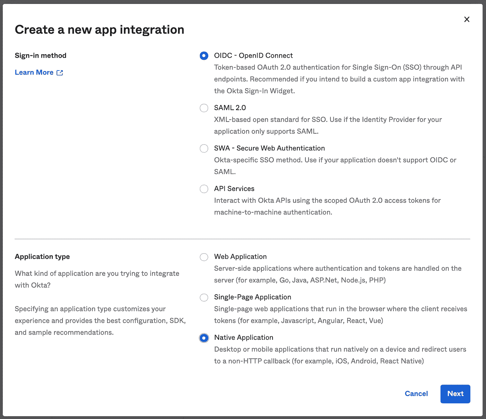
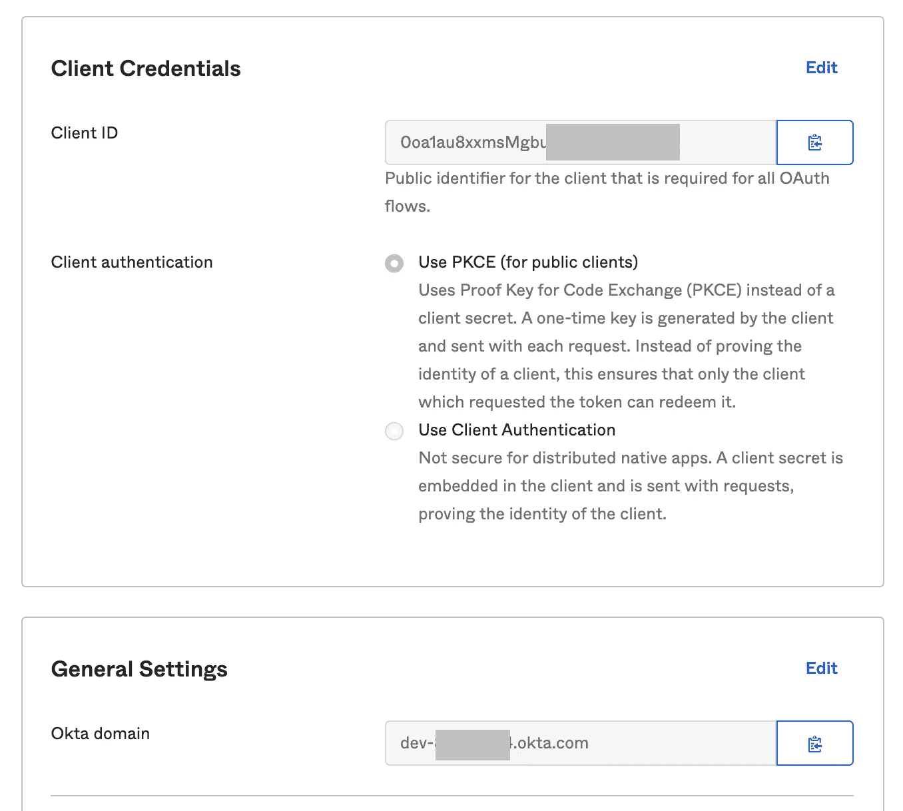
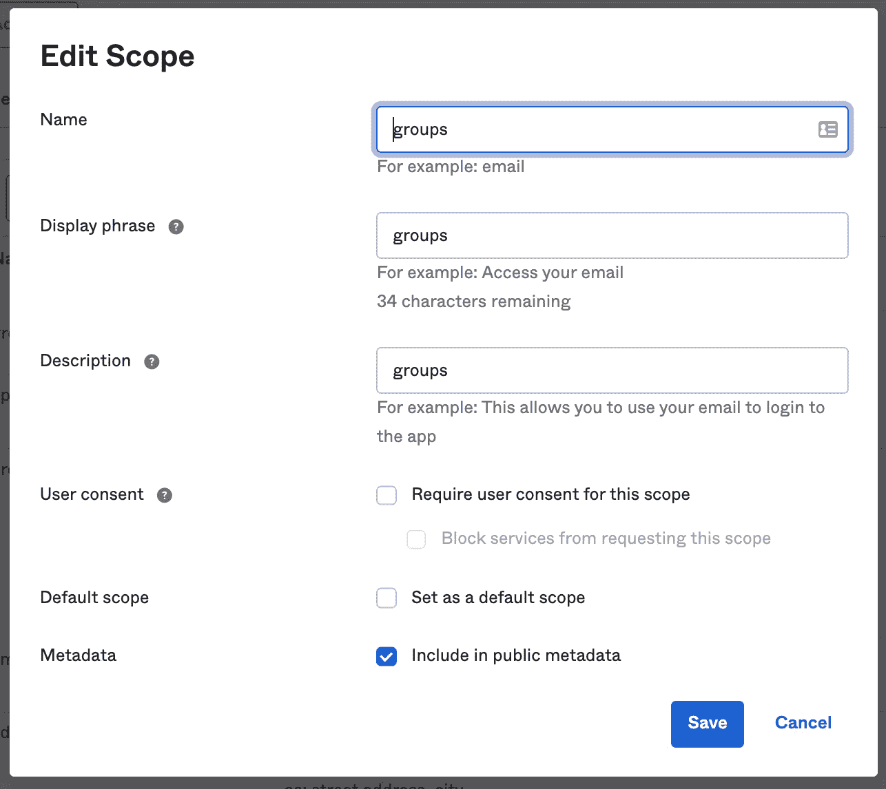
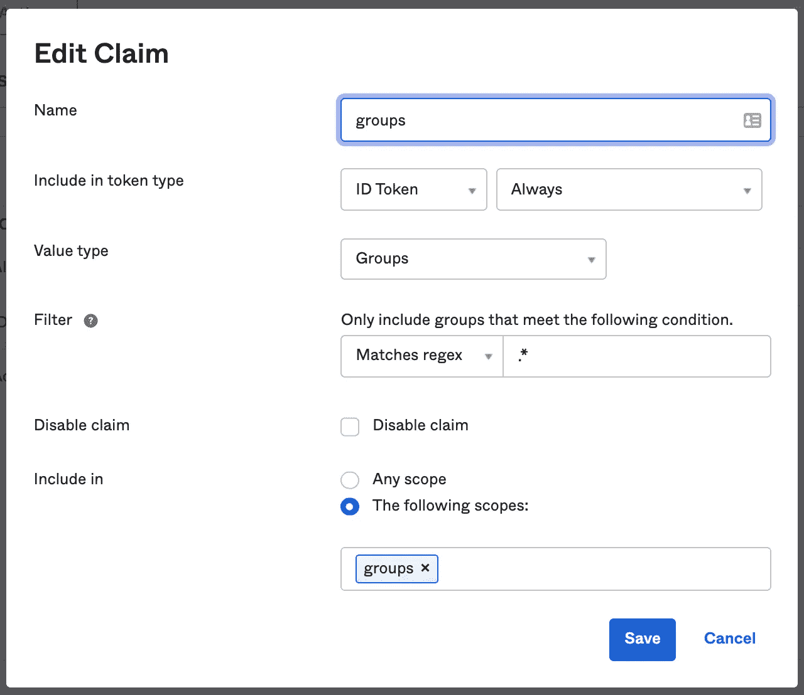
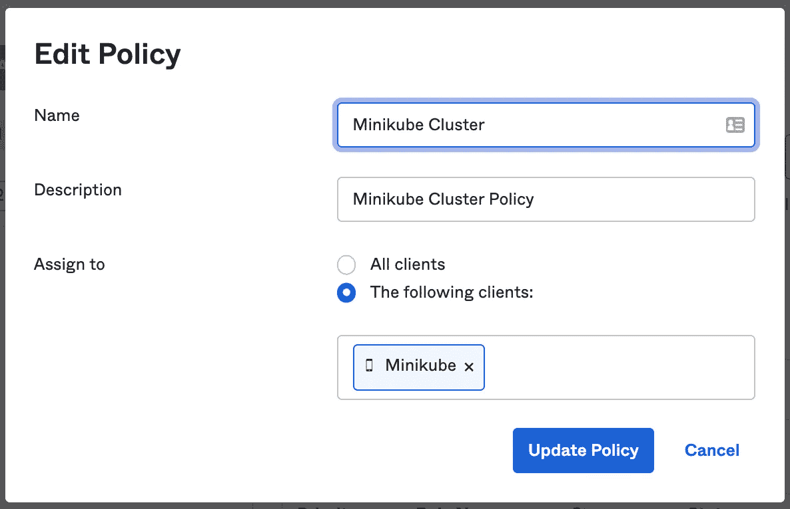
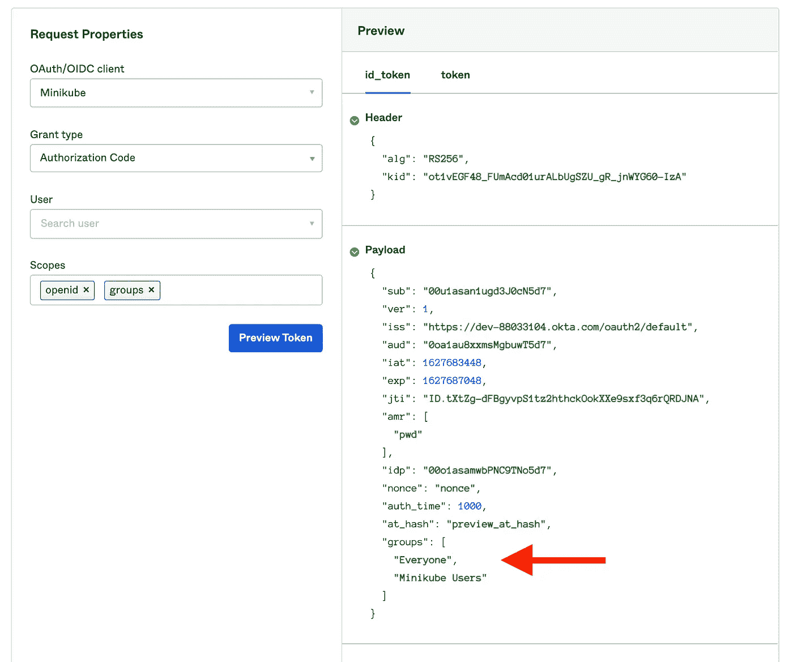

# 通过 Okta 配置集群访问

> 原文：<https://medium.com/codex/configure-cluster-access-via-okta-661d159efc5?source=collection_archive---------7----------------------->

因此，您希望使用 Okta 通过 OIDC 配置对 kubernetes 集群的访问。事实证明，这比您想象的要简单得多，您应该在 5-10 分钟内启动并运行。

你可以在 Github [这里](https://github.com/joshes/example-clusters-using-okta)找到一些样本代码和例子。

在本例中，我们将使用 minikube。就配置而言，minikube 和 AWS 的 EKS 产品之间唯一真正的区别是 API 服务器是如何配置的。Minikube 通过启动标志完成，EKS 通过身份验证配置完成(可以作为 IaC 或通过 AWS 控制台完成)。稍后会详细介绍。

# 配置 Okta

如果你还没有一个 Okta 账户，那就去[创建一个开发者账户](https://developer.okta.com/signup/)，最多允许 5 个申请。

首先，让我们创建一个组并将其分配给我们自己。进入“目录”和“组”，点击“添加组”。给它起个对你有用的名字，我把我的命名为“Minikube 用户”。



点击你新创建的群，点击“管理人员”并添加你自己(如果这是一个新的 Okta 帐户，它将是列表中唯一的用户— *简单！*)到组并保存。

现在，创建一个新的应用程序集成，并选择“OIDC-OpenID 连接”和“本地应用程序”选项。



保持默认值选中，将“授权类型”保留为“授权代码”。

接下来，更新登录和注销重定向 URL，将两者都设置为以下内容:

*   [http://localhost:8000](http://localhost:8000)
*   [http://localhost:18000](http://localhost:18000)

选中“分配”部分下的“限制对选定组的访问”并选择之前创建的 MiniKube 组。

创建之后，记下客户机 Id 和 Okta 域，以便稍后配置 kubectl 客户机。



## 揭露该团体的主张

因为我们使用组来更容易地在集群上分配权限，所以我们需要确保 Okta OIDC 集成实际上公开了组。在更类似于生产的设置中，可以创建许多组来发布集群中的正确权限集(例如，生产集群管理员、生产集群审计员、非生产开发人员等)。).不过，在这个演练中，我们尽量保持简单。

在 Okta 中，单击左侧的安全导航链接，然后选择 API 选项(您可能需要向下滚动一点才能看到它)。

单击默认授权服务器，然后单击“Scopes”选项卡部分并添加一个新的范围。将所有文本字段设置为“组”，并选中“包含在公共元数据中”并保存。



现在转到“索赔”选项卡部分，向“ID”索赔类型添加新索赔。按如下方式设置值:

*   **名称:**团体
*   **包含在令牌类型中:** ID 令牌，始终
*   **值类型:**组
*   **过滤器:**匹配正则表达式，。*
*   **禁用索赔:**不勾选
*   **包括在:**以下范围，“组”



现在进入“访问策略”选项卡部分，Okta 马上就要完成了！添加一个新策略，并将其命名为对您有用的名称，我选择了“Minikube Cluster”。最重要的是，将“分配给”设置为以下客户端，并选择您的应用程序名称(在我的例子中，它被命名为 Minikube)。一致性使这变得简单。



## 确认 Okta 设置正确

转到“令牌预览”选项卡部分，确认您的令牌上的组正在进入。



***注意:*** *在上面的图片中，我已经将我的用户添加到了“Everyone”组中，所以如果按照这个步骤进行操作，您可能看不到这一点。*

# 配置集群

我将尝试概述如何更新我已配置的几种类型的集群，当然有大量的提供者，但一般来说，这里的想法是更新 Kubernetes API 服务器的启动标志，以包括相关的 OIDC 标志，这是一项简单的任务。

您将需要之前创建应用程序集成时的客户端 Id 和 Okta 域值。如果你没有，不要担心——只要打开 Okta，点击你的应用程序并立即获取它们。我将它们称为向前移动的`$CLIENT_ID`和`$OKTA_DOMAIN`。

## 迷你库贝

如果您的 minikube 集群已经在运行，请停止它，并使用以下启动标志重新启动它。

```
minikube start \
  --extra-config=apiserver.oidc-issuer-url=https://$OKTA_DOMAIN/oauth2/default \
  --extra-config=apiserver.oidc-client-id=$CLIENT_ID \
  --extra-config=apiserver.oidc-username-prefix=oidc: \
  --extra-config=apiserver.oidc-username-claim=sub \
  --extra-config=apiserver.oidc-groups-prefix=oidc: \
  --extra-config=apiserver.oidc-groups-claim=groups
```

## AWS EKS

和所有事情一样，你可以用几种方法来做这件事。为了简单起见，我将解释如何使用 AWS 控制台，它可以很好地转换为任何自动化工具或 CLI。

打开 AWS 控制台，导航到 EKS 集群并选择您的集群。现在选择“身份验证”选项卡，并关联一个新的身份提供者。

对于配置，使用以下选项，如果需要，展开高级选项部分:

*   **发行人网址:** `https://$OKTA_DOMAIN/oauth2/default`
*   **客户端 ID:**
*   **用户名声明:** sub
*   **团体索赔:**团体索赔
*   **组前缀:** oidc: *(是的，那是一个结尾冒号)*
*   **用户名前缀:** oidc: *(是的，那是尾随冒号)*

保存。根据我的经验，这需要一段时间才能生效，所以抓紧时间，喝杯咖啡吧。☕️

# 配置集群中的角色

因为我们只有一个 Okta 组，所以我们只用一个`ClusterRole`和`ClusterRoleBinding`将这些点连接起来，以确保用户有访问权和一组权限，并显示我们的系统正在工作。

对于我们的示例，我们将使用下面的简单访问策略，允许组使用`list`、`get`和`watch`pod 和名称空间来证明我们的系统工作正常(注意`oidc:Minikube Users`组——这与前面提到的 ID 令牌组一致)。

参见本文档，了解更多关于[基于角色的访问控制](https://kubernetes.io/docs/reference/access-authn-authz/rbac/) (RBAC)以及如何将 RBAC 应用于您的情况的信息。

```
# example-role.yaml
# apply via: kubectl apply -f example-role.yaml---
kind: ClusterRole
apiVersion: rbac.authorization.k8s.io/v1
metadata:
  name: example-role
rules:
  - apiGroups: [""]
    resources: ["namespaces","pods"]
    verbs: ["get", "watch", "list"]---
kind: ClusterRoleBinding
apiVersion: rbac.authorization.k8s.io/v1
metadata:
  name: example-crb
roleRef:
  apiGroup: rbac.authorization.k8s.io
  kind: ClusterRole
  name: example-role
subjects:
- kind: Group
  name: "oidc:Minikube Users"
  apiGroup: rbac.authorization.k8s.io
```

将这些配置放入集群的最快方法是将上述内容复制/粘贴到文件`example-role.yaml`中，并通过终端`kubectl apply -f example-role.yaml`应用。

# 配置 kubectl 客户机

最后一英里！好了，现在我们有了一个配置好的 OIDC 提供者和集群来连接这些点。为此，我们将通过 [krew](https://krew.sigs.k8s.io/) 使用一个 [kubectl](https://kubernetes.io/docs/tasks/tools/#kubectl) 插件。

## 安装 krew 插件管理器

完整安装选项[这里](https://krew.sigs.k8s.io/docs/user-guide/setup/install/)，这是 bash 和 zsh shells 的快速设置方法。

```
# for bash or zsh
(
  *set* -x; *cd* "$(mktemp -d)" &&
  *OS*="$(uname | tr '[:upper:]' '[:lower:]')" &&
  *ARCH*="$(uname -m | sed -e 's/x86_64/amd64/' -e 's/\(arm\)\(64\)\?.*/\1\2/' -e 's/aarch64$/arm64/')" &&
  curl -fsSLO "https://github.com/kubernetes-sigs/krew/releases/latest/download/krew.tar.gz" &&
  tar zxvf krew.tar.gz &&
  *KREW*=./krew-"${*OS*}_${*ARCH*}" &&
  "*$KREW*" install krew
)*# Add this to your .bashrc or .zshrc
export* *PATH*="${*KREW_ROOT*:-*$HOME*/.krew}/bin:*$PATH*"# Confirm installation
kubectl krew version
```

## 配置您的 kubeconfig

在下面的代码片段中，我们配置我们的 kubeconfig `~/.kube/config`来创建一个新用户`oidc-user`(根据您的需要进行更新)，可以像`kubectl get pods --user oidc-user`一样使用

```
kubectl config set-credentials oidc-user \
  --exec-api-version=client.authentication.k8s.io/v1beta1 \
  --exec-command=kubectl \
  --exec-arg=oidc-login \
  --exec-arg=get-token \
  --exec-arg=--oidc-issuer-url=https://$OKTA_DOMAIN/oauth2/default \
  --exec-arg=--oidc-client-id=$CLIENT_ID \
  --exec-arg=--oidc-extra-scope=groups
```

# 收尾工作

要确认其工作正常，请尝试将 pod 列为`oidc-user`

```
# This should work
kubectl get pods --user oidc-user# This should NOT work
kubectl get cronjobs --user oidc-user
```

## 后续步骤

*   正式确定 Okta 组以及它们在您的集群中应该如何对齐
*   根据需要创建`ClusterRoles`和`ClusterRoleBindings`(或`RoleBindings`)，并将它们与您的 Okta 组对齐

## 陷阱&需要寻找的东西

我在测试的时候遇到了一些事情。

Okta 的 App Integration 部分显示的`$OKTA_DOMAIN`很容易意外粘贴到需要 issuer-url 值的地方。其实是*`https://$OKTA_DOMAIN/oauth2/domain`不是`http://$OKTA_DOMAIN`或者只是`$OKTA_DOMAIN.`*

*你可以把整个过程想象成 3 个不同的配置，这样想有助于调试。*

1.  *配置 Okta 并确保令牌预览工作。如果这有效，你可以进行第二步。*
2.  *配置 API 服务器。如果您可以验证启动标志已经在集群中应用，请继续执行步骤#3。*
3.  *配置您的 kubeconfig。如果 kube-config 已经设置好了，并且你可以通过检查你的`~/.kube/config`(或者类似的设备)来验证它，那么你应该没问题。*

*思考每一部分如何进入下一部分有助于隔离调试空间。*

*我希望你发现这是有用的！*