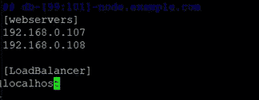
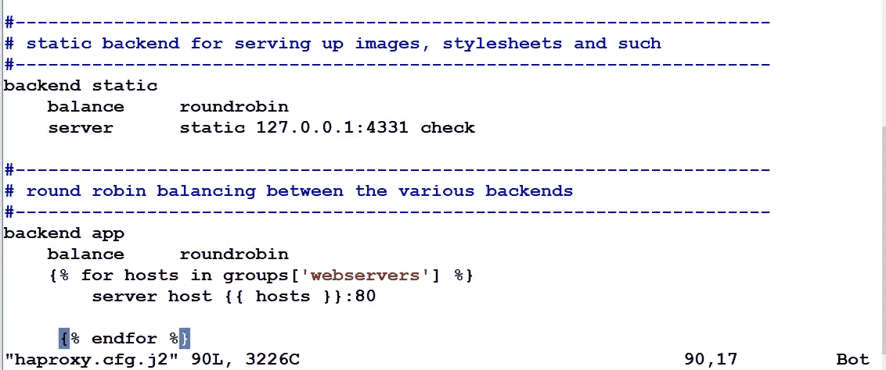

# 使用 Ansible 配置 HAProxy 并动态更新配置文件

> 原文：<https://medium.com/codex/configure-haproxy-and-dynamically-update-the-configuration-file-using-ansible-2d32c3dfba13?source=collection_archive---------8----------------------->

HAProxy 是一个负载平衡器，它通过以循环方式将负载分布在复制的服务器上来平衡服务器上的负载。

本文演示了如何设置 haproxy，并在复制服务器的 IP 加入到 *webserver* 列表时动态添加它们。

**这个演示包括什么？**

**1。**在一列主机上安装 httpd、PHP 等软件，配置 web 服务器

**2。**在服务器的文档根目录中复制一个简单的 PHP 脚本

**3。**启动 web 服务

**4。**安装 haproxy 软件

**5。**更新配置文件以添加后端服务器(我们配置为 web 服务器的服务器)

**6。**如果需要，重新启动服务

主机文件最初看起来像这样:

这意味着我们在两台主机上配置 web 服务器，它们的 IP 地址分别是 192.168.0.107 和 192.168.0.108。

Haproxy 负载平衡器配置在本地主机的端口号 5000 上。

步骤 1:安装 httpd 和 PHP 软件

为此，我们将使用如下所示的包模块，

步骤 2:将 PHP 脚本复制到文档根目录

步骤 3:启动 web 服务并配置防火墙

使用 copy 模块，可以将一个运行 ifconfig 命令并显示输出的简单 PHP 脚本复制到 Web 服务器的文档根目录中。

随后，服务被启动，防火墙被配置为允许端口 80 上的请求。

步骤 4:安装 haproxy 软件

因为，我们希望在本地主机上配置负载平衡器，这不同于我们配置 web 服务器的主机；Haproxy 的这种配置是在不同的剧本中完成的，但在同一剧本中。HAProxy 监听端口 5000，并以循环方式将请求转发到后端 web 服务器。这意味着，负载平衡器是公开的。

步骤 5:编辑 Haproxy 配置文件，并将该文件更新/复制到配置为负载平衡器的主机上

步骤 6:重新启动 haproxy 服务

现在，随着时间的推移，我们可能需要添加更多的 web 服务器副本。因此，为了动态地更新 HAProxy 的配置以在新的一组服务器之间实现负载平衡，我们使用模板模块来复制更新后的配置文件。

这就是我们更新配置文件的方式——循环遍历 *webservers* 主机组，并将服务器添加到配置文件中。

因此，每当清单中出现新服务器时，都会运行行动手册，并且负载平衡器配置会动态更新。

我希望这篇文章能帮助你学到一些新东西。