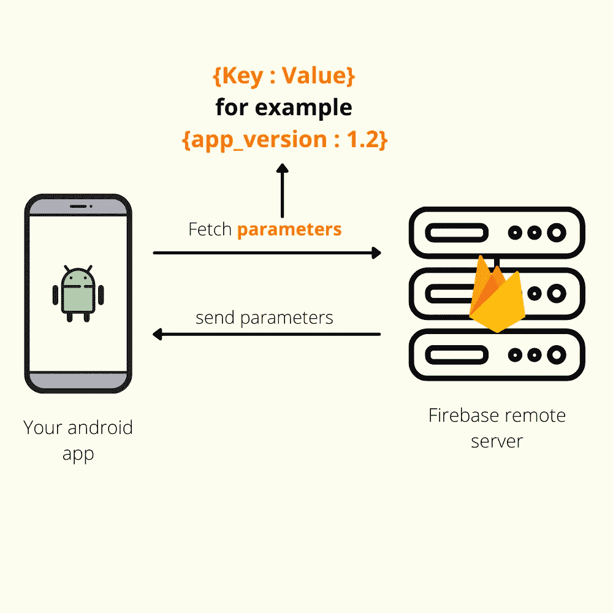
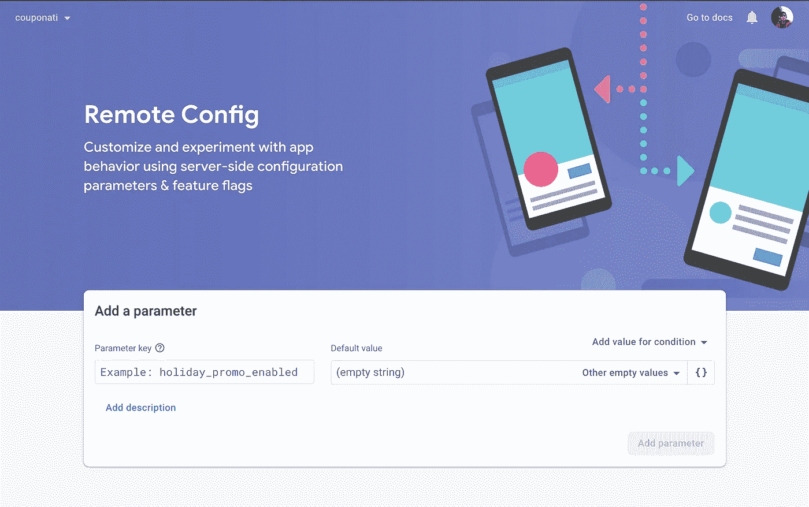
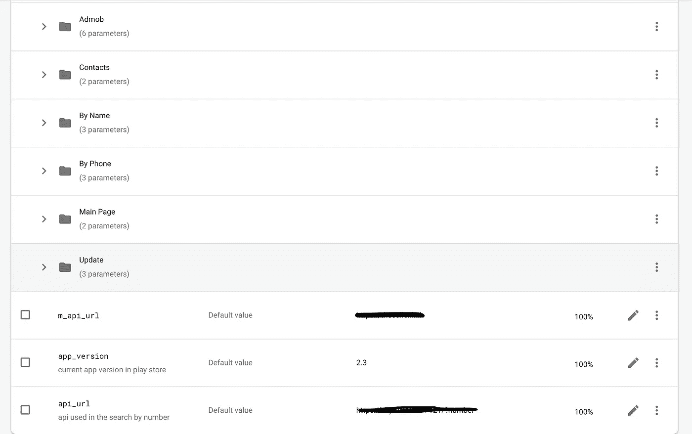
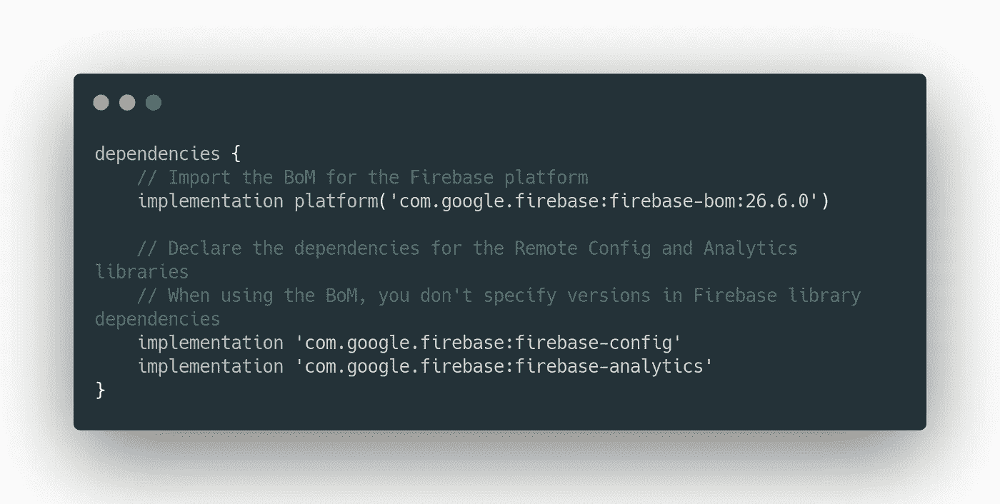
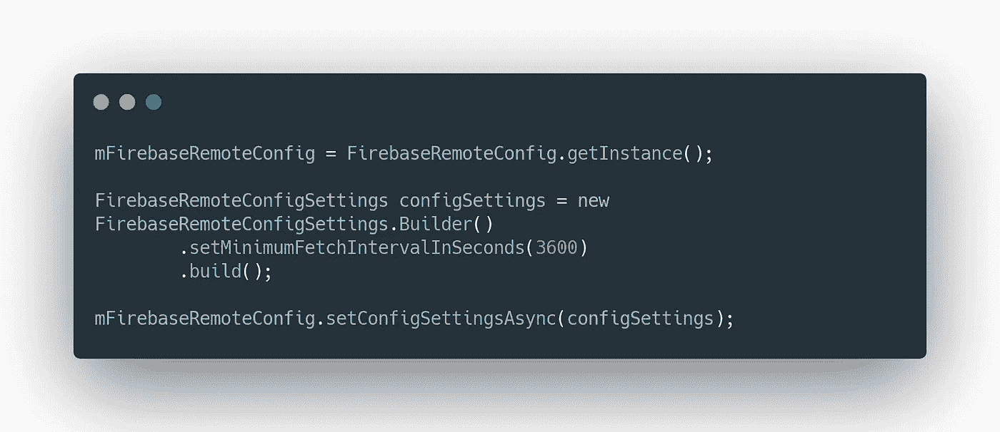
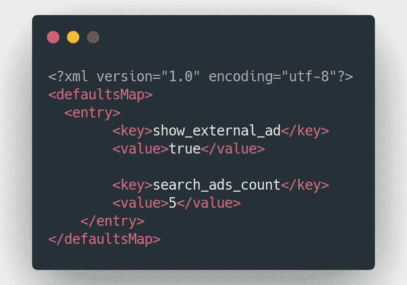
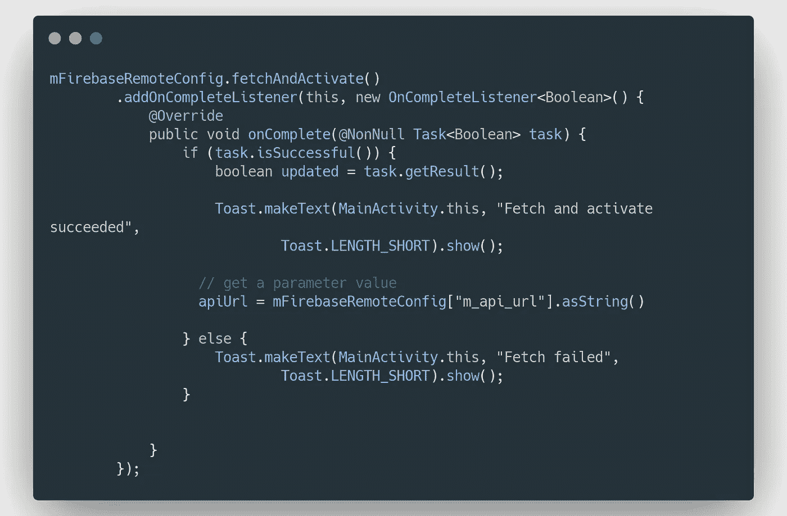

# 通过 Firebase Remote Config 了解您的用户，从您的 Android 应用中获得更多收益

> 原文：<https://medium.com/codex/configure-your-android-application-remotely-with-firebase-remote-config-aa012073ada0?source=collection_archive---------13----------------------->


Header:使用 Firebase Remote Config 远程配置您的应用

Firebase Remote Config 是一项免费的云服务，允许您更改应用程序的行为和外观，而无需用户下载应用程序更新。换句话说，它允许你从颜色、文本到链接远程配置你的应用程序。

本文将讨论以下主题:

> [为什么您应该关注远程配置](#4a3d)
> 
> 【Firebase 远程配置如何工作
> 
> [如何将 Firebase 远程配置集成到您的 Android 应用程序中](#ee0e)
> 
> [有趣的远程配置用例](#a6a1)

# 为什么您应该关注远程配置

既然你在这里，我想你对远程配置感兴趣，所以我不会说太多。比方说，你有一个卖东西的应用程序，你决定改变价格、地址和一个重要的文本，在正常情况下，你需要一个可能需要一天才能发布的更新，这是很不实际的。另一种情况是，当你需要添加一个你不确定如何引入或它是否好的特性时，在正常情况下，你可以编码它并将其发布给你的用户，看看它是否工作，但这需要时间，并且你可能以错误的方式引入该特性。在这种情况下，远程配置允许您进行 A/B 测试，这意味着您可以向 10%的用户发布该功能的测试版，并接收他们的反馈，这种方法可以提高您的工作效率，并帮助您更好地了解您的用户。所以远程配置不仅仅是关于颜色和文本，它实际上允许你配置应用程序的外观和行为

# **它是如何工作的？**

这实际上非常简单，你所要做的就是定义应用内的参数，这些参数可以在 Firebase 控制台中被覆盖，然后这些参数可以为所有用户或定义的用户激活。我将分享一些有趣的参数，你应该在本教程结束时使用



Firebase 远程配置的工作原理

您的应用程序和 Firebase 远程配置服务器之间的关系如上图所示👆。您的应用程序从远程服务器获取数据，服务器将 JSON 对象发送回您的应用程序(不要担心远程配置 SDK 会处理一切:)。

## 1.如何向远程配置添加参数？

首先，你需要有一个 Firebase 项目，我不会去经历这一点，因为它很容易，有许多教程可用。因此，假设您已经创建了您的项目，并且在 firebase 控制台的主页上，从 Engage 部分选择 Remote config



远程配置主页

主页允许您添加您的第一个参数，您需要为您的参数选择一个键，类似于`app_version` *，*这个键将用于在您的应用程序中获取参数，当然，您需要选择一个默认值，它可以是任何主数据类型。



远程配置参数

这张图片取自我的一个项目，它显示了你可以在文件夹中组织你的参数，并且你可以给它们一个描述。100%意味着这个参数被 100%的用户获取

在我们转到代码之前，最后一件事是，您可以向每个参数添加条件，以定义如何或何时发送参数值，例如，如果您的项目链接到 Ios 应用程序或 web 应用程序，您可以定义关于国家、语言、平台的条件。

## 2.如何将其集成到您的 android 项目中

1.  首先，我们需要将远程配置依赖项添加到我们的 **build.gradle** 文件中。

对于远程配置，Google Analytics 需要有条件地将应用程序实例定位到用户属性和受众。确保您在项目中启用了 Google Analytics。



build.gradle

如果使用 [bom 平台实现](https://firebase.google.com/docs/android/learn-more#bom)，添加`implementation 'com.google.firebase:firebase-config'`。

否则就用这个`implementation 'com.google.firebase:firebase-config:20.0.4'`

2.获取一个远程配置对象实例，并设置允许频繁刷新的最小获取间隔。远程配置 SDK 使用缓存，因此它不会在用户每次打开应用程序时从服务器获取数据



获取远程配置单例对象

singleton 对象用于存储应用程序内的默认参数值，从后端获取更新的参数值，并控制获取的值何时可用于您的应用程序。

将这段代码复制到您的启动器活动中

```
mFirebaseRemoteConfig = FirebaseRemoteConfig.getInstance();
FirebaseRemoteConfigSettings configSettings = new FirebaseRemoteConfigSettings.Builder()
        .setMinimumFetchIntervalInSeconds(3600)
        .build();
mFirebaseRemoteConfig.setConfigSettingsAsync(configSettings);
```

3.这是可选的，Firebase Remote config 允许您将应用程序中参数的默认值存储为 XML 文件。

要设置默认值，你必须在`res`文件夹下创建`xml`文件夹，然后创建一个文件，姑且称之为`default_config.xml`



现在，要告诉远程配置使用这个文件，您应该添加这一行

```
mFirebaseRemoteConfig.setDefaultsAsync(R.xml.remote_config_defaults)
```

4.获取参数并在应用程序中使用它们



从远程配置中获取参数

我们使用`fetchAndActivate()`方法首先从远程服务器获取数据，然后激活它们，这意味着通过远程配置对象使它们可用(如果您的逻辑需要，您可以手动使用`fetch()`和`activate()`)

```
mFirebaseRemoteConfig.fetchAndActivate()
        .addOnCompleteListener(this, new OnCompleteListener<Boolean>() {
            @Override
            public void onComplete(@NonNull Task<Boolean> task) {
                if (task.isSuccessful()) {
                    boolean updated = task.getResult();

                    Toast.makeText(MainActivity.this,"done",
                            Toast.LENGTH_SHORT).show(); // get a parameter value
              apiUrl = mFirebaseRemoteConfig["m_api_url"].asString()                  } else {
                    Toast.makeText(MainActivity.this, "failed",
                            Toast.LENGTH_SHORT).show();
                  }

            }
        });
```

## 3.可用的数据类型

远程配置仅允许存储以下 4 种数据类型

*   `[getBoolean()](https://firebase.google.com/docs/reference/android/com/google/firebase/remoteconfig/FirebaseRemoteConfig#getBoolean(java.lang.String))`
*   `[getDouble()](https://firebase.google.com/docs/reference/android/com/google/firebase/remoteconfig/FirebaseRemoteConfig#getDouble(java.lang.String))`
*   `[getLong()](https://firebase.google.com/docs/reference/android/com/google/firebase/remoteconfig/FirebaseRemoteConfig#getLong(java.lang.String))`
*   `[getString()](https://firebase.google.com/docs/reference/android/com/google/firebase/remoteconfig/FirebaseRemoteConfig#getString(java.lang.String))`

如果需要使用更复杂的数据类型，可以使用 Firestore 数据库或 firebase 实时数据库

# 有趣的远程配置用例

Firebase 远程配置用于控制你的应用程序的行为和外观，这里有一个我认为非常重要的用例列表，每个应用程序都应该使用远程配置来实现它

1.  存储您的 API URL:这允许您在您的主机出现问题时或者由于任何其他原因可能发生在您身上时更改 URL
2.  存储您的 Admob 广告 id 和首选项:将 Admob ids 存储在远程配置中，当您的帐户出现问题时，您可以更改它们。它允许您进行 A/B 测试，以优化您显示广告的方式(位置、大小、横幅或原生？…)并提高您的收入
3.  控制更新:您可以在远程配置中添加应用程序的实际版本，并在应用程序中获取它，以确保用户使用的是最新版本，您还可以添加一个参数来判断更新是否是强制性的，甚至可以添加一个文本来显示您何时要求用户进行更新
4.  控制数量:当你的应用程序中有一些数字可能会发生变化，如价格(而不是应用程序内购买的 play store)或电话号码、联系电子邮件，或者观看奖励广告后的奖励。

最后，当你使用远程配置进行 A/B 测试时，你可以得到最好的配置，因为它允许你找出最好的参数，所以当你开始使用 firebase 远程配置时，进行 A/B 测试，它已经在 firebase 控制台中可用，我将很快写一个关于它的教程。