# 在 AWS EC2 中配置和测试自动缩放

> 原文：<https://medium.com/codex/configuring-and-testing-auto-scaling-in-aws-ec2-60a1434b0eae?source=collection_archive---------4----------------------->

## [法典](http://medium.com/codex)

由亚马逊网络服务有限责任公司—[https://Web . archive . org/Web/20140720133240/http://AWS . typepad . com/AWS/2011/12/introducing-AWS-simple-icons-for-your-architecture-diagrams . html](https://web.archive.org/web/20140720133240/http://aws.typepad.com/aws/2011/12/introducing-aws-simple-icons-for-your-architecture-diagrams.html)，公共领域，[https://commons.wikimedia.org/w/index.php?curid=18069398](https://commons.wikimedia.org/w/index.php?curid=18069398)

本指南记录了在 AWS 中使用启动配置配置自动伸缩组(ASG)所需的步骤，以便使用 Apache web 服务器创建 EC2 实例。然后，我们将测试已实现的 ASG 随着实例状态的变化进行扩展和处理增加的流量的能力。

目标:

*   使用用户数据部分中的 Apache web 服务器引导脚本创建启动 t3.nano EC2 实例的启动配置。
*   创建一个最少运行 2 个、最多运行 5 个实例的 ASG。
*   ASG 应该包括一个目标扩展策略，以便根据平均 CPU 使用率进行扩展。
*   通过停止实例来测试扩展策略。如果您的自动伸缩策略有效，正在运行的实例数量应该会向外扩展。
*   用 Apache Bench 测试 ASG 平衡高负载的能力。

在开始启动配置和 ASG 之前，建议做一些环境准备。

# 步骤 1:创建一个 EC2 实例

首先，登录 **AWS 管理控制台**。从服务列表中，选择 EC2:

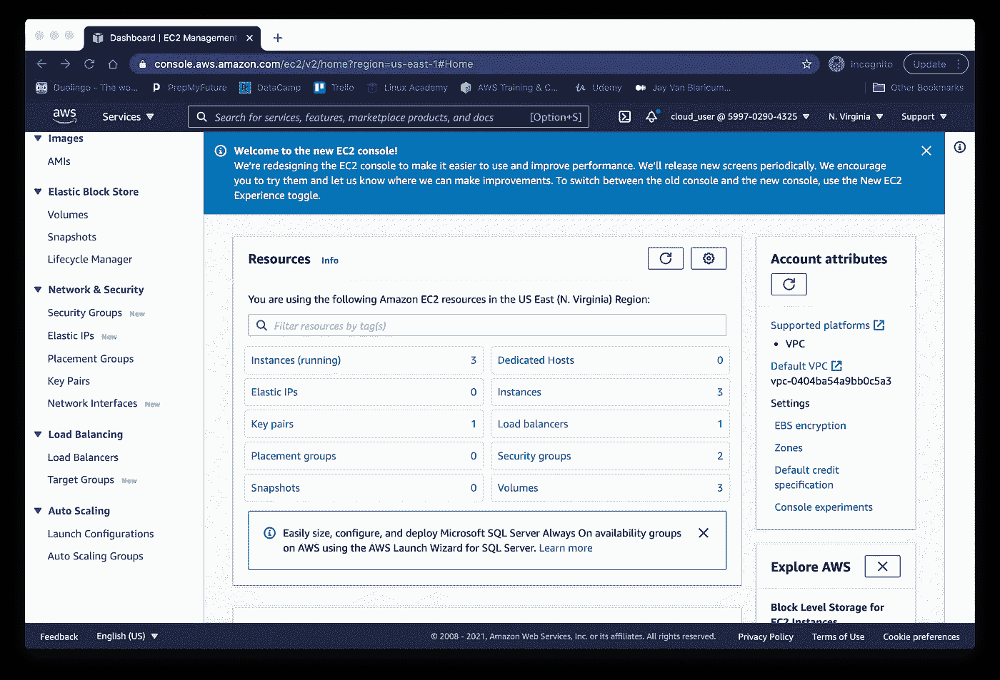

选择**“启动一个实例”**，并按照说明创建一个面向公众的 EC2 实例，其安全组允许**公共 HTTP 访问**和 **SSH 访问您的个人 IP 地址**。我使用 t2.micro 实例类型来利用它的自由层状态。

在步骤 3 下，确保在**网络接口**设置中**“自动分配公共 IP”**被启用。

输入 VPC、子网和可用性区域设置后，滚动到底部的**“高级详细信息”**，然后滚动到**“用户数据”**在**“用户数据”**部分输入以下预配脚本，以自动更新实例并安装 **Apache2** web 服务器:

> #!/bin/bash
> 
> apt-get 更新-y
> 
> apt-get 升级-y
> 
> apt-get 安装 apache2 -y
> 
> systemctl 启动 apache2
> 
> systemctl 启用—现在为 apache2

完成实例设置，并查看在 EC2 控制台中运行的新实例。要测试实例是否遵循了引导指令，请将实例的**公共 IPv4** 地址复制到浏览器中。如果出现了 **Apache 默认页面**，那么实例工作正常。

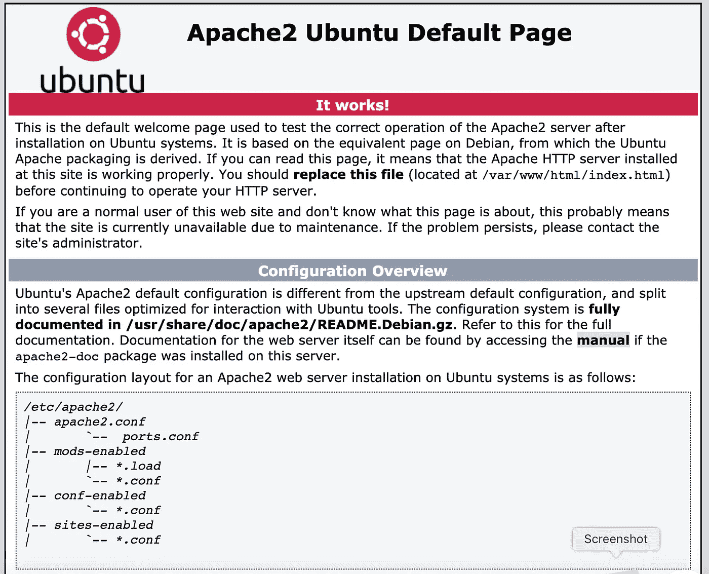

在 EC2 控制台中，选择新的 EC2 实例，并在**“动作”**下拉菜单下，选择**“创建图像”**按照简单的说明创建您的定制**亚马逊机器映像** (AMI)。新的 AMI 将用于自动伸缩配置，但也可用于启动新的 web 服务器实例。

# 步骤 2:使用定制 AMI 创建一个启动模板

AWS 目前不鼓励使用启动配置，因为它们不支持 EC2 的所有功能。最佳做法是，AWS 建议使用启动模板:

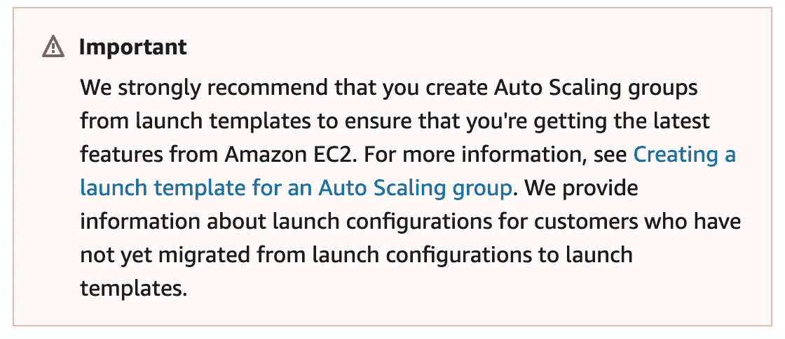

在 EC2 控制台的左侧菜单中，选择“启动模板”

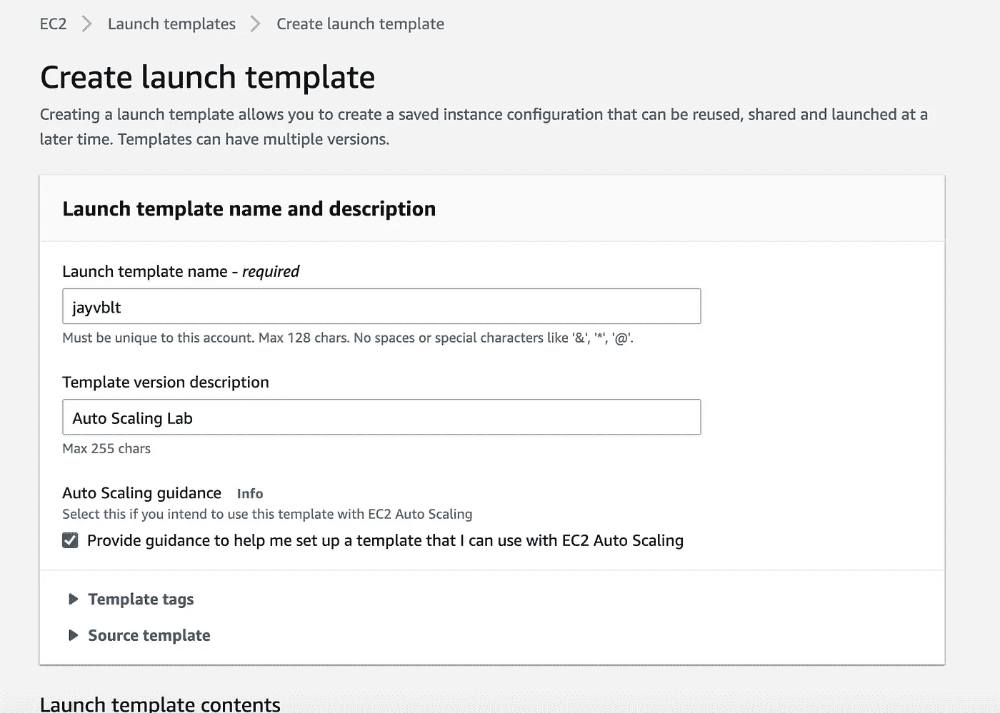

选择您在步骤 2 中创建的**新 AMI** 作为启动模板的**所需 AMI** 。按照不言自明的说明，根据您的自定义 AMI 设置启动模板。

对于您的启动模板，您应该会看到下面的**确认页面**:

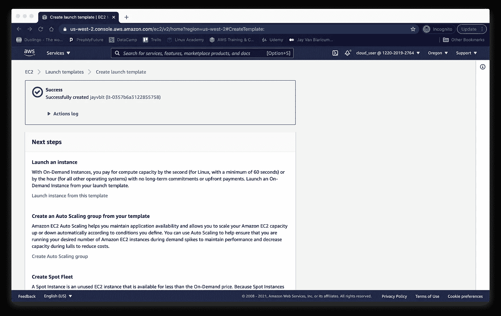

# 步骤 3:创建目标群体

在配置 ASG 的负载平衡器时，还需要一个**目标组**。点击 EC2 控制台左侧菜单中的**“目标组”**，并点击**“创建目标组”**

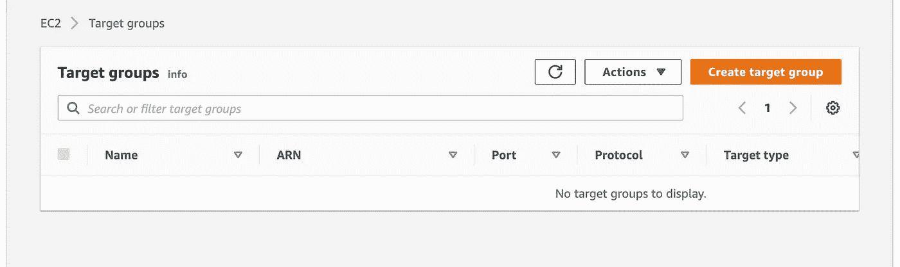

在**“创建目标组”**页面顶部，选择**“实例”**作为目标类型，并给**目标组**命名。在下一页，**“注册目标”，**您应该看到在**步骤 1** 中创建的 EC2 实例。要将实例添加到目标中，请选择实例，然后单击**“作为待决包含在下面”**:

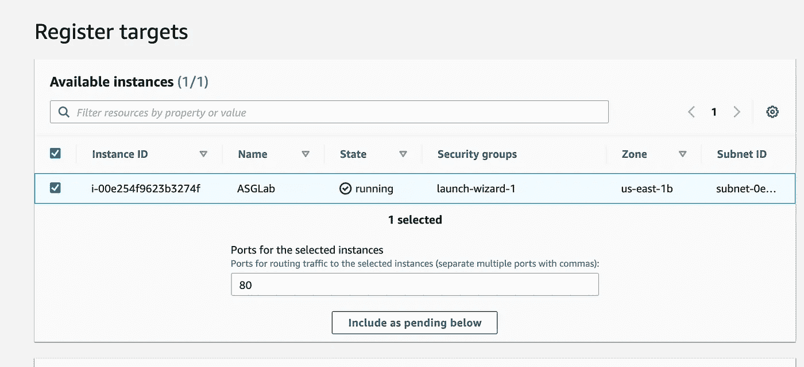

然后，您应该看到您的实例显示为**“Pending”**，并被注册为目标:

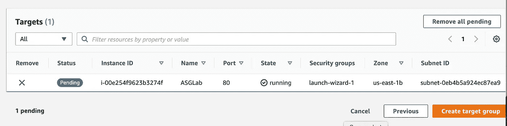

点击**“创建目标组”**完成设置。

# 步骤 4:创建自动缩放组

在 EC2 控制台中，滚动到左侧菜单的底部选择**“自动缩放组”**，然后点击**“创建自动缩放组”**

首先，输入一个名称来标识您的 ASG，并确保选择的启动模板的默认版本与我们之前创建的版本相同。

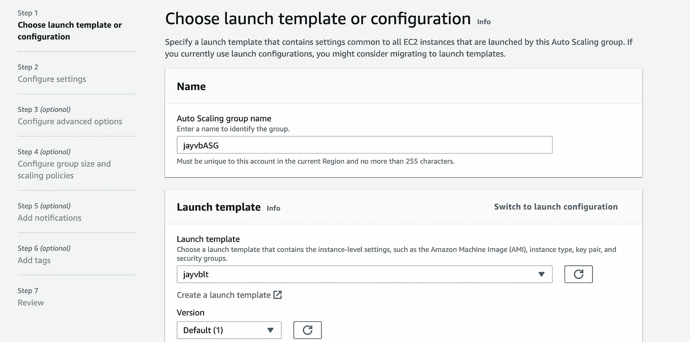

其次，在**【配置设置】**页面中，选择**为【坚持启动模板】***VPC、子网和可用性区域应该与您用于已部署模板实例的区域相同*。

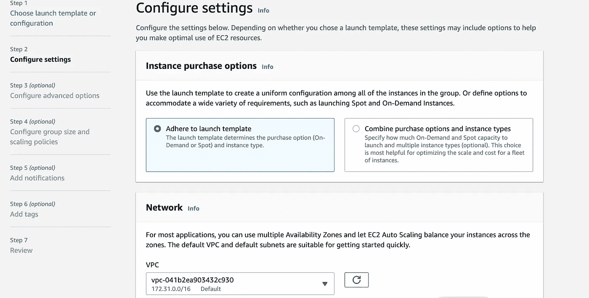

第三，在**“配置高级选项”**步骤中，选择**“启用负载均衡”**，选择之前创建的**目标组**。

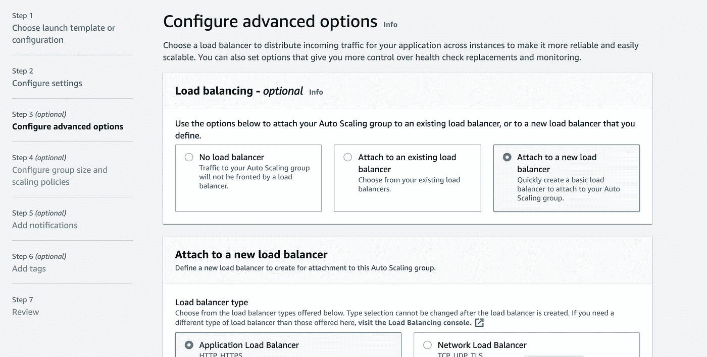

另外，在**“监听器和路由”下，**选择默认路由作为您的**目标组**:

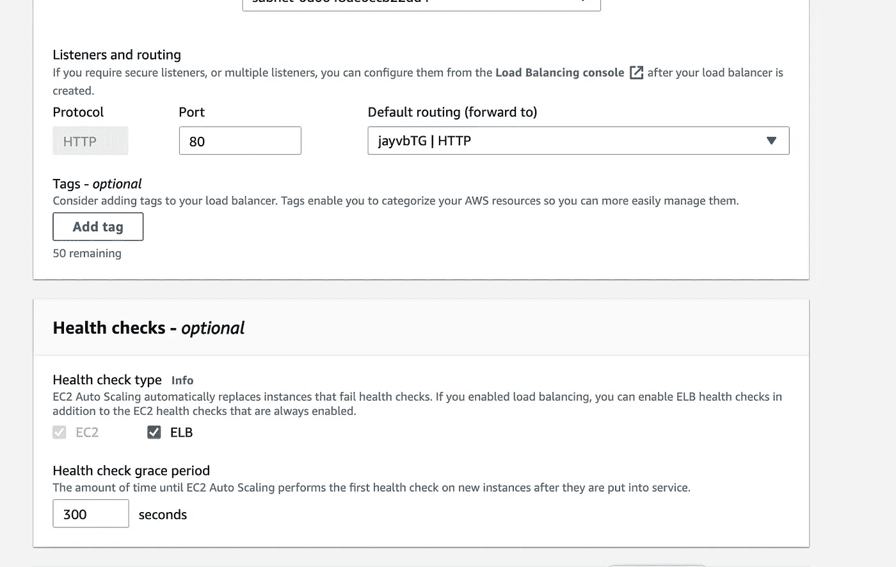

第四，我们可以选择配置 ASG 的**组大小**和**扩展策略**。将所需容量设置为 3 个实例，最小容量设置为 2 个实例，最大容量设置为 5 个实例。

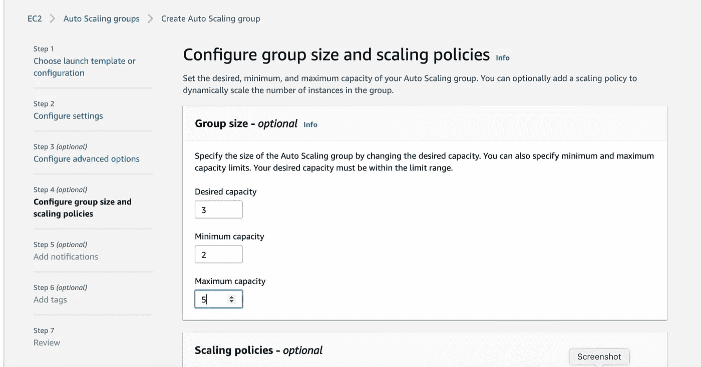

对于扩展策略，选择**“目标跟踪扩展策略”**，并输入**平均 CPU 利用率**的目标值:

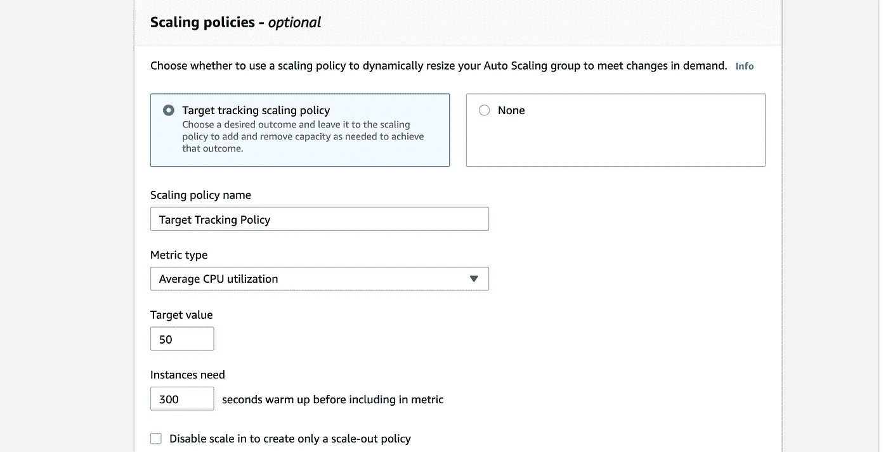

在“实例在纳入度量之前需要 ___ 秒预热”中，输入建议的 300 秒。

接下来的两个 ASG 设置页面允许添加通知和标记。虽然这些在现实世界的设置中是可取的，但它们对于演示自动缩放组的功能并不是必不可少的。

最后，仔细检查“审查”页面上列出的设置，以确保一切都已配置就绪。

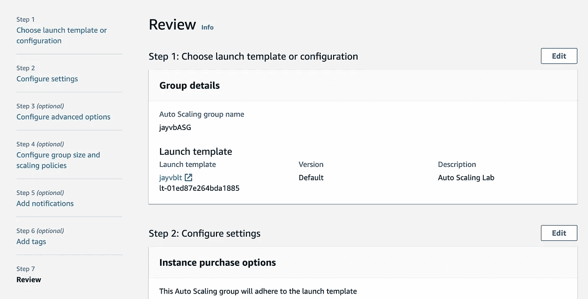

# 步骤 5:测试自动缩放组

ASG 加载并激活后，返回 EC2 控制台，选择**“Instances”**查看 ASG 运行生成的实例:

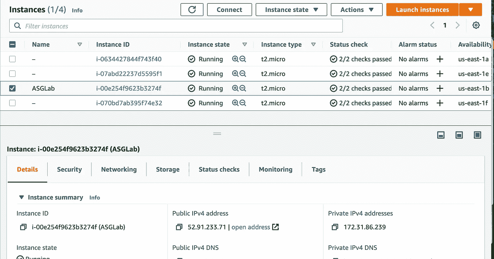

为了测试 ASG 检测不健康实例并根据我们的策略设置替换它们的能力，选择三个新实例，并从**“实例状态”**菜单中选择**“停止”**:

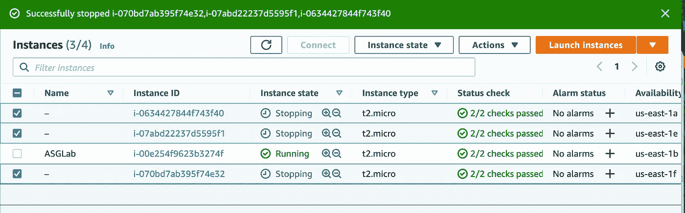

300 秒后，ASG 会发现停止的实例，并按照指示在不同的可用性区域生成三个新实例:

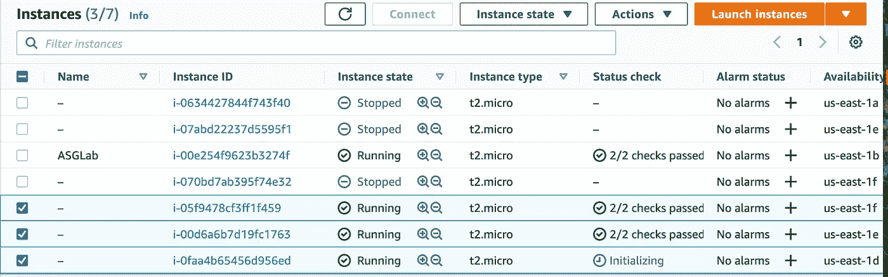

查看**“自动缩放组”**页面上的**“Actions”**选项卡，我们可以确认活动日志已经记录了新 ASG 对我们实例的检测和纠正。

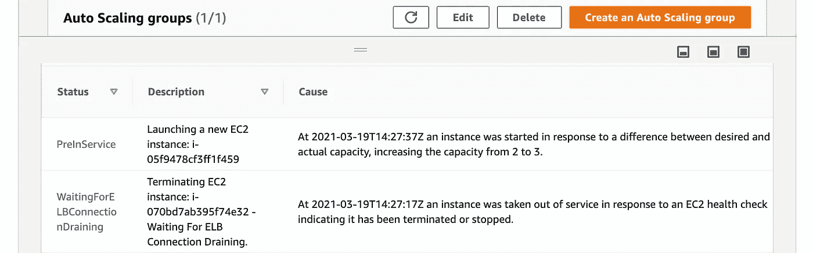

最后，使用命令行，使用 Apache Bench 向每个新实例发送大量负载。为了查看我们的 ASG 是否可以处理 100 个请求，最多同时运行 10 个请求，我输入了:

~ % a b-n 100-c 10[http://52.3.231.143/test.cfm](http://52.3.231.143/test.cfm)>test1 . txt
~ % a b-n 100-c 10[http://18.205.19.144/test.cfm](http://18.205.19.144/test.cfm)>test2 . txt
~ % a b-n 100-c 10[http://44.192.47.196/test.cfm](http://44.192.47.196/test.cfm)>test3 . txt

三个。txt 文件是在我的主目录下创建的。代表 ASG 中每个实例的性能，下面是第一个实例的输出，显示了零个**失败的请求:**

> 这是 ApacheBench，版本 2.3
> 版权所有 1996 亚当·特维斯，宙斯科技有限公司，[http://www.zeustech.net/](http://www.zeustech.net/)
> 授权给 Apache 软件基金会，[http://www.apache.org/](http://www.apache.org/)
> 
> 52.3.231.143 基准(耐心点)…..完成的
> 
> 服务器软件:Apache/2.4.41
> 服务器主机名:52.3.231.143
> 服务器端口:80
> 
> 文件路径:/test.cfm
> 文件长度:274 字节
> 
> 并发级别:10
> 测试所用时间:2.659 秒
> 完成请求:100
> 失败请求:0
> 非 2xx 响应:100
> 总传输量:45400 字节
> HTML 传输量:27400 字节
> 每秒请求数:37.61[#/秒](平均值)
> 每请求时间:265.892[毫秒](平均值)
> 每请求时间:
> 
> 连接次数(毫秒)
> 最小平均值[+/-sd]中值最大值
> 连接:61 66 4.1 66 80
> 处理:60 146 154.2 68 502
> 等待:60 146 154.2 68 501
> 总计:122 212 157.1 133 563
> 
> 在一定时间内处理的请求的百分比(毫秒)
> 50% 133
> 66% 135
> 75% 139
> 80% 513
> 90% 513
> 95% 513
> 98% 513
> 99% 563
> 100% 563(最长的请求)