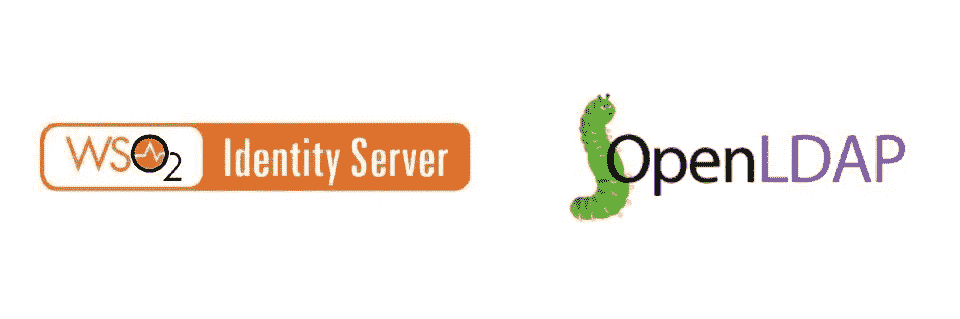

# 在 WSO2 Identity Server 5.11.0 中配置 OpenLDAP

> 原文：<https://medium.com/codex/configuring-openldap-in-wso2-identity-server-5-11-0-c1ec2aaaabff?source=collection_archive---------1----------------------->

WSO2 Identity Server (IS)是一款领先的 API 驱动的开源客户身份和访问管理(CIAM)产品，易于使用，功能丰富。如果您从 WSO2 [网站](https://wso2.com/identity-server/)下载该产品，您就可以立即开始使用它进行开发。

在这篇简短的文章中，我将展示配置 OpenLDAP 所需的配置条目，这是一个…