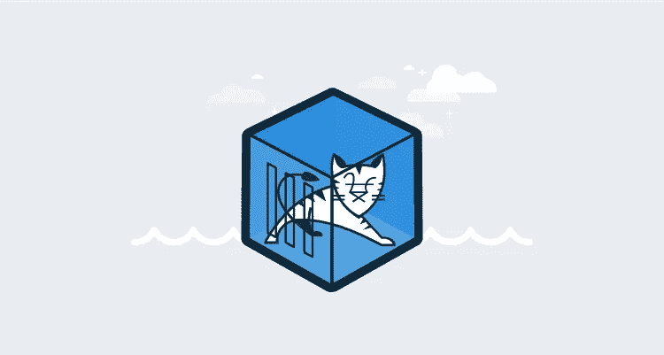

# 在 Kubernetes 中为只读文件系统配置 Tomcat 日志记录。

> 原文：<https://medium.com/codex/configuring-tomcat-logging-for-a-read-only-file-system-in-kubernetes-965556e55045?source=collection_archive---------4----------------------->



> 在本文中，我将讨论如何为容器中的只读文件系统配置 Tomcat 服务器日志记录。

最近我有机会使用 Kubernetes deployment 来部署一个 Tomcat web 服务器，在部署这个应用程序时，我遇到了一个与 Tomcat 服务器日志记录相关的问题。让我向你描述一下这个问题。在部署应用程序之前，我配置了将 Tomcat web 服务器作为只读文件系统运行的容器。现在，这个配置导致了一个错误，即 Tomcat 在内部将自己的日志发布到/logs 目录。由于文件系统被配置为只读，Tomcat 无法将日志发布到/logs 目录，因为我的 Tomcat 部署失败了。幸运的是，我找到了这个问题的答案。

## 从这篇文章中，我们将讨论以下主题。

1.Tomcat 默认日志是如何配置的。

2.如何将 tomcat 日志重定向到控制台

3.配置 emptyDir 卷装载

## Tomcat 默认日志是如何配置的。

在默认模式下，tomcat 日志记录被配置为写入{TOMCAT_HOME}/logs 目录中的日志文件和控制台。以下文件显示了在{ tomcat _ HOME }/conf/logging . properties 文件中定义的默认 TOMCAT 日志记录配置。

```
handlers = 1catalina.org.apache.juli.AsyncFileHandler, 2localhost.org.apache.juli.AsyncFileHandler, 3manager.org.apache.juli.AsyncFileHandler, 4host-manager.org.apache.juli.AsyncFileHandler, java.util.logging.ConsoleHandler.handlers = 1catalina.org.apache.juli.AsyncFileHandler, java.util.logging.ConsoleHandler############################################################
# Handler specific properties.
# Describes specific configuration info for Handlers.
############################################################1catalina.org.apache.juli.AsyncFileHandler.level = FINE
1catalina.org.apache.juli.AsyncFileHandler.directory = ${catalina.base}/logs
1catalina.org.apache.juli.AsyncFileHandler.prefix = catalina.
1catalina.org.apache.juli.AsyncFileHandler.maxDays = 90
1catalina.org.apache.juli.AsyncFileHandler.encoding = UTF-82localhost.org.apache.juli.AsyncFileHandler.level = FINE
2localhost.org.apache.juli.AsyncFileHandler.directory = ${catalina.base}/logs
2localhost.org.apache.juli.AsyncFileHandler.prefix = localhost.
2localhost.org.apache.juli.AsyncFileHandler.maxDays = 90
2localhost.org.apache.juli.AsyncFileHandler.encoding = UTF-83manager.org.apache.juli.AsyncFileHandler.level = FINE
3manager.org.apache.juli.AsyncFileHandler.directory = ${catalina.base}/logs
3manager.org.apache.juli.AsyncFileHandler.prefix = manager.
3manager.org.apache.juli.AsyncFileHandler.maxDays = 90
3manager.org.apache.juli.AsyncFileHandler.encoding = UTF-84host-manager.org.apache.juli.AsyncFileHandler.level = FINE
4host-manager.org.apache.juli.AsyncFileHandler.directory = ${catalina.base}/logs
4host-manager.org.apache.juli.AsyncFileHandler.prefix = host-manager.
4host-manager.org.apache.juli.AsyncFileHandler.maxDays = 90
4host-manager.org.apache.juli.AsyncFileHandler.encoding = UTF-8java.util.logging.ConsoleHandler.level = FINE
java.util.logging.ConsoleHandler.formatter = org.apache.juli.OneLineFormatter
java.util.logging.ConsoleHandler.encoding = UTF-8############################################################
# Facility specific properties.
# Provides extra control for each logger.
############################################################org.apache.catalina.core.ContainerBase.[Catalina].[localhost].level = INFO
org.apache.catalina.core.ContainerBase.[Catalina].[localhost].handlers = 2localhost.org.apache.juli.AsyncFileHandlerorg.apache.catalina.core.ContainerBase.[Catalina].[localhost].[/manager].level = INFO
org.apache.catalina.core.ContainerBase.[Catalina].[localhost].[/manager].handlers = 3manager.org.apache.juli.AsyncFileHandlerorg.apache.catalina.core.ContainerBase.[Catalina].[localhost].[/host-manager].level = INFO
org.apache.catalina.core.ContainerBase.[Catalina].[localhost].[/host-manager].handlers = 4host-manager.org.apache.juli.AsyncFileHandler# For example, set the org.apache.catalina.util.LifecycleBase logger to log
# each component that extends LifecycleBase changing state:
#org.apache.catalina.util.LifecycleBase.level = FINE# To see debug messages in TldLocationsCache, uncomment the following line:
#org.apache.jasper.compiler.TldLocationsCache.level = FINE# To see debug messages for HTTP/2 handling, uncomment the following line:
#org.apache.coyote.http2.level = FINE# To see debug messages for WebSocket handling, uncomment the following line:
#org.apache.tomcat.websocket.level = FINE
```

Tomcat 将日志发布到四个主要组件，即 Catalina、localhost、manager 和 host-manager。如您所见，tomcat 使用 org . Apache . juli . async file handler 将每个组件日志写入一个文件。这个 juli 是作为 apache 自己对 java.util.logging API 的几个关键元素的实现来实现的。这将使属性文件支持扩展的构造，允许更自由地定义处理程序并将它们分配给记录器。默认情况下，处理程序的日志级别阈值是 INFO，可以使用 SEVERE、WARNING、INFO、CONFIG、FINE、FINER、FINEST 或 ALL 来设置。您还可以将特定包作为收集日志记录的目标，并指定级别。

## 因此..这里的问题是什么？

到目前为止，一切都很完美，但当涉及到集装箱化的环境时，可能会有一些问题。正如我之前提到的，我最近在使用 Kubernetes 部署，在这个部署中，我只是尝试部署 docker 容器，它将运行 tomcat 服务器，但是这个容器的文件系统被设置为只读文件系统。一旦我开始部署，它就开始失败，当我检查失败容器的日志时，我发现 tomcat 无法将其日志发布到/logs 目录中的文件。因此我们可以理解，由于只读文件系统配置，tomcat 无法写入该文件。Tomcat 面临这个问题是因为它的日志被定义为写入文件，所以解决方案是我们将这些日志设置为重定向到控制台。

## 如何将 tomcat 日志重定向到控制台

在默认配置文件中，简单地删除文件处理程序会停止将日志发布到文件中。但是应该有适当的方法将日志重定向到控制台。为此，我想出了一个新的日志配置。

```
handlers = 1catalina.java.util.logging.ConsoleHandler, \
    2localhost.java.util.logging.ConsoleHandler, \
    3manager.java.util.logging.ConsoleHandler, \
    4host-manager.java.util.logging.ConsoleHandler.handlers = 1catalina.java.util.logging.ConsoleHandler############################################################
# console Handler specific properties.
# Describes specific configuration info for Handlers.
############################################################1catalina.java.util.logging.ConsoleHandler.level = INFO
1catalina.java.util.logging.ConsoleHandler.formatter = java.util.logging.SimpleFormatter
1catalina.java.util.logging.SimpleFormatter.format=[%1$tc] [:Catalina:] %4$s %3$s %5$s %n 
1catalina.java.util.logging.ConsoleHandler.encoding = UTF-82localhost.java.util.logging.ConsoleHandler.level = INFO
2localhost.java.util.logging.ConsoleHandler.formatter = java.util.logging.SimpleFormatter
2localhost.java.util.logging.SimpleFormatter.format=[%1$tc] [:localhost:] %4$s %3$s %5$s %n 
2localhost.java.util.logging.ConsoleHandler.encoding = UTF-83manager.java.util.logging.ConsoleHandler.level = INFO
3manager.java.util.logging.ConsoleHandler.formatter = java.util.logging.SimpleFormatter
3manager.java.util.logging.SimpleFormatter.format=[%1$tc] [:manager:] %4$s %3$s %5$s %n 
3manager.java.util.logging.ConsoleHandler.encoding = UTF-84host-manager.java.util.logging.ConsoleHandler.level = INFO
4host-manager.java.util.logging.ConsoleHandler.formatter = java.util.logging.SimpleFormatter
4host-manager.java.util.logging.SimpleFormatter.format= [%1$tc] [:host-manager:] %4$s %3$s %5$s %n 
4host-manager.java.util.logging.ConsoleHandler.encoding = UTF-8############################################################
# Facility specific properties.
# Provides extra control for each logger.
############################################################org.apache.catalina.core.ContainerBase.[Catalina].[localhost].level = INFO
org.apache.catalina.core.ContainerBase.[Catalina].[localhost].handlers = 2localhost.java.util.logging.ConsoleHandlerorg.apache.catalina.core.ContainerBase.[Catalina].[localhost].[/manager].level = INFO
org.apache.catalina.core.ContainerBase.[Catalina].[localhost].[/manager].handlers = 3manager.java.util.logging.ConsoleHandlerorg.apache.catalina.core.ContainerBase.[Catalina].[localhost].[/host-manager].level = INFO
org.apache.catalina.core.ContainerBase.[Catalina].[localhost].[/host-manager].handlers = 4host-manager.java.util.logging.ConsoleHandler# For example, set the org.apache.catalina.util.LifecycleBase logger to log
# each component that extends LifecycleBase changing state:
#org.apache.catalina.util.LifecycleBase.level = FINE# To see debug messages in TldLocationsCache, uncomment the following line:
#org.apache.jasper.compiler.TldLocationsCache.level = FINE# To see debug messages for HTTP/2 handling, uncomment the following line:
#org.apache.coyote.http2.level = FINE# To see debug messages for WebSocket handling, uncomment the following line:
#org.apache.tomcat.websocket.level = FINE
```

您可以看到，我引入了新的控制台处理程序，使用 Java . util . logging . console handler 将 tomcat 日志重定向到控制台。

*   <handler-name>。级别指定了`Handler`的默认级别(默认为`Level.INFO`)。</handler-name>
*   <handler-name>。filter 指定要使用的`Filter`类的名称(默认为 no `Filter`)。</handler-name>
*   <handler-name>。格式化程序指定要使用的`Formatter`类的名称(默认为`java.util.logging.SimpleFormatter`)。</handler-name>
*   <handler-name>。编码要使用的字符集编码的名称(默认为默认平台编码)。</handler-name>

但是问题仍然存在，在这种配置下，我无法将 tomcat 访问日志重定向到控制台。因此，由于部署中的只读文件系统配置，我的部署又开始失败。目前，您不能将 tomcat 访问日志重定向到控制台，因为访问日志配置是在 server.xml 文件中定义的。为了给访问日志提供新的配置，您必须提出一个新的自定义 valve 实现。因此，我解决这个问题的方法是将 emptyDir 卷挂载到 tomcat 中的/logs 目录。

## 配置 emptyDir 卷装载

为了解决这个问题，我尝试将一个 emptyDir 卷挂载到 tomcat 中的默认日志目录“/logs”目录。emptyDir 卷最初是空的，因此当您挂载它时，请确保该目录中没有任何文件，因为当您挂载 emptyDir 时，它最初会在相应的位置创建一个空目录，这可能也会删除该目录中的其他文件。关于 emptyDir 最好的一点是，pod 中的所有容器都可以在 emptyDir 中读写相同的文件。因此，这将通过让 tomcat 将日志写入 emptyDir 卷挂载来解决我们的问题，该卷挂载到“/logs”目录。

```
volumes:             
emptyDir: {}        
- name: tomcat-logs-dir 
```

一旦定义了 emptyDir，就必须将其挂载到 tomcat "/logs "目录中。

```
volumeMounts:                     
- name: tomcat-logs-dir              
mountPath: /usr/local/tomcat/logs
```

一旦我做了这个更改，我就能够为我的部署用只读文件系统配置我的 tomcat 服务器了。您可以登录到容器并检查日志，您应该能够在控制台中看到除访问日志之外的日志，要检查访问日志，您可以转到/logs 目录检查那里的访问日志文件。所以我希望这篇文章能够帮助您在部署中配置 apache 日志:)。