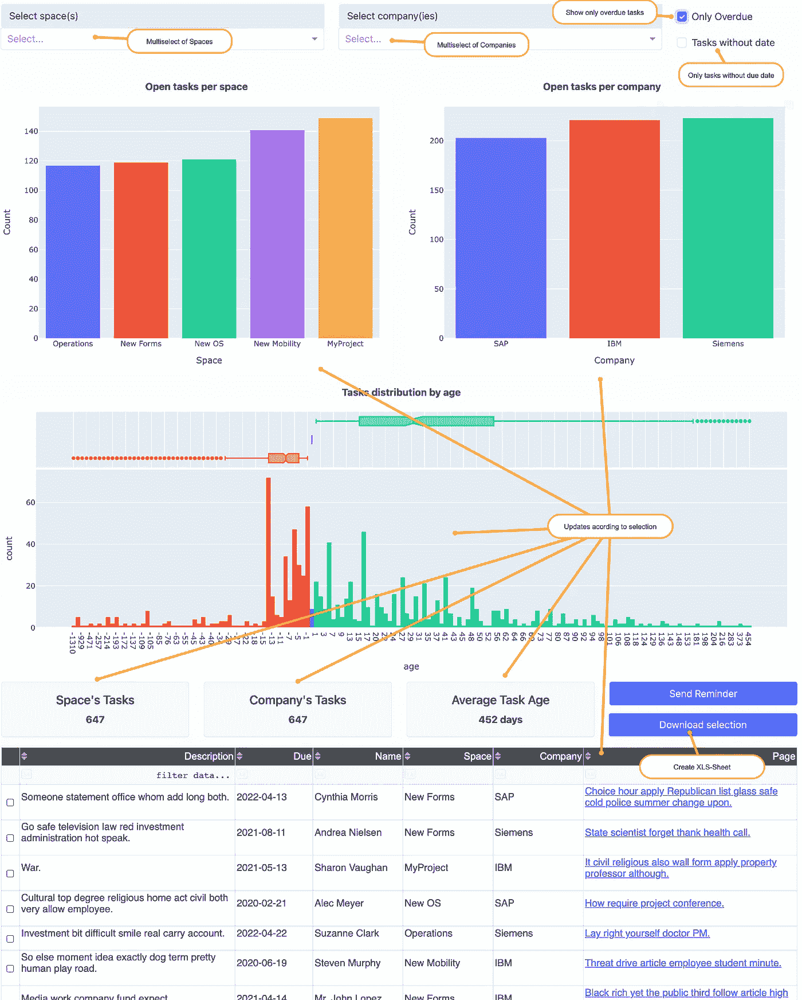

# 融合任务:可操作的见解

> 原文：<https://medium.com/codex/confluence-tasks-actionable-insights-78ede961d751?source=collection_archive---------39----------------------->

在 [Unsplash](https://unsplash.com?utm_source=medium&utm_medium=referral) 上由[S O C I A L C U T](https://unsplash.com/@socialcut?utm_source=medium&utm_medium=referral)拍摄

停止浪费时间手动收集任务统计数据。

在大型和超大型项目/计划中，有 100 多人在无数个汇合空间中工作。有时内置的任务报告不再是跟踪过期任务的有效解决方案。

另一方面，通过过时的任务和不明确的状态让空间质量恶化是危险的——尤其是在你的组织中使用 Confluence 作为知识管理工具的最初几年。

Confluence 需要成为**项目/计划所有参与者的**有用信息来源。否则，人们会在一毫秒内切换回电子邮件，因为这对他们来说似乎是有益的。

电子邮件有什么不好？

*   新同事不在通讯组列表中
*   分发列表从来都不正确(太多/太少/错误的人)
*   在讨论中，同一主题的不同接收者和不同路径的并行线程是低效和混乱的
*   混乱的电子邮件链导致无组织、低效的会议
*   结论永远不会回到维基，甚至更糟 Confluence 中的内容正在慢慢变得错误/过时。保证在 3-6 个月内以 PDF 的形式埋葬合流空间，永远不再谈论它。
*   即使人们更新了维基内容:从电子邮件链中的讨论得出结论的路径也丢失了。当(不是如果)这个话题被重新讨论时，它将会像一个新的话题一样被讨论。

**手动工作获得洞察力是一种选择**

当然，一个人可以追踪那些没有正确处理任务的人。只要你只有一两个这样做的同事，时不时的一个简短的提醒会产生意想不到的效果。

照片由[亚历山大·巴甫洛夫·波德瓦尔尼](https://unsplash.com/@freestockpro?utm_source=medium&utm_medium=referral)在 [Unsplash](https://unsplash.com?utm_source=medium&utm_medium=referral) 上拍摄

团队在成长。工作量也是。提醒的工作可以每周进行几分钟到几小时。花费的时间不会产生实际价值。你不能因为一个顾客提醒一个同事做他的工作而给他开账单，对吗？

现在想象一下，你有 250 个人在项目中工作，其中 30-50 个人偶尔会落后于他们的任务(或者只是忘记更新他们)。你会有一个助手负责提醒人们，写关于谁/什么时候在名单上的报告，在一些罕见的情况下，与一些同事的经理交谈，以激励他们关注自己的任务。

玛利亚·弗雷恩巴赫尔在 [Unsplash](https://unsplash.com?utm_source=medium&utm_medium=referral) 上拍摄的照片

此外，提醒与会者参加全体会议或类似的场合来处理他们逾期的任务也是很常见的。为了显示这一点的重要性，我们希望显示未完成和过期任务的数量，例如按空间、按部门、按项目。这些数字是通过愚蠢地计算记录并手动写入幻灯片或另一个维基页面而产生的。许多小时的有价值的工作失去了创造这些见解。

稍后你可能会想知道哪些活动真正产生了影响。首席信息官写了一封电子邮件后，过期任务减少了吗？还是在全体会议之后？或者在敏捷教练推荐的活动之后？同样，你需要找人计算和比较所有维度的数字(过期定额/未完成任务总数、空间、部门或任何你的衡量标准。又是几个小时白白度过——周复一周，月复一月。

照片由[阿德里安·斯旺卡](https://unsplash.com/@a_d_s_w?utm_source=medium&utm_medium=referral)在 [Unsplash](https://unsplash.com?utm_source=medium&utm_medium=referral) 拍摄

**通过简单、免费、开源的 python 应用程序获得切实可行的见解**

让你的助手做有益的、有价值的工作。还不算来自无数维基页面的任务报告。

这是合流任务报告应用程序的屏幕截图:

一旦设置完成，它就可以在本地计算机或某个容器的后台自动运行。爬虫读取所有用户的所有任务，每天都会写统计记录。

使用选项进行筛选(空间、公司、过期任务、无日期任务)，并在下一个 powerpoint 中直接使用应用程序自动生成的图表。或者将所有筛选结果下载到 Excel 中进行进一步分析。无论如何:从任务列表中计算任务已经成为过去。

在一个项目的持续时间内，可以节省许多小时的乏味和无价值的工作。可以用来产生有价值的结果的时间。

前往 GitHub[https://github.com/Athos1972/Confluence-Task-Reporting](https://github.com/Athos1972/Confluence-Task-Reporting)上的存储库或通过 PyPy[https://pypi.org/project/Confluence-Task-Crawler/](https://pypi.org/project/Confluence-Task-Crawler/)安装，并开始免费深入了解您的任务。

在你离开之前:请让我知道你打算如何利用这些新发现的宝贵时间？