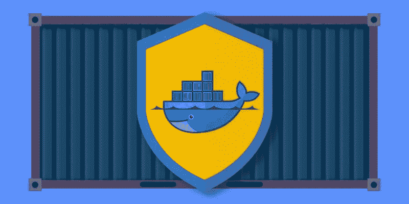
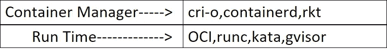
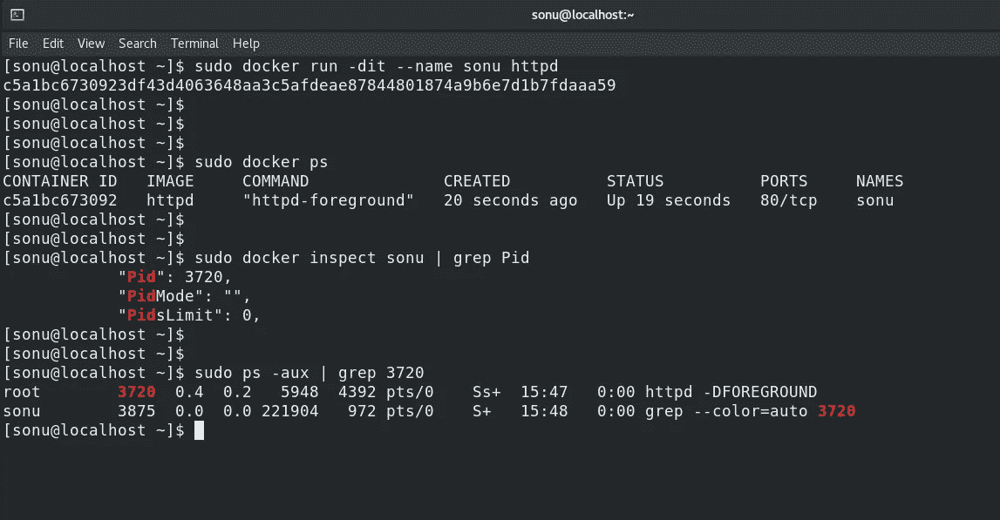
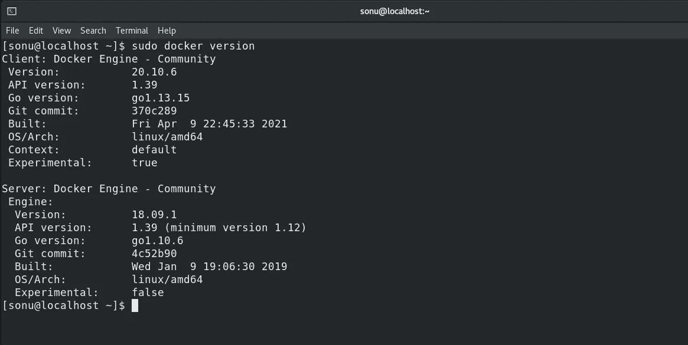
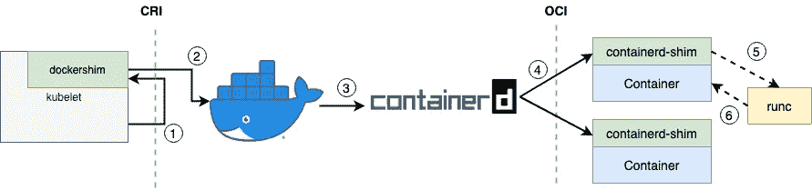
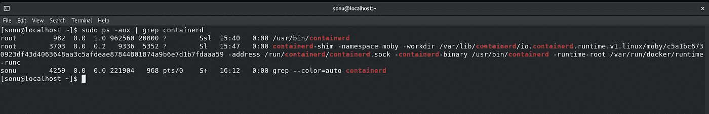
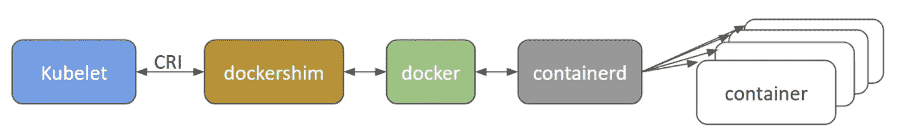
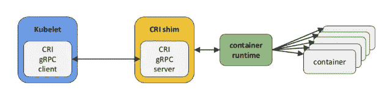
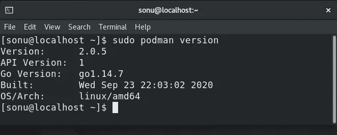

# 骗子:{Docker}内部透露

> 原文：<https://medium.com/codex/conman-docker-internals-revealed-23b8f29c52dc?source=collection_archive---------18----------------------->



码头工人是“骗子”

在这篇文章中，我们将讨论容器运行时(docker)的内部。(先决条件，即应了解 docker 或任何容器引擎)

其实 Docker 不是运行时。是**容器管理器**帮助(*mark 只帮助但不午餐， **runc*** 是启动容器的实际运行时)启动和执行容器上的不同操作。

```
**runc** →runc is a runtime that runs the bundle (docker image)provided to it. runc can be compaired with the python in “python my.py”,where my.py consist of some python code ,similar ways runc is the runtime of container where as python is runtime of above mentioned command. 
```

**关于内核特殊功能的一点历史，容器使用**内核 3 推出后，它推出了一些特殊功能，即当基础操作系统上的某个程序启动任何进程时，默认情况下，内核版本会将所有基础操作系统资源共享给所有由某个程序启动的进程，但新版本内核拥有的特殊功能是， 我们可以一起向流程显示不同的视图，这将与基础操作系统资源完全不同(即基础操作系统的资源是抽象的)

因此，Linux 内核的强制隔离/特殊功能可以通过以下方式实现

*   **命名空间** - >通过调整命名空间中的资源，只有该特定命名空间的成员才能看到或使用命名空间中存在的那些资源。
*   **Cgroup** - > Cgroup 对进程可能使用的资源量进行限制，即避免在主机/基本操作系统上使用过多资源。
*   它限制进程如何使用系统调用。
*   安全增强的 Linux 是一个对进程的强制访问控制系统，因此用于保护进程免受彼此和主机系统的影响。

# **现在让我们从 Docker/容器管理器的内部架构开始**

谈到容器管理器，它是帮助完成容器生命周期管理的软件。cri-o、rkt 等都是容器管理器的例子。



容器只不过是带有上述限制的**进程**(在 Linux 中)，CMD 如日期、cal 等。也是进程，进程的生命周期直到特定程序的特定进程/CMD 运行，因此我们可以控制进程，即容器操作系统，并根据使用情况使用。

下图就是证明，运行容器就是流程



要启动容器，我们需要 Docker 映像，容器管理器帮助运行这段代码，runc 负责启动容器或对容器执行操作，因此在坚果壳 Docker 中，即容器管理器以 json 格式向 runc 发送声明性信息，该信息存储在 config.json 文件中，这是一个文件，它要求或声明容器管理器使用指定的资源创建容器，最后 runc(容器运行时)按照 config.json 文件的指示运行容器。

```
**REQUIREMENT OF "config.json" FILE** config file is the one that provides the information (filesystem(fstab),network card, unique process tree etc)for the container that is to be launched it actually comes from the bundle i.e. the docker images**.
Its exactly like all the resources information are stored in the hardware and once we boot the system the complete hardrive is mountated to c drive (talking wrt windows)**
```

# **Docker 内部架构**



```
docker (cli tool)
        |
        v
 dockerd (daemon) 
        |
        v
 containerd (daemon) -┐
                      |
                      --> runtime-shim -> runc -> container
                      |
                      --> runtime-shim -> runc -> container
                      |
                     --> runtime-shim -> runc -> container
```



cli 工具是 docker 的客户端，其中 docker 和 containerd 是服务器部分，上面的块清楚地描述了 docker 不是联系 runc 的人，这就是为什么我们调用 docker 容器管理器而不是调用 docker 作为运行时。

下图显示 containerd 服务也在运行:-



因此，containerd 实际上是联系 runc 的人，因为我们与 docker cli 交互，但 containerd 是在 docker 后面运行的实际服务器，因此 containerd 被称为 Containerd

# **现在谈论容器管理器 wrt kubernetes**



docker 之前的架构已被弃用

kubelet 是 worker 节点上的一个，它联系 docker shim(这是一个接口或 API ),帮助联系 docker，因此，在后台 docker 联系 Docker 守护进程(containerd ),然后被包含的联系 runc，它是最后一个根据收到的包启动容器的联系(完全按照 config.json 一节中讨论的方式)



docker 之后的架构已被弃用

注意:kubernetes 不赞成使用 docker，有些是在 2020 年 12 月左右，因此导致了 Dockershim 层的删除，所以在 Dockershim 的位置，引入了容器运行时接口(CRI ),它本身是一种可以与许多容器运行时管理器通信的 Shim，因此启动了另一个容器管理器，称为 CRI-O，它充当容器引擎并联系运行时 **runc。**

事实:podman 是无服务的(无守护程序的)，因此不需要接口层/垫层，它直接联系 runc(容器运行时)来执行关于容器的动作



可以看到没有服务运行@ podman