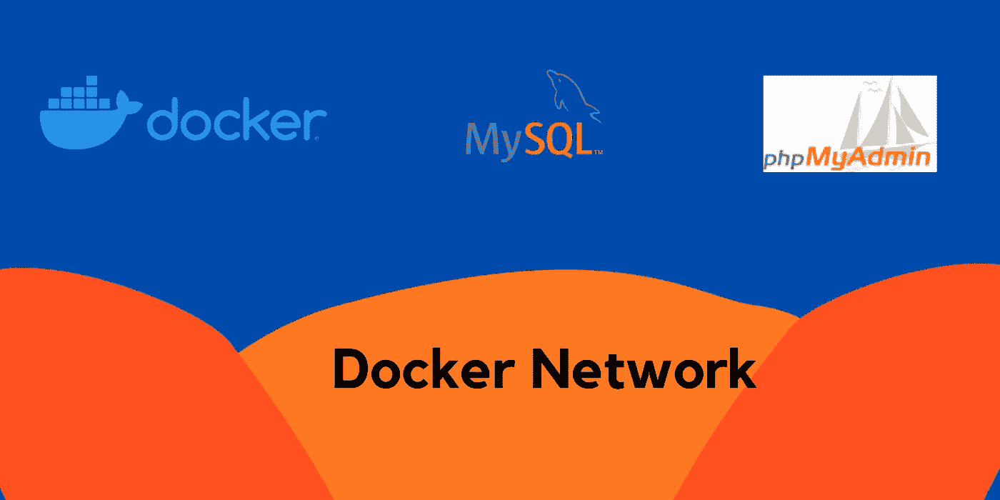

# 使用 Docker | Docker Network 连接 MySQL 和 phpMyAdmin 解释

> 原文：<https://medium.com/codex/connect-mysql-and-phpmyadmin-using-docker-docker-network-explained-6025b382dd58?source=collection_archive---------4----------------------->

## 了解如何创建 Docker 网络和连接容器。

码头网络

之前我们已经看到了如何[安装**Docker**以及如何](/codex/install-docker-on-ubuntu-and-centos-bcde88e77466)[运行 Docker](/codex/docker-basics-commands-cb956c4ef2ef) 容器？。Docker 在一个隔离的环境中运行容器。如果容器以隔离模式运行，那么我们如何将一个容器与另一个容器连接起来…