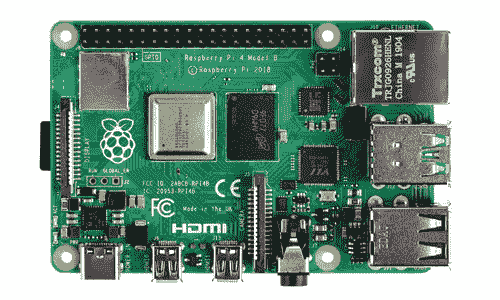
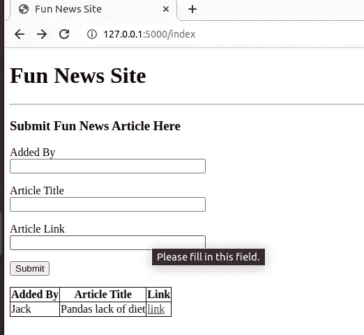

# 将 Flask 应用程序连接到 Raspberry Pi PostgreSQL 服务器

> 原文：<https://medium.com/codex/connecting-a-flask-application-to-a-raspberry-pi-postgresql-server-b37b54286ab0?source=collection_archive---------10----------------------->


有了一些使用 Flask 和使用 sqlite 数据库创建自己的小型本地应用程序的经验后，我想推动自己，为我正在制作的应用程序创建一个数据库服务器。幸运的是，我有一个备用的 Raspberry Pi 4 坐在家里什么也不做，所以在安装了一个无头版本的 Raspbian 并启用 SSH 后，它就可以开始了…

**在 Raspberry Pi 上设置 PostgreSQL**

在 Pi 上安装操作系统并检查它是否启动后，第一步是在本地网络上找到 Pi 的 IP 地址。这可以通过在 Pi 上的终端中运行`ip address`命令来完成，或者通过对网络上的设备运行 nmap 扫描来识别与 Pi 相关联的 IP。



一旦找到 IP 地址，就可以从主设备 ssh 到 Pi，这就是已经采用的方法。为此，请在终端中运行以下命令，并按照提示输入密码进行连接。

```
user@mycomputer$ ssh pi@<ip_address>
```

**安装 PostgreSQL**


连接到 Pi 后，下一步是更新包管理并将 PostgreSQL 安装到设备上。以下命令将完成此操作，并确保安装最新版本的 PostgreSQL。

```
pi@raspberrypi$ sudo apt-get update
pi@raspberrypi$ sudo apt-get install postgres -y
```

**访问 Pi 上的 psql**

虽然仍然通过 SSH 连接到 Pi 并安装了 PostgreSQL，但下一步是创建一个数据库用户和数据库，以便与 Flask 应用程序一起使用。要使用管理员权限访问 psql 的命令行应用程序，可以使用以下命令:

```
pi@raspberrypi$ sudo -u postgres psqlpostgres=# 
```

**创建一个 psql 用户**

通过 psql 的管理员访问权限，可以创建一个用户:

```
postgres=# create user <username>;
```

这将创建一个没有密码的数据库用户，虽然可以在创建用户时设置密码，但我不知道如何设置。因此，我在创建后使用以下命令为用户设置密码。

```
pi@raspberrypi$ sudo -u postgres psql
postgres =# ALTER USER <username> PASSWORD '<new password>';
```

**创建数据库**

同样，对于 psql 的管理员访问权限，可以使用以下命令创建数据库:

```
postgres=# create database <db_name>;
```

最后，可以向上一步中创建的用户授予特权。

```
pi@raspberrypi$ sudo -u postgres psql
postgres=# grant all privileges on database mydb to myuser;
```

**启用从其他设备到数据库的连接**

目前，我们有一个数据库和一个可以访问它的用户。然而，在这个阶段唯一可以连接到数据库的连接只能来自 Raspberry Pi。由于 Pi 充当 Flask 应用程序的数据库服务器，因此需要在 PostgreSQL 的配置文件中启用到它的连接。需要修改的文件需要 root 权限才能编辑，并且可以在`/etc/postgres/`目录中找到。

首先，在 **pg_hba.conf** 文件中，来自 IPv4 地址的连接需要被更改为 **0.0.0.0/0** ，以允许来自连接到同一网络的设备的连接。下面一行应该从[旧的]改为[新的]。

```
pi@raspberrypi$ sudo vim /etc/postgres/13/main/pg_hba.conf[old]    host   all   all   192.168.1.111/24   trust    
[new]    host   all   all   0.0.0.0/0          trust
```

其次，需要修改 **postgres.conf** 文件，将`listen_address`变量配置为活动的，并列出所有地址的连接。这可以通过删除行首的注释并编辑文件来实现，如下所示:

```
pi@raspberrypi$ sudo vim /etc/postgres/13/main/postgres.conf
    listen_address = "*"
```

最后，要启用对数据库配置的更改，需要重新启动 PostgreSQL 服务。

```
pi@raspberrypi$ sudo service postgresql restart
```

# **设置 Flask App 连接数据库**

每当我创建一个 Flask 应用程序时，我都会参考 [Flask Mega 教程](https://blog.miguelgrinberg.com/post/the-flask-mega-tutorial-part-i-hello-world)来了解项目设置的基础知识，所以我不会在这里详细介绍。项目的基本文件结构如下:

```
Project_Folder/
|
|--main.py
|--config.py
|--venv/
|--app/
   |
   |--__init__.py
   |--routes.py
   |--models.py
   |--templates/
      |
      |--index.html
```

## **安装依赖关系**

要安装所需的依赖项，请在终端中运行以下命令:

```
user@mycomputer$ python3 -m venv venv # setup python environment
user@mycomputer$ source venv/bin/activate # activate environment
(venv)user@mycomputer$ pip3 install flask 
(venv)user@mycomputer$ pip3 install flask-sqlalchemy
(venv)user@mycomputer$ pip3 install flask-migrate
(venv)user@mycomputer$ pip3 install python-dotenv
```

## **设置 main.py**

main.py 文件将是运行应用程序的脚本，并将利用 app 文件夹中的脚本。设置 main.py 文件，使其包含以下内容:

```
from app import appif __name__ == "__main__":
    app.run(debug = True)
```

## **设置配置文件**

现在，在上面的 Project_Folder 中，编辑 config.py 配置文件来存储数据库的连接细节。

```
import osclass Config(object):
    SECRET_KEY = os.environ.get('SECRET_KEY') or 'you-will-never-guess'
    SQLALCHEMY_DATABASE_URI = os.environ.get('DATABASE_URL') or \
        'postgresql://<db_username>:<db_password>
        @<db_ip_address>:5432/website'
    SQLALCHEMY_TRACK_MODIFICATIONS = True
```

## **设置 app/__init__。py**

__init__。py 文件设置应用程序的主 Flask 实例，以及数据库管理的 SQLAlchemy 和 Migrate 实例。最后，这个文件还将使用前面创建的 config.py 文件中的 Config 对象为应用程序建立配置。

```
from flask import Flask
from config import Config
from flask_sqlalchemy import SQLAlchemy
from flask_migrate import Migrateapp = Flask(__name__)
app.config.from_object(Config)
db = SQLAlchemy(app)
migrate = Migrate(app, db)from app import routes
```

__init__ 的最后一行。py 文件正在从应用程序包中导入 routes.py 文件。这需要到文件的最后一行，以解决循环导入问题，因为应用程序(如上定义)需要导入到 routes.py 文件中。

## **设置 routes.py**

routes.py 文件将定义应用程序中可用的不同 URL。该文件包含一系列可以映射到一个或多个 URL 端点的“查看”函数。例如，主页可能希望被映射到“/”和“/index”URL 中。创建函数时，装饰符:`@app.route("<destination>")`用于将 URL 与函数关联起来。也可以在视图函数中呈现 HTML 模板来生成页面。这是通过从 Flask 包中导入`render_template`函数来完成的。要渲染的模板存储在应用包的`templates`文件夹中，通过将文件名传递给`render_template`函数来访问。额外的参数也可以传递到函数中，以改变页面上显示的内容。

在本例中，index.html 文件包含以下内容:

```
<!DOCTYPE html>
<html>
    <head>
        <meta charset="utf-8">
        <title>{{ title }}</title>
    </head>
    <body>
       <h1>{{ title }}</h1>
    </body>
```

routes.py 文件包含以下内容来生成索引页面:

```
from app import app
from flask import render_template@app.route("/")
@app.route("/index")
def index():
    return render_template("index.html", title = "Home Page")
```

## **首次运行应用程序**

在继续创建数据库模型并进行全面测试之前，检查 Flask 设置和到目前为止所做的一切工作是否正常非常重要。为此，需要将 main.py 文件分配给`FLASK_APP`环境变量。这可以通过在 Project_Folder 目录中创建一个. flaskenv 文件来实现。

```
FLASK_APP=main.py
```

使用这个环境文件，可以在终端中调用“flask”命令来运行应用程序和执行数据库迁移任务。要运行该应用程序，只需调用:

```
(venv)user@mycomputer$ flask run
```

这将在终端中启动一个调试器，通过在任何 web 浏览器中导航到 127.0.0.1:5000，应用程序将可见。

## 创建用户数据库模型

现在，应用程序最基本的形式已经可以工作了，是时候添加与前面创建的数据库的交互了。这是通过在 models.py 文件中创建一个类来实现的，该类反映了数据在数据库中的存储方式。这些类通常被称为数据库模型或数据模型。

在 models.py 文件中，可以添加以下内容来为应用程序创建第一个数据库模型。在这种情况下，数据库将存储有趣新闻故事的标题和链接，以及谁将它们添加到数据库中:

```
from app import dbclass InterestingNews(db.Model):
    id = db.Column(db.Integer, primary_key = True)
    added_by = db.Column(db.String(64))
    title = db.Column(db.String(128))
    link = db.Column(db.String(128)) def __repr__(self):
        return f"<{self.added_by} added: {self.title}>"
```

上面代码中需要注意的一些事情。首先，代码第一行导入的`db`对象是 __init__ 中 SQLAlchemy 设置的实例。之前的 py 文件。其次，该类继承了先前存在的`db.Model`类。最后，当在数据中创建新列时，它被定义为一个`db.Column`对象，然后在其中指定数据类型。这将在以后的阶段中作为数据输入数据库时的验证。

## 数据库的终端测试

要测试数据库连接，启动 Python3 终端并运行以下命令:

```
>>> from app import db
>>> from app.models import InterestingNews
>>> news= InterestingNews(added_by= "name", title= "Funny story",
                          link= "http://<link_to_story>")
>>> db.create_all()
>>> db.session.add(news)
>>> db.session.commit()
>>>
>>> InterestingNews.query.all()
[<name added: Funny story>]
```

## 创建表单以捕获数据

现在可以在终端中添加到数据库的连接和故事了，让我们更新 flask 应用程序以包含一个收集用户输入的表单。

这里的第一步是在 app 文件夹中创建一个名为`forms.py`的新文件，在编辑该文件之前，还需要安装一个依赖项:

```
(venv)user@mycomputer$ pip3 install flask-wtf
```

现在在`forms.py`中，可以创建收集新闻故事链接的表单。表单字段将与之前创建的数据库模型的字段相匹配。

```
from flask_wtf import FlaskForm
from wtforms import StringField, SubmitField
from wtforms.validators import DataRequiredclass NewsForm(FlaskForm):
    added_by = StringField("Added By", validators=[DataRequired()])
    title = StringField("Article Title", 
                         validators=[DataRequired()])
    link = StringField("Article Link", validators=[DataRequired()])
    submit = SubmitField("Submit")
```

上面的 NewsForm 继承了 FlaskForm 类，并利用了 wtforms 模块中的 StringField 和 SubmitFields。

要将表单放入网页，需要更新`routes.py`文件来导入表单，并将其传递给生成页面的 render_template 函数。

```
from app import app
from flask import redirect, render_template, url_for
from app.forms import NewsForm@app.route("/")
@app.route("/index")
def index():
    news_form = NewsForm()
    if news_form.validate_on_submit():
        return redirect(url_for("index")) return render_template("index.html", title = "Home Page", 
                            form = news_form)
```

`index.html`现在可以使用 Jinja2 将表单对象嵌入到表单中的页面上。在下面的代码中，定义了表单，使用语法`{{ form.attribute.label }}`调用表单对象中的项目来提取文本标签，使用语法`{{form.attribute(size=32)}}`来创建输入字段。

```
...
<form action="" method="post">
    {{ form.hidden_tag() }}
    <p>
        {{ form.added_by.label }}<br>
        {{ form.added_by(size=32) }}
    </p>
    <p>
        {{ form.title.label }}<br>
        {{ form.title(size=32) }}
    </p>
    <p>
        {{ form.link.label }}<br>
        {{ form.link(size=32) }}
    </p>
    <p>{{ form.submit() }}</p>
</form>
...
```

现在，这个项目的最后阶段是在页面上显示一个表格，其中包含已经提交的新闻文章。在`routes.py`文件的前一阶段，表单在提交时被验证。在验证表单的 if 语句中，表单的内容可以用来创建数据库项，就像在 python shell 中创建一样。

```
from app import app
from flask import redirect, render_template, url_for
from app import db
from app.forms import NewsForm
from app.models import InterestingNews@app.route("/")
@app.route("/index")
def index():
    news_form = NewsForm()
    news_stories = InterestingNews.query.all() if news_form.validate_on_submit():
        news = InterestingNews(
                 added_by = news_form.added_by.data,
                 title = news_form.title.data,
                 link = news_form.link.data
        )
        db.session.add(news)
        db.session.commit()
        return redirect(url_for("index")) return render_template("index.html", title = "Home Page", 
                           form = news_form, stories = news_stories)
```

为了让表格显示在 web 页面中，`index.html`文件将被更新为包含一个表格，该表格带有一个表单循环，以生成与数据库中条目数量相对应的行数。

```
...
<table>
   <tr>
        <th>Added By</th>
        <th>Article Title</th>
        <th>Link</th>
    </tr>
    
        <tr>
            <td>{{ story.added_by }}</td>
            <td>{{ story.title }}</td>
            <td><a href="{{ story.link }}">link<a></td>
        </tr>
    
</table>
...
```



## 结论

这篇文章比预期的要长。然而，总结一下这里所做的一切:

*   在 Raspberry Pi 4 上设置 PostgreSQL 服务器
*   创建模板烧瓶应用程序
*   将 Flask 应用程序连接到 PostgreSQL 服务器
*   创建表单以更新数据库
*   在应用程序的表格中显示数据库内容

我希望这是对建立数据库并将其与 Flask 应用程序连接的有用介绍。这是一个简单的概述，有许多方法可以做到这一点，这些例子只是支持本文的基础。请随意对代码进行实验，并尝试提出其他示例，如果您真的这样做了，请在本文的评论中告诉我。我打算在以后的文章中扩展这个应用程序。

非常感谢您的阅读:)