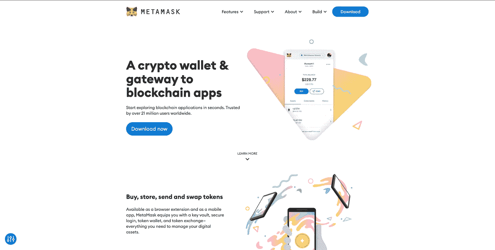

# 将元掩码连接到您的分散式应用程序

> 原文：<https://medium.com/codex/connecting-metamask-t-your-decentralised-application-3e8c98e96aa1?source=collection_archive---------10----------------------->

区块链开发的第一步，使用 metamask 钱包对用户进行身份验证。

Metamask 网站截图

## 在后台

故事从我们为所有渴望学习区块链的开发者创建一个新的自定义回购部分开始。创建去中心化应用的第一步是连接用户的钱包，在今天的故事中，我们将…