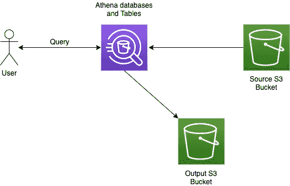

# 使用 Python 连接到 AWS Athena 数据库

> 原文：<https://medium.com/codex/connecting-to-aws-athena-databases-using-python-4a9194427638?source=collection_archive---------0----------------------->

## 这里有两种方法


**注**:与本文相关的完整代码可以在[这个 Github repo](https://github.com/ramdesh/athena-python-examples) 上找到。

[AWS Athena](https://aws.amazon.com/athena) 是一项服务，允许您在 AWS S3 存储桶中存储的数据文件上构建数据库，并从中查询数据。如果您有一个存储为 CSV 或 parquet 文件的大规模数据集，并且您不想花几天时间编写 ETL 作业并将其加载到标准 SQL 数据库中，那么这将非常有用。它基本上允许您编写标准的 SQL 查询，从存储在 S3 上的平面数据文件中检索数据。
我刚刚开始使用 Athena 数据库，面临着让我们的团队能够通过 Python，更具体地说是 Jupyterlab 访问 Athena 的问题，我想出了两种不同的方法来开发 Python 包装器，以便轻松有效地访问 Athena 数据库。

# 方法 1: PyAthena + SQLAlchemy

如果你像我一样是 SQLAlchemy 的粉丝，你会知道它是一个很棒的库，可以抽象出到不同数据库的数据库连接，维护一个 ORM 层，还有许多其他很酷的好处。每当我遇到一个新的数据库，需要编写一个包装器来连接它时，我都会想 SQLAlchemy 能做到吗？’在雅典娜的例子中，事实证明是可以的。大多数 Python 开发人员非常习惯使用 SQLAlchemy 来连接和查询数据库，因此检查是否有方法使用它来连接任何新的数据库总是好的。

[PyAthena](https://pypi.org/project/pyathena/) 是一个使用 [Athena 的 REST API](https://docs.aws.amazon.com/athena/latest/APIReference/Welcome.html) 连接 Athena 并获取查询结果的库。它可以直接包装在 SQLAlchemy 中，并且您可以创建一个 SQLAlchemy 连接对象，该对象可以非常直接地绑定到您通常使用的任何查询方法，例如将数据加载到一个`pandas` DataFrame 中:

```
from urllib.parse import quote_plus
from sqlalchemy.engine import create_engineAWS_ACCESS_KEY = "AWS_ACCESS_KEY"
AWS_SECRET_KEY = "AWS_SECRET_KEY"
SCHEMA_NAME = "schema_name"
S3_STAGING_DIR = "s3://s3-results-bucket/output/"
AWS_REGION = "us-east-1"

conn_str = (
    "awsathena+rest://{aws_access_key_id}:{aws_secret_access_key}@"
    "athena.{region_name}.amazonaws.com:443/"
    "{schema_name}s3_staging_dir{s3_staging_dir}&work_group=primary"
)

# Create the SQLAlchemy connection. Note that you need to have pyathena installed for this.
engine = create_engine(
    conn_str.format(
        aws_access_key_id=quote_plus(AWS_ACCESS_KEY),
        aws_secret_access_key=quote_plus(AWS_SECRET_KEY),
        region_name=AWS_REGION,
        schema_name=SCHEMA_NAME,
        s3_staging_dir=quote_plus(S3_STAGING_DIR),
    )
)athena_connection = engine.connect()
```

因此，您需要计算出 AWS IAM 帐户的访问密钥和秘密密钥，该帐户有权查询您正在连接的 Athena 数据库，还需要计算出您为 Athena 实例配置的结果 S3 存储桶，因为 Athena 需要一个结果 S3 存储桶来写入物理结果文件，也就是它从中提取结果的位置。您会注意到，我们甚至没有导入 PyAthena，但是当我们对连接字符串使用`awsathena+rest`语法时，它需要作为 SQLAlchemy 的底层数据库驱动程序安装。

现在我们已经连接到您的数据库，您需要做的就是使用您构建的连接对象查询它。我更喜欢用熊猫:

```
import pandas as pddf_data = pd.read_sql_query("select * from table", conn)
```

使用非常简单，但可能不是最好的方法，因为它在查询大型数据集时非常慢。Athena REST API 的`GetQueryResults`方法一次最多只能返回 1000 条记录，这意味着 PyAthena 必须维护一个游标并请求下一个 1000 条结果，以此类推。当我们继续查询数百万行数据时，这会花费很多时间。

这让我们想到:

# 方法 2:使用 Boto3 并下载结果文件

在我们开始讨论下一个方法之前，让我们看看 Athena 是如何工作的(在非常高的层次上):



当用户在 Athena 数据库上进行查询时，Athena 将从源 S3 存储桶中获取源数据，将结果返回给用户，并将结果(大多数情况下作为 CSV 文件)写入输出 S3 存储桶，这也是 Athena 实例配置的一部分。

我们将使用这种工作方式，并利用 Python 的 AWS 库 [boto3](https://boto3.amazonaws.com/v1/documentation/api/latest/index.html) 来运行我们的查询，获取刚刚运行的查询的 ID，并使用该 ID 获取相关的 CSV 文件。

首先，我们使用 boto3 构建一个 Athena 客户端:

```
import boto3AWS_ACCESS_KEY = "AWS_ACCESS_KEY"
AWS_SECRET_KEY = "AWS_SECRET_KEY"
AWS_REGION = "us-east-1"athena_client = boto3.client(
    "athena",
    aws_access_key_id=AWS_ACCESS_KEY,
    aws_secret_access_key=AWS_SECRET_KEY,
    region_name=AWS_REGION,
)
```

然后，我们使用客户端运行一个查询:

```
query_response = athena_client.start_query_execution(
    QueryString="SELECT * FROM table",
    QueryExecutionContext={"Database": SCHEMA_NAME},
    ResultConfiguration={
        "OutputLocation": S3_STAGING_DIR,
        "EncryptionConfiguration": {"EncryptionOption": "SSE_S3"},
    },
)while True:
    try:
        # This function only loads the first 1000 rows
        client.get_query_results(
            QueryExecutionId=query_response["QueryExecutionId"]
        )
        break
    except Exception as err:
        if "not yet finished" in str(err):
            time.sleep(0.001)
        else:
            raise err
```

注意这里的`get_query_results`函数并没有回调函数让我们知道查询已经完成；我们必须在 while 循环中不断检查。我们完全忽略了由`get_query_results`函数生成的返回值，因为我们想要做的只是计算出查询何时停止执行，然后下载结果文件。

然后，我们使用 boto3 创建一个 S3 客户端，并使用它直接从 S3 下载查询结果文件。

```
import pandas as pdS3_BUCKET_NAME = "s3-results-bucket"
S3_OUTPUT_DIRECTORY = "output"temp_file_location: str = "athena_query_results.csv"
s3_client = boto3.client(
    "s3",
    aws_access_key_id=AWS_ACCESS_KEY,
    aws_secret_access_key=AWS_SECRET_KEY,
    region_name=AWS_REGION,
)
s3_client.download_file(
    S3_BUCKET_NAME,
    f"{S3_OUTPUT_DIRECTORY}/{query_response['QueryExecutionId']}.csv",
    temp_file_location,
)
df = pd.read_csv(temp_file_location)
```

这会将结果下载到您的工作区中一个名为`athena_query_results.csv`的文件中，然后您可以将它加载到熊猫数据框架中。

Github repo 上有一个更有条理的版本。

# 比较两者

下面是这两种方法的比较，从包含 200 多万条记录的表中提取一列，分别提取 100、1000、10，000、100，000 和 100 万条记录:


结果文件下载方法胜出！

如您所见，随着我们试图检索的数据量增加并超过 10，000 条记录，Boto3 显然是更好的选择。PyAthena 必须使用游标不断返回 Athena，这一事实似乎真的阻碍了它对大型查询的处理。

看来我们要从 S3 下载结果文件了。