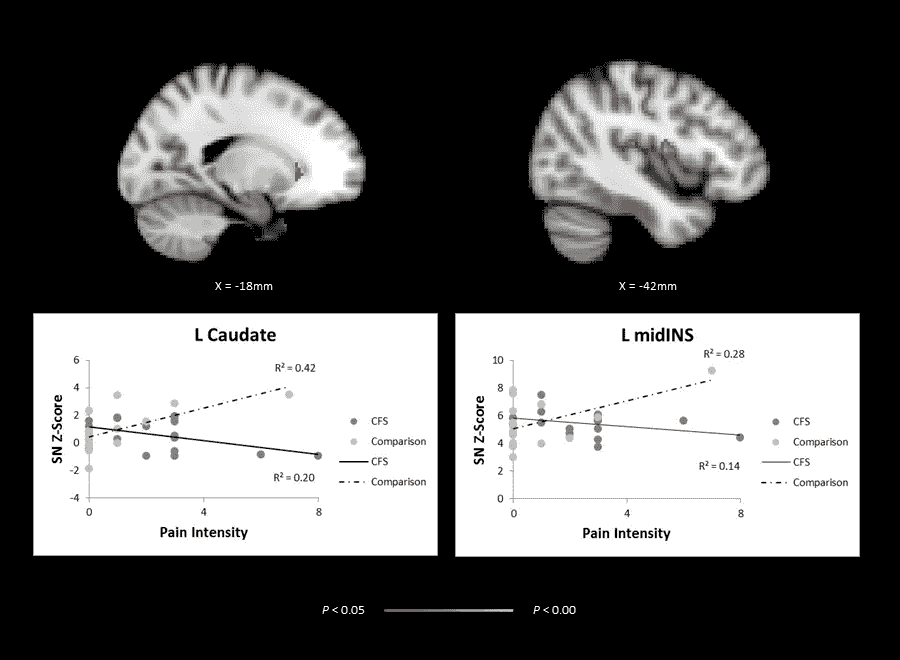

# 意识不是量子力学，大脑也不是在猜测

> 原文：<https://medium.com/codex/consciousness-is-not-quantum-mechanics-and-the-brain-isnt-making-guesses-85c7ba2c0474?source=collection_archive---------7----------------------->

显著性网络(SN)连接性和疼痛强度之间的协变通过 [Wortinger 等人](https://journals.plos.org/plosone/article?id=10.1371/journal.pone.0159351)

大脑如何{相当准确地}猜测或预测它还不知道的东西？如果没有被提取和储存，大脑如何更新任何东西？如果没有统一的储存，大脑如何储存各种形式的感觉(内部和外部)？

**记忆**

一个被忽视的问题是:记忆(或大脑中储存已知信息的区域)如何挑选并给出储存的信息？

为什么它会先发制人地这样做，这看起来像是预测，但却是快速性的基本功能？

大脑不[对现实做出猜测。相反，它承载着一个外部可获得的现实版本。](https://www.youtube.com/watch?v=z7_LwuuPsAE)

感觉输入主要在丘脑中整合，嗅觉在嗅球中。

这种输入被传递——传递到一个知道的目的地，然后感受。它是已知的，或者说它是如何决定感觉的方向的。

单词的变化可能会引起兴奋然后大笑，或者愤怒然后皱眉，但是单词必须是已知的{默认位置}，变化是传输，然后是感觉和反应。

感觉整合的单位{或意识的开端}是思想或思想的一种形式。它是记忆储存并用来与世界联系的任何外部事物的思想版本。

简单来说，记忆储存的东西和感觉统合的统一单位是一样的。

所有假定的{大脑}猜测或预测都是以思想的形式——来自经验。所有更新都来自感觉整合。

如果猜测是未知的，它们将是随机的，如果猜测是随机的，没有人会幸存。

杯子、汽车、房子或其他任何东西都不是最佳猜测，而是一个思维版本——作为存储，在记忆中分组。快乐或悲伤是由思想版本传递、知晓和负责的。

存储器中的存储具有默认组，其可以是普通功能、最近功能或最显著的体验。商店会访问其他组，但默认组会在其他组之前首先成为某个事物的含义，就像在创伤中一样。

商店有一个他们去过的所有组的标识符。在自动和受控过程中，跨组存储的传输是一个主要的记忆功能。

组不同于内存概念和类别，因为它们定义了静态实例。它们不考虑记忆中的运输，而且考虑到整个知识范围而不仅仅是几个对象，它们意味着太多的重复。

概念和范畴类似于语言学中的框架语义学，大多适用于词，而不是每一个内部和外部的意义——记忆储存和分组的意义。

没有一个大脑对世界的内部模型不是通过感觉整合获得的。除了存储器给出的默认组含义之外，没有预测编码或处理。

**当**是什么感觉

意识是[不是量子力学](https://bigthink.com/13-8/quantum-consciousness-2/)。大脑是[而不是沙堆](https://www.scientificamerican.com/article/sand-pile-model-of-the-mind-grows-in-popularity/)，它不是在[混沌的边缘](https://www.sciencedaily.com/releases/2009/03/090319224532.htm)或者[自组织临界状态](https://journals.aps.org/prl/abstract/10.1103/PhysRevLett.126.098101#fulltext)运行。感觉整合和记忆操作有一个模式。

意识是什么和知道什么，从感觉整合的统一单位开始，最终成为记忆储存的相同单位——或者知道意味着什么。

它被认为是，自动的或受控制的从记忆储存中传输到有意义的世界。

在昏迷、全身麻醉和睡眠状态下，记忆继续挑选并给予相当于内部感觉的输入，因此即使外部感知不足，记忆仍然活跃。

心身问题主要是通过精神神经内分泌免疫双向交流中的思想运输来解决的。

如果有一个{变化或}危险的感官输入，它会进入丘脑，整合到思想或其形式中。正是这种形式进入其记忆存储，然后进入危险组，扩展并诱导优先级，影响可能包括内部系统的其他存储的规律性，导致{呼吸、血流}活动的尖峰，因为它们在记忆中的功能检查被中断。

在危险的群体中储存，向目的地发送思想，感受危险可能会促使神经递质的释放和逃离的反应，这一切发生得如此之快。

思想影响了身体，但不是在真空中发生的，而是来自感觉统合和记忆协调。记忆储存了每一个内部和外部的过程，所以一个储存影响另一个推动身心。商店有一个最佳的规模，并且经常对功能检查进行被动的思考。