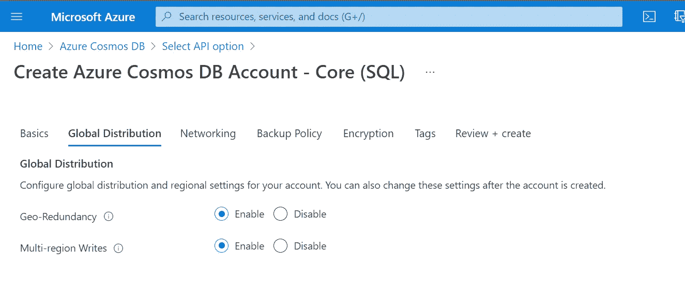
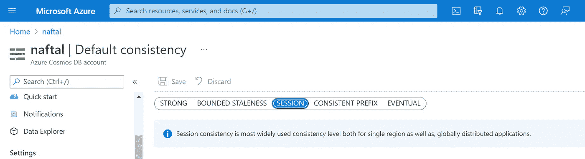

# Azure Cosmos DB 中的一致性

> 原文：<https://medium.com/codex/consistency-in-azure-cosmos-db-1e19868c4cef?source=collection_archive---------10----------------------->

任何数据库中的一致性都意味着确保发生的任何事务都不会影响数据库的结构完整性。在任何给定的时间点，可能会有多个写事务影响数据库中的一个实体。如果用户试图在更改后读取同一个实体，那么他们会看到什么，是实体的更新值还是更新前的值？这个问题的答案取决于为 NoSQL 数据库设置了什么样的一致性级别。

Cosmos DB 是 Azure 的 NoSQL，旨在供要求低延迟响应时间的关键任务应用程序使用。Azure 提供的一致性级别有:

*   *强*
*   *有界无状态*
*   *会期*
*   *一致前缀*
*   *最终*

**Strong —** 在这种情况下，对所有地区的数据库的任何读取都将显示最新的数据。一旦提交了写事务，它将被写入到提供数据库的所有区域。

在要求用户无论身在何处都能查看更新信息的应用程序中，强一致性非常重要。这方面的一个例子是需要显示正确库存数量的电子商务和售票应用程序。每当发生任何销售/预购时，所有地区的库存量都应更新，这一点很重要，因为交易是在离用户最近的供应地区处理的。

**有界无状态—** 在此一致性级别下，我们引入两个参数来确定读取和写入之间的延迟。这两个参数是 T 和 K: **T —** *时间间隔，* **K—** *更新。*读取可以远离最新版本最多 K 次提交或 T 个时间间隔。对区域的更新取决于首先到达哪个参数。

**会话—** 在特定的会话窗口内，保证相同区域内的客户端的所有读取都是一致的。这是管理员尚未配置的新建数据库的默认一致性级别。与强一致性相比，这种配置的主要好处是节省成本。

**一致前缀—** 根据微软文档，“T28”在一致前缀选项中，返回的更新包含所有更新的一些前缀，没有间隔。一致的前缀一致性级别保证读取永远不会看到无序写入。这仅仅意味着接收事务的顺序与更新数据库的顺序相同。

**最终—** 在这种情况下，读取没有顺序保证。这是一致性的最弱形式。在这种情况下，客户端可能会读取被认为是旧的/陈旧的数据。这种一致性用于不需要排序保证的情况。

上述一致性级别还取决于创建帐户时设置的全局分布设置。这决定了数据库是否有多区域写入，默认设置为 enabled。

如前所述，默认一致性设置为会话。该信息可在菜单的*默认一致性*部分找到。

如果多区域写入会产生强一致性等影响，则启用此功能非常重要。这可以在*全局复制数据*菜单选项下找到。这将允许写入比两个预定区域更多的区域。