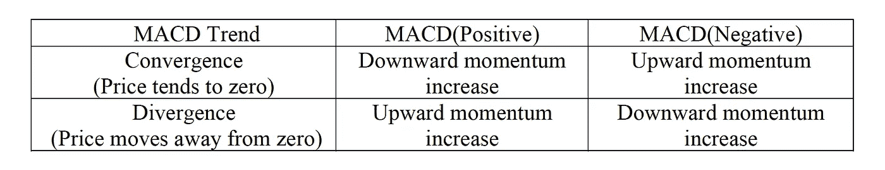

# 用弹性搜索构建 MACD 直方图

> 原文：<https://medium.com/codex/construct-macd-histogram-with-elasticsearch-ecd6b627457e?source=collection_archive---------10----------------------->

移动平均线收敛发散(MACD)是一种用于股票技术分析的交易指标，由 Gerald Appel 于 1979 年发明。MACD 涉及两个移动平均值，一个短周期和一个长周期。常见的做法是，短周期为 12，长周期为 26，移动平均函数使用指数加权(EWMA)。基本上，MACD 是每日股票价格的短期和长期指数加权移动平均线之间的距离。如果距离趋于减小，则意味着收敛，反之，则意味着发散。当 MACD 为零时，趋势处于收敛和发散之间的过渡状态。计算公式如下:


如果 MACD 是正的，远离零，股票价格的上升势头正在增加。如果是负的，远离零，向下的动力在增加。下表描述了 MACD 值和趋势组合的含义。



在本文中，我们尝试将 MACD 应用于免佣金的交易所交易基金(ETF ),并将弹性搜索作为分析工具。以下示例随机选取“富达国际多因子 ETF”。它的股票代码是 FDEV。数据选自投资者交易所 IEX 提供的 2021 年 1 月 5 日至 2021 年 5 月 31 日的时间范围。


当 MACD 值从零以下上升并穿过零时，市场被认为是看涨的。另一方面，当 MACD 值从零以上下降并穿过零时，市场被认为是熊市。在上面的图表中，我们可以看到当价格趋势改变时，MACD 和 Y 轴(y=0)的交点滞后。因此，交易者经常批评这种缺陷。1986 年，Thomas Aspray 引入了 MACD 直方图/动量法来解决这个问题，并被广泛使用。与 MACD 相比，MACD 直方图可以提供早期信号。但后来发现，一些所谓的早期信号可能是无效的，需要其他指标来证实。基本上，MACD 直方图是 MACD 和它的信号线之间的距离。信号线是 MACD 的 EWMA，周期为 9。公式如下:


当 MACD 直方图为零(两条线交叉)时，意味着趋势即将反转。下图显示了 2021 年 1 月 15 日和 2021 年 5 月 31 日的日 MACD 和相应的信号符号 FDEV。观察 MACD 和 Y 轴(y=0)相交的时间，你会发现在 MACD 和信号线的前方有一个对应的交点。


由于 MACD 的折线图和它的信号线不容易观察到，所以可以用一个条形图来描绘 MACD _ 直方图来直观地反映市场的走势。下图显示了从 2021 年 1 月 15 日到 2021 年 5 月 31 日的日 MACD 直方图。当 MACD 高于信号线时，横条为正值，反之亦然。条的高度是 MACD 和信号线之间的差。在该图中，水蓝色条代表积极向上的趋势。蓝色柱代表积极，但显示下降趋势。橙色条代表负值，但显示增长。最后，红色柱代表负值，显示负增长。


假设有一个用数据填充的 Elasticsearch 指数，其使用的数据映射与上一篇论文中描述的相同([通过 Elasticsearch](https://wtwong316.medium.com/calculate-bollinger-band-width-through-elasticsearch-39f7f3a1ceff) 计算布林带宽度)。以下步骤解释了如何使用 Elasticsearch 构建 MACD 直方图，并演示了 REST API 请求体代码。

> 通过搜索操作收集所有相关文件

使用带有“must”子句的“bool”查询来收集符号为 FDEV 且日期在 2021–01–15 和 2021–5–31 之间的文档。由于 26 个交易日移动平均线的计算，额外数据调整为 1.5 个月(从 2021 年 12 月 1 日至 2021 年 1 月 14 日)。

```
{
    "query": {
        "bool": {
            "must": [
                {"range": {"date": {"gte": "2020-12-01", "lte": "2021-05-31"}}},
                {"term": {"symbol": "FDEV"}}
            ]
        }
    },
```

> 计算基金的每日典型价值

使用名为 MACD 直方图的“日期直方图”聚合，参数“字段”为“日期”，参数“间隔”为“1d”，以提取每天的基金价格。然后是名为 TP 的“scripted_metric”聚合，以计算典型价格，该价格等于最高价、最低价和收盘价的平均价格。

```
 "aggs": {
        "MACD_Histogram": {
            "date_histogram": {
                "field": "date",
                "interval": "1d",
                "format": "yyyy-MM-dd"
            },
            "aggs": {
                "TP": {
                    "scripted_metric": {
                        "init_script": "state.totals=[]",
                        "map_script": "state.totals.add((doc.high.value+doc.low.value+doc.close.value)/3)",
                        "combine_script": "double total=0; for (t in state.totals) {total += t} return total",
                        "reduce_script": "return states[0]"
                    }
                },
```

> 提取桶的日期

由于存在额外的数据，后续操作需要稍后过滤掉超出范围的部分。一个名为“DateStr”的“min”聚合将获取存储桶的日期。在 Elasticsearch 服务器中，日期字段以纪元时间存储。时间单位是毫秒，时区是 UTC。

```
 "DateStr": {
            "min": {"field": "date"}
        },
```

> 选择包含 1 个以上文档的存储桶

为了过滤掉空的时段(非交易日)，使用一个名为 STP 的“bucket_selector”聚合来选择文档计数大于 0 的时段。

```
 "STP": {
            "bucket_selector": {
                "buckets_path": {"count":"_count"},
                "script": "params.count > 0"
            }
        },
```

> 计算每日 12 个交易日和 26 个交易日 EWMA 的典型值

使用名为 EWMA12 的“移动 _fn”聚合，参数 window 为 12，参数“buckets_path”为 TP.value，计算典型值的 12 个交易日 EWMA。EWMA 是通过使用函数 MovingFunctions.ewma 和参数 alpha 为 2/(window+1)来计算的。EWMA26 聚合可以用同样的方式完成。

```
 "EWMA12": {
            "moving_fn": {"script": "MovingFunctions.ewma(values, 2/(12+1))", "window": 12, "buckets_path": "TP.value"}
        },
        "EWMA26": {
            "moving_fn" : {"script": "MovingFunctions.ewma(values, 2/(26+1))", "window": 26, "buckets_path": "TP.value"}
        },
```

> 计算 MACD

使用名为 MACD 的“bucket_script”聚合和参数“buckets _ path”来指定来自 EWMA12 和 EWMA26 的结果。然后，根据以下等式计算 MACD 指标。

```
 "MACD": {
            "bucket_script": {
                "buckets_path": {
                    "EWMA12": "EWMA12",
                    "EWMA26": "EWMA26"
                },
                "script": "params.EWMA12 - params.EWMA26"
            }
        },
```

> 计算 MACD 信号

使用名为 Signal 的“移动 _fn”聚合，参数 window 为 9，参数“buckets_path”指定 MACD 的结果，以计算 MACD 的 9 个交易日 EWMA。EWMA 是通过使用参数α为 2/(9+1)的函数 MovingFunctions.ewma 来计算的。

```
 "Signal": {
            "moving_fn": {"script": "MovingFunctions.ewma(values, 2/(9+1))", "window": 9, "buckets_path": "MACD"}
        },
```

> 计算 MACD 直方图

使用名为 MACD 直方图的“桶 _ 脚本”聚合，并带有参数“桶 _ 路径”来指定 MACD 和信号聚合结果。然后，根据等式计算 MACD 直方图指示符。

```
 "MACD_Histogram": {
            "bucket_script": {
                "buckets_path": {
                    "MACD": "MACD",
                    "Signal": "Signal"
                },
                "script": "params.MACD - params.Signal"
            }
        },
```

> 确定 MACD 直方图值的类型

a)使用一个名为 MACD _ 柱状图的“衍生”聚合，并带有参数“桶 _ 路径”来指定 MACD _ 柱状图的值，以确定它是从前面的时间戳开始递增还是递减。

```
 "MACD_HistogramDiff": {
            "derivative": {
                "buckets_path": "MACD_Histogram" 
             }
        },
```

b)使用名为 MACD 直方图类型的“桶 _ 脚本”聚合，并带有参数“桶 _ 路径”来指定 MACD 直方图和 MACD 直方图的结果，以对 MACD 直方图值的类型进行分类。

如果 MACD_HistogramDiff 是减量，则为➤类型 1；如果 MACD_HistogramDiff 是增量，则为 MACD_Histogram 类型 2；如果 MACD_HistogramDiff 是增量，则为 MACD_Histogram 类型 3；如果 MACD_HistogramDiff 是减量，则为➤类型 4；对于其他情况，为 MACD_Histogram 类型 0

```
 "MACD_HistogramType": {
            "bucket_script": {
                "buckets_path": {
                    "MACD_Histogram": "MACD_Histogram",
                    "MACD_HistogramDiff": "MACD_HistogramDiff"
                },
                "script": "(params.MACD_Histogram > 0) ? (params.MACD_HistogramDiff > 0 ? 3 : 4) : ((params.MACD_Histogram < 0) ? (params.MACD_HistogramDiff > 0 ? 2 : 1): 0)"
            }
        },
```

> 筛选出要输出的附加文档

使用名为 SMACD_Histogram 的“bucket_selector”聚合，使用参数“buckets_path”作为“DateStr”来选择“script”语句中指定的正确存储桶。选择标准是那些日期等于或晚于 2021 年 1 月 15 日的时段(纪元时间 1610668800000 以毫秒为单位)。

```
 "MACD_HistogramType": {
            "bucket_script": {
                "buckets_path": {
                    "MACD_Histogram": "MACD_Histogram",
                    "MACD_HistogramDiff": "MACD_HistogramDiff"
                },
                "script": "(params.MACD_Histogram > 0) ? (params.MACD_HistogramDiff > 0 ? 3 : 4) : ((params.MACD_Histogram < 0) ? (params.MACD_HistogramDiff > 0 ? 2 : 1): 0)"
           }
       },
```

> 收集完结果后，我们就可以画出如图所示的图形了。

本文中使用的 Elasticsearch 示例显示了无缝集成和易于理解。读者可以进一步参考 GitHub 上的开源项目([Construct _ MACD _ 直方图 _With_Elasticsearch](https://github.com/wtwong316/Construct_MACD_Histogram_With_Elasticsearch) )

备注:

一、感谢 IEX(投资者交易所)提供 ETF 数据，也感谢 GitHub 提供开源项目存储。

二。本文基于一种技术思路，不构成任何投资建议。读者在使用时必须承担自己的责任。

三。文章可能还有错误，恳请读者指正。

四。感兴趣的读者可以参考作者的书，了解弹性搜索的所有基本技巧。《高级弹性搜索 7.0》，2019 年 8 月，Packt，ISBN: 9781789957754。