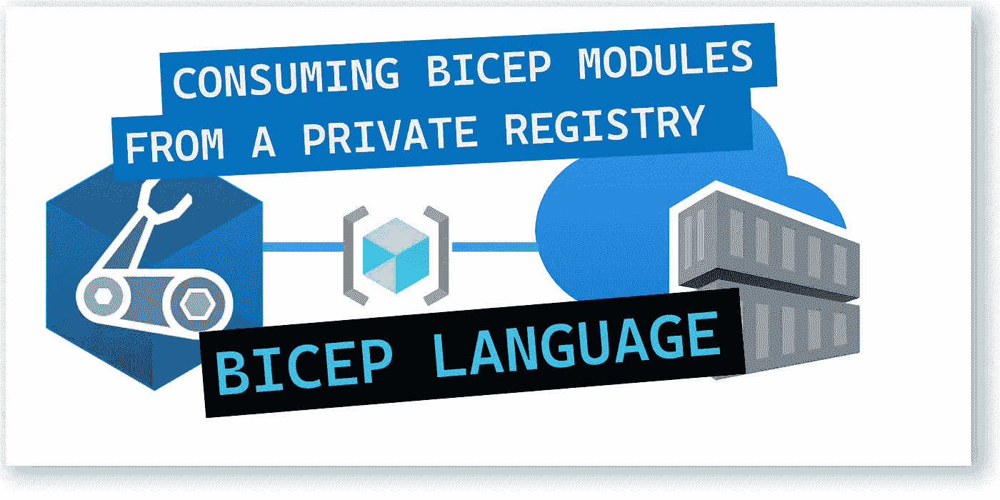
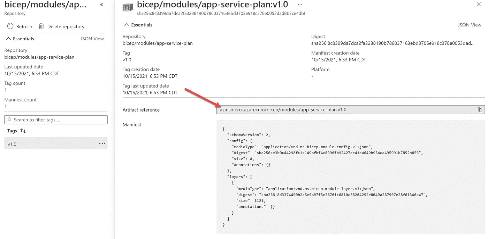
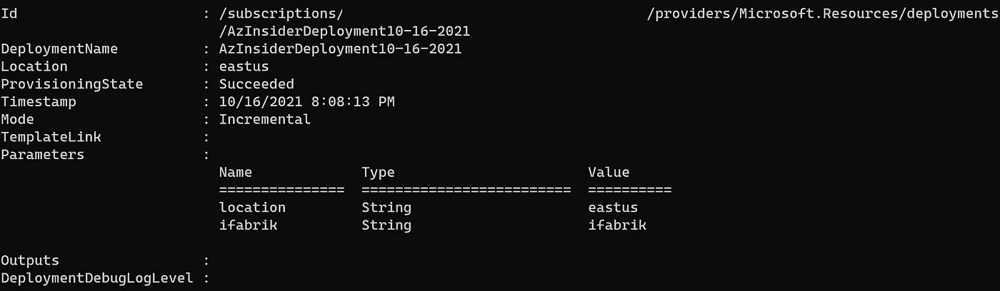
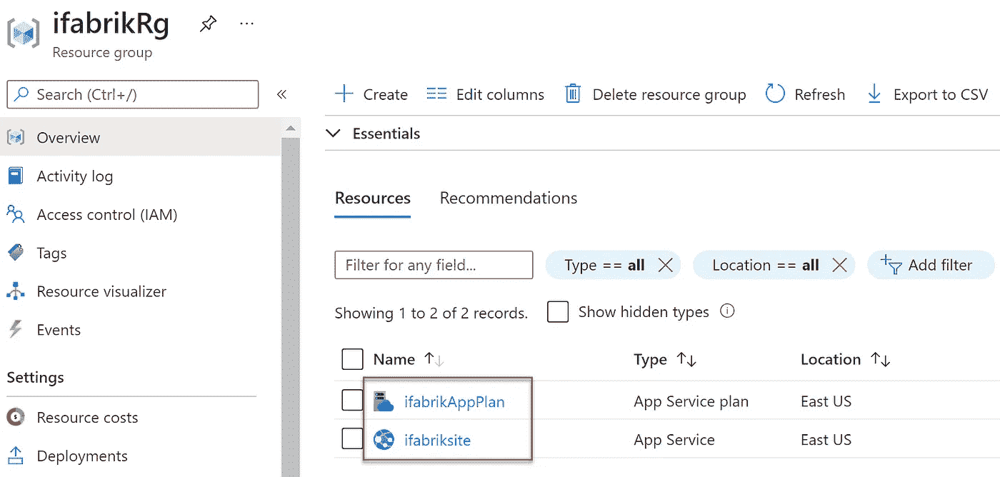

# 💪使用私有注册表中的 Bicep 模块

> 原文：<https://medium.com/codex/consuming-bicep-modules-from-a-private-registry-77cc0775bcfd?source=collection_archive---------4----------------------->

了解如何轻松使用存储在私有注册表中的 Bicep 模块。



💪使用私有注册表中的 Bicep 模块

在之前的[文章](/codex/sharing-bicep-files-within-your-organization-using-a-private-registry-439294593a9b?source=friends_link&sk=25c2cba024b53fcd91afb95c2d1ebda8)中，我们回顾了如何使用私有注册表在您的组织内共享 Bicep 文件。本文将研究如何使用发布在私有注册中心的 Bicep 模块。

## 先决条件:

*   Bicep 安装在您的本地机器上
*   Azure 订阅中的私有注册表
*   私有注册表中的 Bicep 文件(模块)

该解决方案将由以下文件组成:

*   *main* :这个填充将包含参数的定义，一个资源组，并将消耗两个模块。
*   *appService* :这是一个二头肌模块，将从本地来源消费
*   *appServicePlan* —这是一个 Bicep 模块，将从私有注册中心使用。

# 使用私有注册表中的 Bicep 模块

在下面的例子中，我们将使用 Bicep 创建一个 web 应用程序，并使用私有注册中心的 Bicep 模块。

为了使用模块，我们提供 Azure 容器注册中心的名称和模块的路径，如下所示:

```
module <Your-Module-Symbolic-Name> 'br:<registry-name>.azurecr.io/<file-path>:<tag>' = {
```

首先，我们将从私有注册中心的 Bicep 模块中提取信息；在这种情况下，私有注册表的名称是:

```
azinsidercr.azurecr.io/bicep/modules/app-service-plan:v1.0
```

您可以使用 Azure Portal 或 Azure PowerShell 或 Azure CLI 从您的私有注册表中获取信息。



Bicep 私人登记处

下一步是定义我们的 *main.bicep* 文件。该文件将包含参数和资源的定义。

注意，我们使用两个模块:一个来自私有注册表，第二个来自本地 Bicep 文件。

当引用注册表中的模块时，Visual Studio 代码中的 Bicep 扩展将使用 bicep *restore* 命令执行调用。该命令从注册表中获取所有必需模块的副本，并将这些副本存储在本地缓存中。

现在我们将定义 *appService.bicep* 模块。下面的代码显示了这个 Bicep 模块的定义。

```
param appServicePrefix string
param location string = 'eastus'
param appServicePlanId stringresource appService 'Microsoft.Web/sites@2021-01-15' = {
  name: '${appServicePrefix}site'
  location: location
  properties:{
    siteConfig:{
      linuxFxVersion: 'DOTNETCORE|3.0'
    }
    serverFarmId: appServicePlanId
  }
}
// Set an output which can be accessed by the module consumer
output siteURL string = appService.properties.hostNames[0]
```

现在我们将使用下面的命令继续部署 *main.bicep* 文件:

```
New-AzDeployment -Name $deploymentName -TemplateFile .\main.bicep -Location eastus
```

请注意，我们的目标是订阅范围。为什么？我们将创建一个新的资源组，然后在新的资源组中部署资源。

下图显示了部署输出:



部署输出。

您还可以访问 Azure 门户，验证新的资源组是否已随应用服务计划和应用服务一起提供，如下图所示:



Azure 门户—部署

在 Bicep 中使用模块非常简单，您可以轻松地在不同的部署中重用模块。

👉 [*在此加入****azin sider****邮箱列表。*](http://eepurl.com/gKmLdf)

*-戴夫·r·*