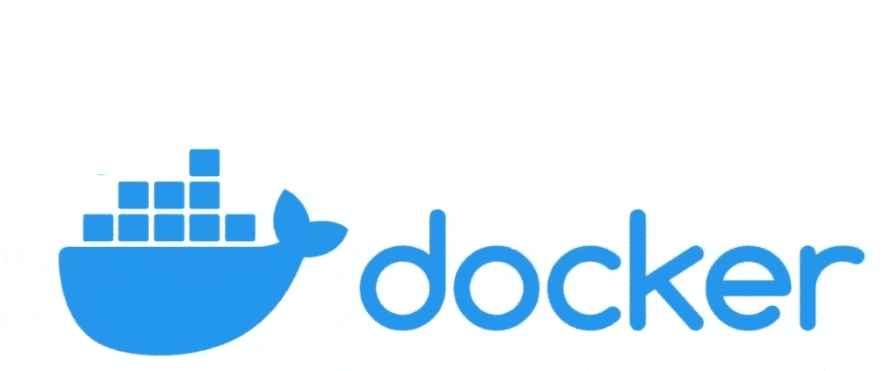
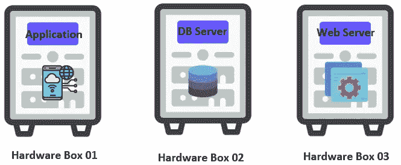
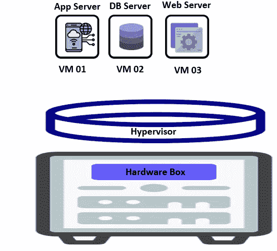
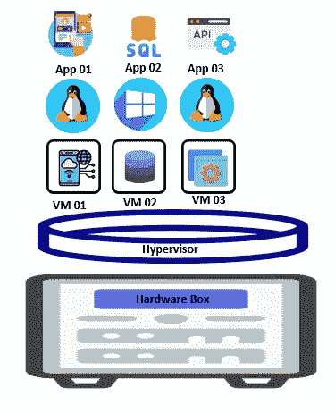
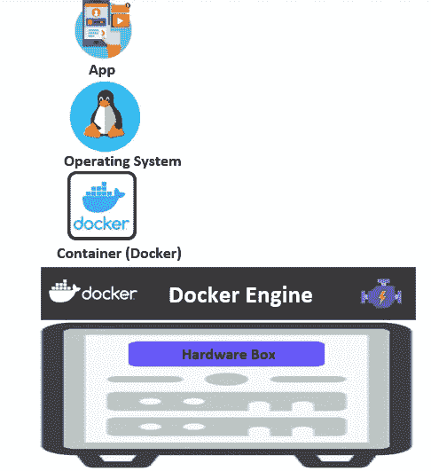

# 基于容器的应用程序开发

> 原文：<https://medium.com/codex/container-based-application-development-692c816ae115?source=collection_archive---------7----------------------->

什么是基于容器的应用程序？

容器是可以虚拟打包和隔离应用程序以进行部署的软件。容器可以共享对操作系统内核的访问，而不需要传统的虚拟机。

很多人不熟悉基于容器的应用程序。但是他们熟悉 Docker。

Docker 是什么？

Docker 是一个用于构建、部署和管理容器化应用程序的开源平台。这意味着 docker 是一个产品，并没有提取术语来使用。

我将使用 docker 作为我的软件，向您解释如何处理基于容器的应用程序

从早期开始，开发人员使用物理服务器来部署他们的应用程序。现在，我们也使用物理服务器来部署我们的应用程序。但是使用物理服务器会产生巨大的评估。

举个例子:我们有一个应用程序、一个数据库和一个 web 服务器。现在我们有三台不同的服务器。在早期，开发人员使用三种不同的硬件设备。此时，开发人员面临许多问题，如维护空间、独立网络、操作系统、维护成本和电源管理。等等……这是巨大的浪费。因为该网络服务器没有使用该机器 100%的空间。至少 web 服务器不会使用那台机器 100%的处理能力，内存也是一样的。

但是下一代产品通过一种叫做 Hypervisor 的技术解决了其中的一些问题。在虚拟机管理程序中，它使用单个高处理能力的硬件设备。然后，开发人员将虚拟机管理程序安装在硬件设备上。然后，开发人员能够在这个虚拟机管理程序之上构建多个虚拟机(VM)。

让我们假设 VM 01 获得了 20%的处理能力。VM 02 获得 15%的处理能力，VM 03 获得 25%的处理能力。现在我们已经使用了 60%的处理能力。所以我们保留了 40%的处理能力。利用剩余的处理能力，我们可以为邮件服务器、代理或负载平衡器创建多个虚拟机。

使用这种方法，开发商能够停止浪费。现在我们将最大限度地利用我们的投资。然后，我们可以为每个虚拟机安装不同的操作系统。最后，将应用程序放入虚拟机。这被称为**虚拟化环境**。这是第二代。

借助 Hypervisor，开发人员能够解决一些问题。但是其他一些主要问题仍然存在。有助于解决 50%的问题。但是，开发人员仍然需要进行安全配置(更新安全补丁、安全更新)&还需要多个操作系统。这意味着我们必须许可我们的操作系统。虚拟机管理程序也给我们留下了大量的管理工作。

在第二代中，我们必须维护多个操作系统。这是我们面临的问题之一。虚拟机需要处理启动，这需要一些时间。所以我们有一个时间问题。以及巨大的维护成本。

第三代带来了新的解决方案。它被称为容器。

我们用一个硬件盒子作为第二代。但问题是，我们不会在此基础上安装多个操作系统。我们只在硬件设备上安装一个操作系统。这样，我们就解决了操作系统许可、补丁更新和一些维护成本的问题。然后在操作系统之上，我们创建 Docker 引擎。我们用 docker 来给你解释这个。除此之外，我们还创建了容器。我们在这里使用 docker 软件，所以这些容器可以作为 docker 调用。在 docker(容器)上，我们创建自己的应用程序。

重要的是 Docker(容器)不是管理程序，Docker 也不等于管理程序。Docker 比 Hypervisor 小很多。虚拟机管理程序有自己的操作系统和配置。但是 Docker 没有。有了 docker，我们解决了多个操作系统、维护成本和时间安排等问题。

Docker 是什么？

Docker 是一个用于构建、部署和管理容器化应用的开源平台。了解容器，它们与虚拟机的比较，以及为什么 Docker 被如此广泛地采用和使用。

Docker vs 虚拟机

Docker 是一个容器，VM 是一个管理程序。这两个完全不同。当我们使用容器时，它不需要自己的操作系统。所以我们不必配置不同的虚拟机。所以它节省了很多空间，让我们可以利用这些空间创造更多的容器。

如上图所示，容器没有独立的操作系统。它在主机操作系统上。这意味着容器不必启动操作系统，并且主机操作系统已经启动。因此，我们可以在几秒钟内启动我们的应用程序。这是我们使用基于容器的应用程序可以获得的一个重要优势。

码头引擎

docker 引擎是 coup 编排、注册、安全和服务构建在该 docker 引擎之上或周围的小部分。用这个术语，有两个不同的东西。

1.  编排——这是一个将所有这些实例整合在一起并实现共同目标的过程。

举个例子——您的应用程序包含不同的过程，比如登录、授权和服务。那些都是微观层面的不同服务。所以我们可以为它们创建不同的容器。管弦乐队负责所有容器的单一目标。

2.注册表—注册表是我们存储 docker 图像的地方。

如果您正在使用基于容器的应用程序，最好使用微服务架构。

谢谢大家！