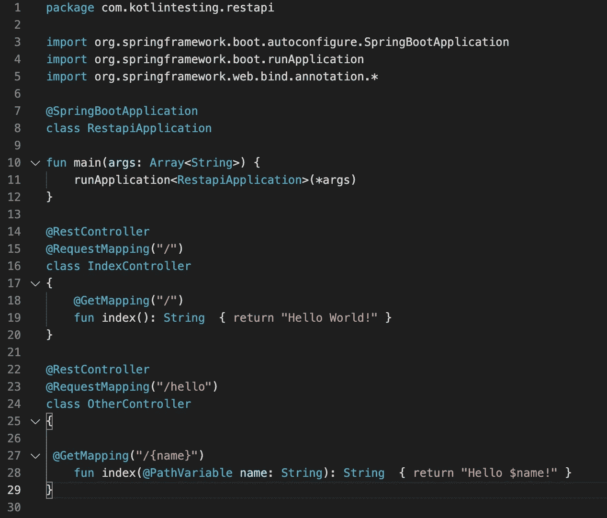
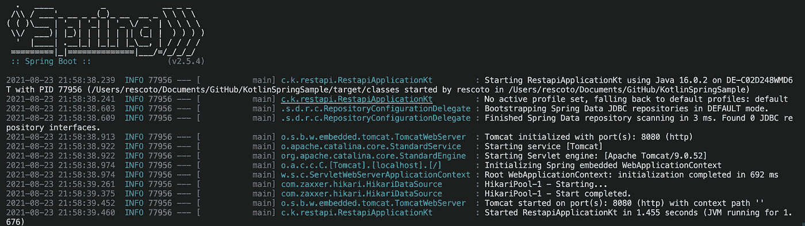
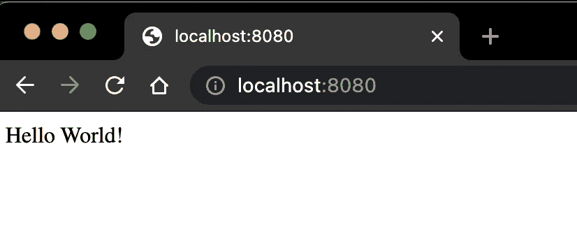
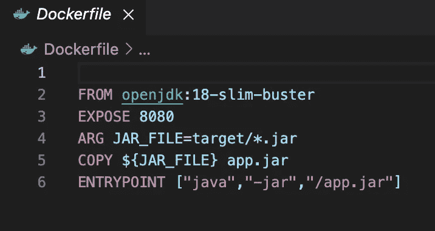

# 将您的第一个应用程序容器化

> 原文：<https://medium.com/codex/containerizing-your-application-b1644385e2ef?source=collection_archive---------16----------------------->

## 让我们讨论一下什么是容器，并运行一个例子。


由 [Timelab Pro](https://unsplash.com/@timelabpro?utm_source=unsplash&utm_medium=referral&utm_content=creditCopyText) 在 [Unsplash](https://unsplash.com/s/photos/containers?utm_source=unsplash&utm_medium=referral&utm_content=creditCopyText) 上拍摄的照片

这是**系列的第一部分**，我正在计划一个关于容器的系列。接下来是**谷歌云**上的 **Kubernetes** ，敬请关注。

很难定义容器是什么。让我们从了解它们不是什么开始。容器是**不是虚拟化**；这是最难理解的事情之一，至少对我来说是这样。为什么？嗯，通常我们通过选择我们想要使用的操作系统来开始定义一个容器…

# 什么是容器？

容器是打包我们的应用程序的一种方式，我个人认为它们相当于一个 EXE 文件，但是对于成年人来说。容器的概念是将一个进程与主机系统中的所有其他进程隔离开来，给你的进程一个自己的文件系统和硬件分区。这意味着启动一个容器和启动一个新进程一样快。与虚拟化相反，启动一个实例可能需要几分钟。

这里，*你的进程*实际上是由主机系统运行的，容器共享主机 OS 的内核，OS 的共享部分是只读的，因此它们不能访问主机 OS 的许多工具集；这就是为什么选择操作系统通常是在容器上配置应用程序的第一步。

选择操作系统就是选择设置和执行与主机内核匹配的应用程序所需的工具集。

这就是为什么你不能简单地在 Linux 上运行 Windows 容器，反之亦然。

因此，定义容器包括定义将要运行的应用程序以及这个应用程序需要执行的所有依赖项。

> 如果您的二进制文件没有链接到任何其他库，那么您几乎可以只使用一个二进制文件而不使用其他任何东西。

# 让我们建造一个容器

***这个例子是关于容器而不是 app*** 。在本例中，我们将使用以下工具:

*   码头工人；[获取 Docker](https://docs.docker.com/get-docker/)
*   科特林；[我用的是酿造](https://formulae.brew.sh/formula/kotlin#default)；如果你不知道 Kotlin 是什么以及可能的额外需求(比如 Java 的 JVM ),请查阅官方文档
*   Maven[我用的 brew](https://formulae.brew.sh/formula/maven)；查看[官方文档](https://maven.apache.org/)

版本现在不是很重要，因为应用程序没有做任何花哨的事情，只要去找最新的就可以了；安装完工具集后，通过检查每个工具版本来验证它是否安装正确。

## 验证工具集

码头工人:

```
$> docker --version
Docker version 20.10.8, build 3967b7d
```

科特林:

```
$> kotlin -version
Kotlin version 1.5.21-release-314 (JRE 16.0.2+0)
```

Maven:

```
$> mvn --version
**Apache Maven 3.8.2** (ea98e05a04480131370aa0c110b8c54cf726c06f)
Maven home: /usr/local/Cellar/maven/3.8.2/libexec
**Java version: 16.0.2**, vendor: **Homebrew**, runtime: /usr/local/Cellar/openjdk/16.0.2/libexec/openjdk.jdk/Contents/Home
```

## 让我们得到代码

现在我们知道我们的工具已经就位，让我们做一些有趣的事情，一些代码克隆。转到您将用作工作目录的文件夹，然后提取 repo。

```
git clone [https://github.com/Escoto/KotlinSpringSample.git](https://github.com/Escoto/KotlinSpringSample)
```

Git 不是必需的，你可以直接去下载它，但是它会让你的生活更轻松。

它带有 2 个开箱即用的控制器，可以随意修改，但首先要确保它能正常工作。正如我在开始时所说的，这个例子是关于容器而不是代码质量的…



[样本代码](https://github.com/Escoto/KotlinSpringSample/blob/main/src/main/kotlin/com/kotlintesting/restapi/RestapiApplication.kt)来自 [**Escoto**](https://github.com/Escoto) (me)

在项目的根目录下运行以下命令

```
$> mvn compile
$> mvn package
```

都应该是好的；现在测试一下

```
$> mvn spring-boot:run
```

一旦它运行，您的控制台应该看起来有点像这样



Spring 应该正在运行并监听端口:8080

检查 API 是否按预期工作

```
[http://localhost:8080/](http://localhost:8080/)
[http://localhost:8080/hello/hame](http://localhost:8080/hello/name)
```

在您的浏览器中，您应该会看到`Hello World!`。



**你好世界！**从控制台运行应用程序

现在使用控制台中的`ctrl+c`停止它。

如果一切按预期运行，您就可以配置一个 *Docker 映像*。在主目录中，有一个名为`Dockerfile`的文件。



[来自](https://github.com/Escoto/KotlinSpringSample/blob/main/Dockerfile) [Escoto](https://github.com/Escoto) (me)的样本代码

这个脚本将

1.  使用来自 [OpenJDK](https://hub.docker.com/_/openjdk) 的 docker 图像；它已经为我们的应用程序配置了所需的环境。
2.  暴露端口`8080`；因为我们的应用程序是一个 Web-API，所以端口`8080`是最常见的端口之一，也是我们的应用程序中配置的默认端口*。*
3.  将您用`mvn package`命令生成的`restapi-1.0.jar`复制到这个 docker 的映像中。
4.  配置一个`entrypoint`；这基本上告诉了 docker 如何启动我们的应用程序。

现在让我们构建 Docker 映像

```
$> docker build -t kotlinapihello .
```

列出您的 Docker 图像，以确保它已成功创建

```
$> docker images
REPOSITORY       TAG     IMAGE ID       CREATED         SIZE
kotlinapihello   latest  a7d5841c86b9   2 minutes ago   427MB
```

现在，让我们开始我们刚刚创建的图像的实例。它将被称为`workinginstance`，我们将把计算机的端口`8080`映射到你在`Dockerfile`中的图像所显示的端口

```
$> docker run -d -p 8080:8080 --name workinginstance kotlinapihello
```

*   `-p`配置端口
*   `--name`给实例命名
*   `-d`到*从您的控制台分离*正在运行的实例

不带`-d`运行意味着您的映像将*附加到*您的控制台或任何启动该实例的进程。在这种情况下，这将意味着你不能继续使用这个控制台，直到你**停止**你刚刚**启动**的实例。

现在！又来了！检查 API 是否按预期工作

```
[http://localhost:8080/](http://localhost:8080/)
[http://localhost:8080/hello/hame](http://localhost:8080/hello/name)
```

这是现在运行从你的码头形象！


你好，世界！从 Docker 容器中运行的应用程序

现在，让我们来清理一下环境，这样你就不会到处乱放容器了

```
$> docker stop workinginstance
$> docker rm workinginstance
```

这只会停止并删除*实例* `workinginstance`，但您的`kotlinghelloapi` *图像*仍会保留在那里。如果您想完成清洗，请同时删除图像:

```
$> docker image rm kotlinapihello
```

# 结论

正如我在开头提到的，容器只是包装和应用的另一种方式。

最大的好处是让这种配置*准备好发货*。这意味着您拥有极大的可移植性，允许您毫不费力地在您的开发/测试/生产环境中复制完全相同的行为。