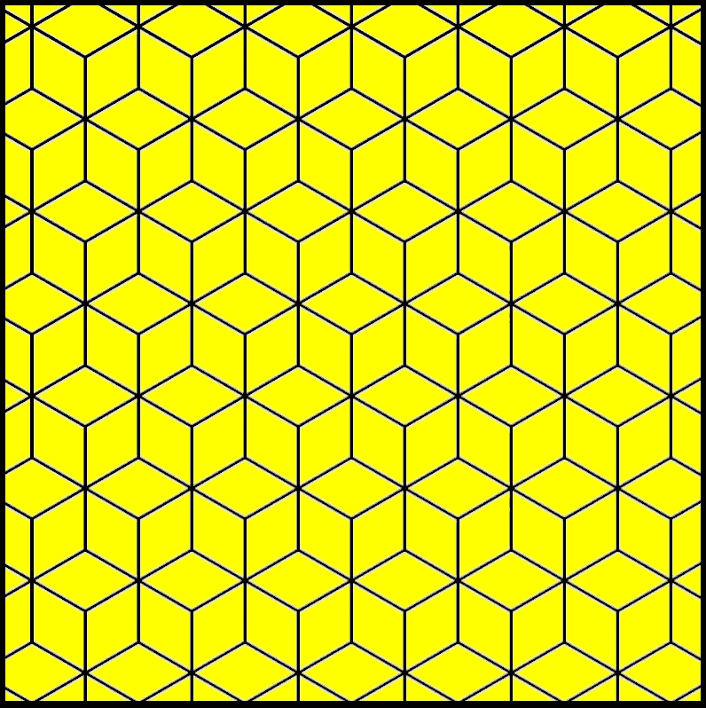

# 无容器计算机和流软件

> 原文：<https://medium.com/codex/containerless-compute-and-federated-architecture-f4f39dc9d8cb?source=collection_archive---------8----------------------->

## 没有容器、没有软件安装、没有设备限制:面向台式机、数据中心、电话、无人机等的计算和软件交付

## 无容器计算机

想象一下，你可以把你最喜欢的语言编译成一个通用的二进制指令集…