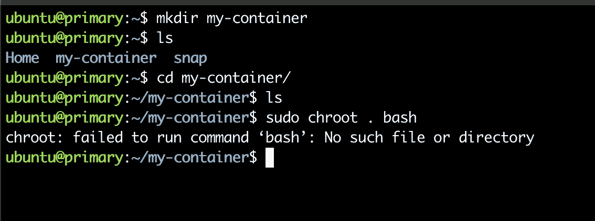
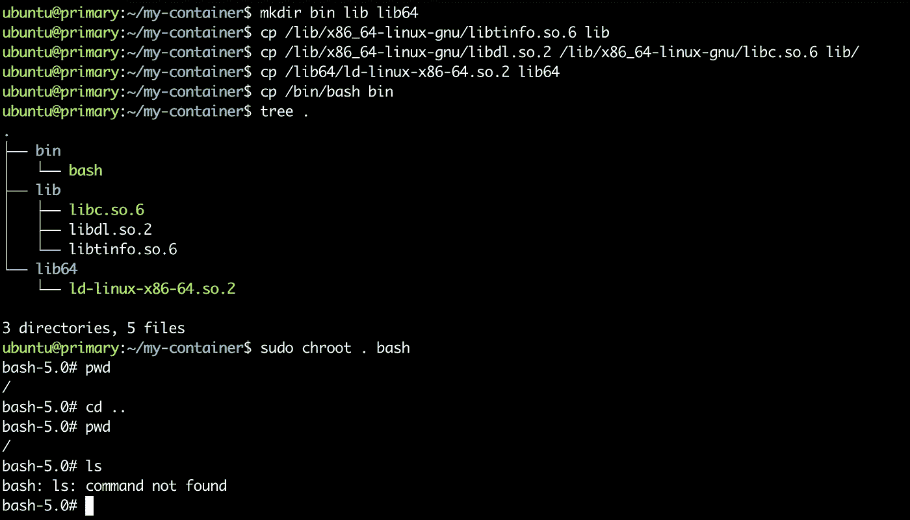
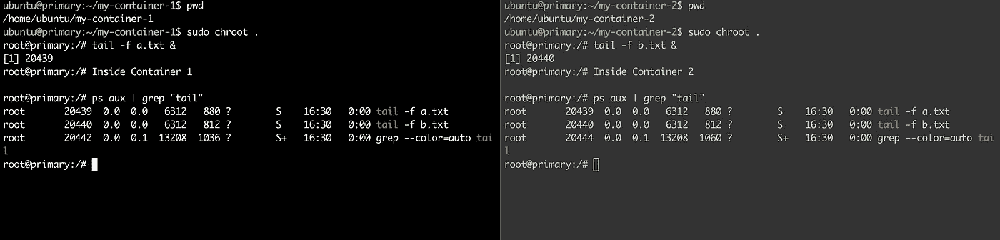
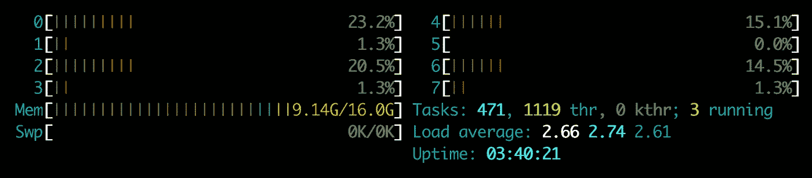

# 引擎盖下的容器

> 原文：<https://medium.com/codex/containers-under-the-hood-8d3ef4965fa8?source=collection_archive---------8----------------------->

为了部署我们的应用程序，我们可以使用实际的物理机器，但是一个应用程序可能会干扰另一个应用程序，并可能会导致停机、资源匮乏、同一机器上运行的另一个微服务的安全问题。

为了解决这个问题，我们可以为每个应用/微服务创建单独的虚拟机，并根据它们的需求分配资源。通过对我们共享的资源进行更多的控制，虚拟机为我们提供了许多好处，如果一个应用程序/微服务出现问题，它只会影响自身，从而保护其他应用程序的安全。虚拟机的所有这些功能都是以性能为代价的。在主机操作系统之上运行整个客户操作系统，只是为了运行我们的代码。虽然，在我们拥有非常高的计算能力的今天，这不会有太大的区别。，但是生成一个新的容器比生成一个新的虚拟机耗时更少，并且有助于减少部署时间

如果呢？我们可以减少所有这些性能开销，直接运行具有所有这些虚拟机功能的代码，并节省一些部署时间。这就是容器发挥作用的地方。

# 什么是容器？

从真正的意义上来说，容器只不过是 Linux 的一些特性的组合。这些是

*   Linux 监狱，又名 **chroot**
*   名称空间又名**取消共享**
*   对照组又名**c 组**

让我们逐一了解他们的目的:

## [chroot](https://www.gnu.org/software/coreutils/manual/html_node/chroot-invocation.html#chroot-invocation)

*   这是一个 Linux 命令，允许我们设置您创建的任何新进程的根目录。让我们创建一个名为“my-container”的新定制容器，并设置其根目录



在上面的截图中，我创建了一个名为 my-container 的目录。现在我试图在 my-container 目录中设置新的根目录，并运行命令“bash ”,但是失败了。失败的原因是“bash”命令将试图在/bin 目录中查找当前不存在的二进制文件。因此，为了成功运行这个命令，让我将 bash 二进制文件及其库文件手动复制到这个文件夹中。



*   在上面的截图中，我已经将 bash shell 的所有二进制文件及其所有必需的依赖项复制到 my-container 目录中，并重新运行 chroot 命令。看到我们的容器被锁定在这个文件系统级别，不知道任何关于它的外部空间。整个容器安装在一个新的根目录下。如果您想隔离容器的文件系统，并且不想让它们查看每个文件，这对于容器来说是至关重要的。

## 命名空间

*   chroot 帮助我们隔离文件系统，但是我们的自定义 my-container 仍然存在一些问题。如果我们复制一些其他重要的二进制文件如 ps 来列出所有的进程，我们不仅可以看到运行在容器本身中的进程，还可以看到运行在父容器即主机上的所有进程，我们有能力通过使用“sudo kill-9<PID>命令发送 **SIGKIll** 信号来破坏其他容器和重要进程。如果我复制 ifconfig 二进制文件，我们也可以看到主机的网络详细信息。我们需要这些重要的功能，但是希望不共享所有父级进程或同级进程的关键信息，这些信息来自运行在容器本身中的进程。这就是 unshare 命令发挥作用的地方。



在上面的截图中，我又创建了一个名为 my-container-2 的容器。在这两个容器中，我已经启动了一个 tail 命令后台进程，分别轮询容器 1 和容器 2 中的 a.txt 和 b.txt 文件。如果您使用 ps 命令检查两个容器中的进程，您将能够获得在单独的容器中运行的另一个进程的进程 id，并且您将能够轻松地终止在不同容器上运行的进程。这就是我们想要解决的问题，可以使用 unshare 命令来解决。

为了取消主机上运行的所有进程的共享，我们可以使用 **PID 名称空间**，子进程将拥有一组与其父进程不同的 PID-进程映射。

```
unshare --pid chroot my-container-1
unshare --pid chroot my-container-2
```

有不同的命名空间来控制功能并设置许多其他内容的上限，如网络命名空间、挂载命名空间和用户命名空间。停止分享帮助主持人对我们的其他流程更加负责，因为**“权力越大，责任越大。:)"**

注意:使用非共享子进程看不到主机进程，但主机可以。

## c 组

*   好了，我们已经完成了文件系统隔离，并限制了一些非常重要和有用的命令。剩下的唯一事情就是控制一个单独的进程可以占用多少硬件资源，比如 CPU、Ram、网络带宽。我们需要注意这最后一件事，因为一个糟糕的代码或饥饿的微服务可以通过消耗所有硬件资源来关闭所有容器。
*   在 c-group 来拯救我们之前，c-group 是由谷歌发明的，并于 2007 年发布。下面我附上了两张截图，一张是我的主机 mac 的，一张是我的 docker 容器的。对于我的 docker 容器，我已经将 docker 进程的 cpu 使用率设置为只使用一个内核，内存使用率为 1000MB。



具有 8 个内核和 16GB Ram 的主机(Mac)


`#create a controle group` Docker 容器运行 Ubuntu，具有 1 个内核和 1000MB Ram

```
#create a control group named container-group
cgcreate -g cpu,memory:/container-group# add our unshared env to our cgroup
cgclassify -g cpu,memory <container-PID>#now we can use cgset command to set cpu and memory upper bound
cgset -r cpu.cfs_period_us=100000 -r cpu.cfs_quota_us=$[ 100000 * $(getconf _NPROCESSORS_ONLN) ] container-groupcgset -r memory.limit_in_bytes=1000M container-group
```

所以，现在把 docker 想象成容器的这些关键功能的包装器，帮助我们轻松地自动化这些事情。

谢谢你看了这么久。希望你喜欢这篇文章，如果是的话，请点击掌声按钮😜