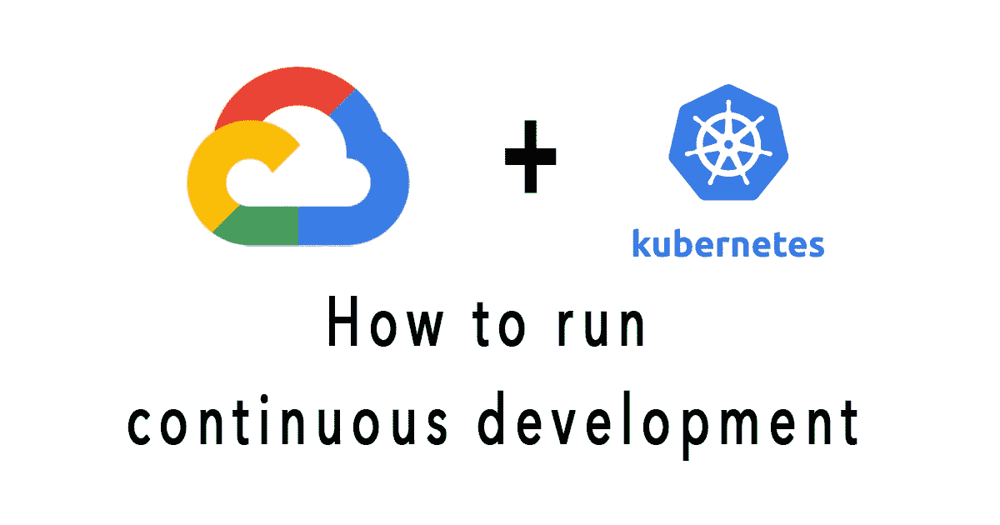

# 使用 Kubernetes 引擎的持续部署-综合教程

> 原文：<https://medium.com/codex/continuous-deployments-with-kubernetes-engine-comprehensive-tutorial-708b574e49e1?source=collection_archive---------6----------------------->

## 药典

DevOps 实践将定期利用多个部署来管理应用程序部署场景，如“连续部署”、“蓝绿色部署”、“金丝雀部署”等。

如何管理 Kubernetes 在 GCP 的部署？这篇文章将向你展示一个循序渐进的过程。