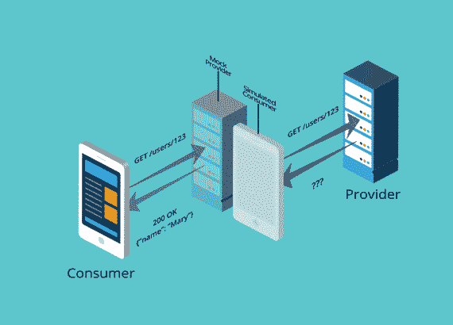

# 使用 Pact.io 进行合同测试

> 原文：<https://medium.com/codex/contract-testing-using-pact-io-7632e5ee33ab?source=collection_archive---------1----------------------->

## [法典](http://medium.com/codex)

## 我听说契约测试是集成测试的替代方法，并最终决定学习它的概念并使用 Pact.io 进行尝试。


您如何确保同一系统的多个应用和服务能够很好地协同工作？
你可以进行端到端的测试，但是测试所有的组合几乎是不可能的。此外，针对问题的有效[和](/swlh/automated-testing-goals-d3ace8fd223a)将会非常低。
您也可以[通过模拟其他服务的回复，在每个应用程序的基础上单独进行测试](https://levelup.gitconnected.com/unit-testing-a-gateway-with-javalin-24e3b7e88ef2)，但是由于它们可以独立发展，因此安全网很低，因为尽管集成被破坏，但每组测试都可能通过。
最后，集成测试是典型的解决方案，因为测试是针对依赖的服务运行的。这看起来很有希望，但它很快会带来问题:

*   应用/服务可能由不同的团队开发，这使得将它们全部集成到一个 CI 渠道中变得更加困难。更糟糕的是，它可能使本地测试变得不切实际。
*   启动多个服务会随着时间的推移使测试变慢，因为我们必须在测试过程中多次旋转它们。快速反馈在自动化测试中是必不可少的，但是在集成测试中很容易受到伤害。

> 如果没有契约测试，确保应用程序能够正确协同工作的唯一方法就是使用昂贵而脆弱的集成测试。 [*Pact.io 简介*](https://docs.pact.io/)

面对这些，我们可以问“服务/app A 和 B 有什么共同点？”，“我是否需要运行这两个程序来确认它们是否正常说话？”。这就是契约测试的亮点，因为我们只测试 A 和 B 之间的重叠部分，这被称为契约。我们根据所有消费者的合同测试提供商的。

[当你控制合同的双方时，合同测试是有意义的](https://docs.pact.io/getting_started/what_is_pact_good_for)，特别是如果他们属于同一公司的不同团队。

> 契约测试是一种测试集成点的技术，它通过单独检查每个应用程序来确保它发送或接收的消息符合记录在“契约”中的共同理解。 [*契约文件*](https://docs.pact.io/)



[Pact 如何工作](https://pactflow.io/how-pact-works/#slide-3)

📝*我决定用 Kotlin 试试 Pact.io，但是它支持* [*多种语言/运行时*](https://docs.pact.io/implementation_guides/workshops/) *。*

# 给我看看代码

Pact 支持很多用例及组合，但是学习它的唯一方法是从一个基本的、典型的例子开始。假设我们的用户应用程序依赖另一家公司的服务来检索个人资料信息。在开始之前，我们需要定义的概念是消费者和提供者。消费者就是调用 API 的人；提供者是 API。在我们的例子中，消费者将是用户的服务；提供者是概要文件的服务。

## 消费者

契约测试也被称为消费者驱动的契约测试，这意味着我们将从消费者开始。从添加依赖项开始:

```
testImplementation("au.com.dius:pact-jvm-consumer-junit5:4.+")
```

出于示例练习的目的，我们将对要编写合同的位置进行硬编码:

```
tasks.withType<Test> {
    useJUnitPlatform()
    systemProperty("pact.rootDir", "src/main/resources/pact-tests")
}
```

📝*在实际项目中，我们可能会使用契约代理，这是一个管理合同的中心实体。或者，我们可以手动将合同复制到其他地方，以便提供者可以使用它们。*

现在是时候用我们的期望创建一个[测试了](https://github.com/lsoares/clean-architecture-sample/blob/master/src/test/kotlin/adapters/ProfileConsumerCDC.kt):

第一种方法(`create pact`)表示对提供者应该如何处理某个调用的模拟(它类似于对基于 HTTP 的 API 使用模拟器，如 [MockServer](https://www.baeldung.com/mockserver) 或 [WireMock](https://www.baeldung.com/introduction-to-wiremock) )。在您进行设置时，它的行为就像一个 JUnit `BeforeAll`注释。

第二种方法(`get user`)是测试本身。此时，它假设假 API 正在运行，因此您可以在网关中针对假 API 基本 URL 进行网络调用(`mockServer.getUrl()`)。

测试为绿色后，转到契约文件夹(`/src/main/resources/pact-tests`)并检查生成的合同:

看一下 JSON:它描述了请求/响应对(交互),作为一个整体，这些请求/响应对表示消费者期望履行的契约。

## 供应商

在我们的 Profiles 服务中，我们需要添加相应的提供者依赖关系:

```
testImplementation("au.com.dius.pact.provider:junit5:4.+")
```

让我们看看我们的测试:

这里的想法是运行(由多个消费者)分配给提供者的所有契约。请注意，我们对 pact 文件夹进行了硬编码，这可能不太现实。计划是在端口`4444`启动我们的 API(注意对`main()`的调用)，然后告诉 Pact 它是在哪里启动的，这样神奇的事情就发生了。下面是实际的 API 服务(使用 [Javalin](https://javalin.io/) )供参考:

仅此而已。希望你喜欢。我相信将测试绑定到合同(就像在现实生活中的合同一样)的力量，因为它给了我所需要的安全网。你可以在[我的清洁建筑项目](https://github.com/lsoares/clean-architecture-sample)中找到所有代码。我推荐[阅读 Pact.io 文档](https://docs.pact.io/)，它非常适合初学者。