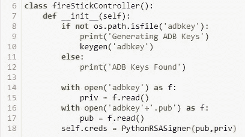

# 用 Python 控制你的消防电视

> 原文：<https://medium.com/codex/controlling-you-fire-tv-with-python-d5e102669066?source=collection_archive---------8----------------------->

格伦·卡斯滕斯-彼得斯在 [Unsplash](https://unsplash.com?utm_source=medium&utm_medium=referral) 上拍摄的照片

对于那些喜欢在任何设备上简单地使用 python 代码控制家中事物的人来说，这应该会让你感兴趣。我个人喜欢所有的智能家居设备，让一切自动化，房子里的遥控器越少越好。因此，在这篇文章中，我将向您展示我如何使用 python 向我的 Fire TV 发送与遥控器相同的消息。

整个过程依赖于 ADB (Android Debug Bridge)调试功能，这在许多 Android 设备上都可用。在这种情况下，它将允许我们使用 python 的键码向 fire-stick 发送信号。

因此，作为开始，我们总是需要这个小项目的所有正确的库。

缺省情况下，OS 库应该是可用的，但是在对 adb-shell 进行 pip 安装后，可以访问其他三个包。

我们想从创建一个带有初始化函数的 fire-stick 控制器类开始，如下所示:

连接到 fire-stick 需要一个公钥和私钥，这就是包“keygen”派上用场的地方。所以在我们的初始化函数中，我们想首先检查一个键是否已经存在，如果不存在，我们将创建一个新的。这是通过使用 if 语句来完成的，以检查该文件是否与 python 文件在同一个目录中，如果不是，将使用“keygen”方法创建一个新的目录。凭证文件需要打开并读入 python，然后使用我们导入的函数‘python rsasigner’进行加密，代码现在如下所示:

在“init”函数中添加一些“print”函数是很有帮助的，这样可以清楚地知道在运行它时遵循了哪些步骤。

下一步是创建到我们的荧光棒的连接。为此，我们将添加一个名为“addDevice”的新方法，它将从“init”函数继承，并接受一个附加参数，即 fire-stick 的 IP 地址。这很容易在您的 fire TV 上找到，请访问:

设置→我的 Fire TV →关于→网络

在屏幕的右边，你可以找到 IP 地址，并把它作为变量保存在你的代码中。请记住，除非您在您的家庭网络上设置了静态 IPV4 地址，否则这可能会不时发生变化。

所以在我们的新方法中，首先要做的是在 adb 调试服务器上定义设备，这是使用开始时导入的‘AdbDeviceTcp’函数来完成的。这个函数将接受 3 个参数:IP 地址、一个应该设置为 5555 的默认端口，以及一个超时持续时间。所以这个方法的开始看起来像这样:

在我们使用凭据创建连接之前，我们需要确保所有现有的连接都已关闭，而这是使用“try block”最容易做到的。因此，我们将“尝试”关闭一个到 fire-stick 的现有连接，通过打印“当前没有设备连接”来处理“except ”,并添加一个“else”来创建一个新连接。最后，我们定义和连接的设备需要返回。所以我们的 addDevice 方法现在看起来像这样:

所以现在当我们创建这个类的实例时，我们将能够让它连接到我们的 fire-stick，但是此时它没有任何其他交互。因此，我们的下一个任务是创造更多的方法，让我们能够发送命令，如播放/暂停，选择，主页等…

创建一个发送命令的方法非常简单，它试图模仿的所有按钮都遵循相同的模板。以“select”按钮为例，我们首先在类中定义一个名为“select”的方法，该方法继承了从前面的 addDevice 方法返回的设备。只需一行代码，我们就可以向 fire-stick 发送命令。该命令类似于:

_service(，)方法的两个参数都必须是“b”字符串，这意味着信息以字节形式发送。第一个参数意味着它在 adb 服务器中发送一个 shell 命令，第二个参数将使用不同的数字来代替' # '，这些数字具有不同的数字键码来表示远程按钮。关于哪个键码对应哪个按钮的完整列表，你可以访问这个页面:"[https://gist . github . com/kibo tu/76be 44 AAA 1174 BDD 252 a 49 a1 CD 7a 02 f 9](https://gist.github.com/kibotu/76be44aaa1174bdd252a49a1cd7a02f9)"

因此，完整选择方法非常简单:

如果需要，您可以为所有按钮添加方法，或者只为您需要的按钮添加方法。

我们的 python 脚本几乎准备好了，剩下的就是创建这个类的一个实例，并把它连接到你的 fire-stick，这非常容易！

我们只需要添加这几行代码:

现在，当你运行这个代码时，它应该连接到你的 fire-stick，应该很容易分辨，因为你的电视上应该有一个弹出窗口，询问你是否希望允许 adb 连接。你要做的就是选择允许，如果你选择，你可以选择记住这个设备，这种情况下弹出窗口不会再出现。

都搞定了！剩下的就是你想出创造性的方法来激活你的遥控按钮的方法。我写了一个脚本，使用手势控制来导航我的荧光棒！选项是无穷无尽的，这只是让你开始尝试 python 控制 firestick 的基本框架。我希望你喜欢把这个好好利用！

这是一篇后续文章，向你展示如何使用 opencv 和 mediapipe 添加手势控制来控制火棍！

[https://medium . com/@ toma Clarke 16/gesture-control-of-your-fire TV-with-python-7 D3 D6 C9 a 503 b](/@tomaclarke16/gesture-control-of-your-firetv-with-python-7d3d6c9a503b)