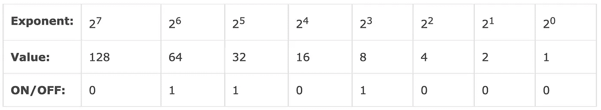
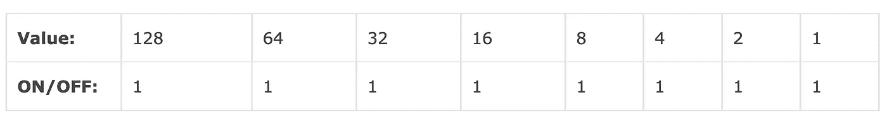
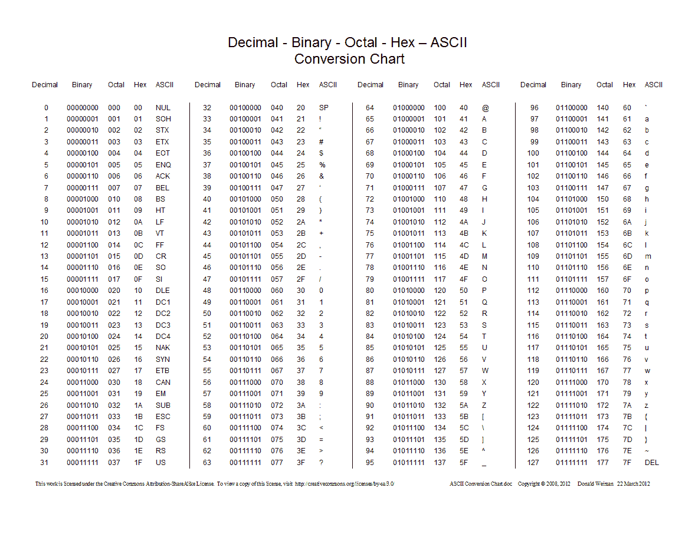

# 将二进制数转换为字符串消息

> 原文：<https://medium.com/codex/convert-binary-numbers-to-string-message-322093545634?source=collection_archive---------7----------------------->


你听说过机电设备的双态表示吗？这将是开关，开-关，或去-不去。我们可以想到其他如工作-不工作，是-不，喜欢-不喜欢。生活中很多事情都是两种状态的问题。这让我想到人类的逻辑和计算机的逻辑是多么的相似。对于计算机来说，[二进制](https://www.britannica.com/science/numeral/Development-of-modern-numerals-and-numeral-systems#ref233819)是它们的精神状态。

你可能知道，二进制数由 0 和 1 两个数字组成。数字 2 表示为 10，数字 3 表示为 11，数字 4 表示为 100，以此类推。在计算机中，二进制的 0 和 1 分别代表关或开。这样，数字在计算设备内部被物理地表示，允许计算。


创，1982 年。版权所有迪士尼

查看此[页面](https://www.computerhope.com/jargon/b/binary.htm)上的下列图表作为示例。每一列代表数字 2 的一个[指数](https://www.computerhope.com/jargon/e/exponent.htm)，当你移动通过一个字节的八个位置中的每一个时，该指数的值增加一位。记住，每个字节由 8 位组成。如你所见，0 位没有被计数，因为它们被“关闭”



下一个例子是二进制的 11111111，最大的 8 位[值](https://www.computerhope.com/jargon/num/8bit.htm)为 255。从右往左读我们有 1 + 2 + 4 + 8 + 16 + 32 + 64 + 128 = 255。



所有这些都被解释和提醒了，因为我们要把二进制转换成文本。计算机将文本和其他数据转换成带有指定值的二进制码。



让我们来看看代码。

# 解决方案 1:暴力

```
function binaryToEnglishLetters1(str)
```

让我们称这个函数为`binaryToEnglishLetters1`，因为我们要将二进制转换成我们的语言，这个来自罗马人的[拉丁语和 Futhorc 的 runic 字母表的组合慢慢演变成了现代英语](https://www.daytranslations.com/blog/origin-english-alphabet/)我们就是在这个时候编写并转换成二进制的。

```
let splitStr = str.split(" "), result = [];
```

接下来我们创建`splitStr`并用空格分割函数参数中的字符串。让我们也添加结果变量作为一个空数组。

```
for(let i = 0; i < splitStr.length; i++) { result.push(String.fromCharCode(parseInt(splitStr[i])));}return result.join("");
```

创建变量后，让我们遍历`splitStr`并迭代字符串，使用 [fromCharCode](https://developer.mozilla.org/en-US/docs/Web/JavaScript/Reference/Global_Objects/String/fromCharCode) 和[解析字符串参数](https://developer.mozilla.org/en-US/docs/Web/JavaScript/Reference/Global_Objects/parseInt)，从指定的 UTF-16 代码单元序列中得到结果，返回指定的[基数](https://en.wikipedia.org/wiki/Radix)的整数(在我们的例子中，是 2 位数的二进制基数)。之后，让我们调用结果并使用`join("")`返回转换后的字符串，而不是一个每个字母带逗号的数组。

我们准备好了吗？让我们用控制台记录下计算机想说什么。

好了，准备好了吗？我们走吧！


```
䘳죡쥎쥅쳓蚠촬촷쥅蚠촭쥅諶蚠
```


哦，等等！为什么它不在我们的字母表里？

这是因为我们没有指定输入数字的基数。很奇怪吧？让我们继续修理它。

```
result.push(String.fromCharCode(parseInt(splitStr[i], 2)));
```

你甚至可以试着输入其他数字，看看会出现什么其他字符，但让我们坚持正确的数字，最后用我们的字母表得出结果。

```
Kraftwerk loves me.
```

厉害！电脑刚刚告诉我们发电厂乐团喜欢它。

从他们的劲歌《发电厂乐团爱电脑》来看，我完全同意。

代码如下:

# 解决方案 2: ES6 扩展运算符

在这个解决方案中，让我们使用扩展操作符将每个数字转换成相应的字符，并使用`map()`将每个数字转换成十进制。我们只是用几行代码做了与暴力解决方案相同的事情。

让我们看看这次电脑告诉我们什么。

```
console.log(binaryAgent2("1000010 1110101 1111001 100000 1101001 1110100 101100 100000 1110101 1110011 1100101 100000 1101001 1110100 101100 100000 1100010 1110010 1100101 1100001 1101011 100000 1101001 1110100 101100 100000 1100110 1101001 1111000 100000 1101001 1110100 101100 100000 1110100 1110010 1100001 1110011 1101000 100000 1101001 1110100 101100 100000 1100011 1101000 1100001 1101110 1100111 1100101 100000 1101001 1110100 101100 100000 1101101 1100001 1101001 1101100 101100 100000 1110101 1110000 1100111 1110010 1100001 1100100 1100101 100000 1101001 1110100"))
```

在人类英语中的意思是:

```
Buy it, use it, break it, fix it, trash it, change it, mail, upgrade it
```

它唱的是蠢朋克的技术。我想他们会接受所有建议我们唱歌曲。

谁会不喜欢这首曲子呢？

这就是了，你可以把这个算法用于较小的项目和学校作业。我希望你能从中获得创造性的乐趣。

编码快乐！

# 总结:

1.  二元系统概述
2.  从二进制转换为字符串-暴力解决方案
3.  从二进制转换为字符串- ES6 扩展运算符解决方案

# 参考资料:

1.  大英百科全书，[双星系统](https://www.britannica.com/science/numeral/Development-of-modern-numerals-and-numeral-systems#ref233819)
2.  计算机希望，[二进制](https://www.computerhope.com/jargon/b/binary.htm)
3.  [ASCII 码表](https://ascii.cl/)
4.  英语字母表(及其所有 26 个字母)的起源。[日译博客](https://www.daytranslations.com/blog/origin-english-alphabet/)2018 年 8 月 14 日
5.  MDN Web Docs, [String.fromCharCode](https://developer.mozilla.org/en-US/docs/Web/JavaScript/Reference/Global_Objects/String/fromCharCode)
6.  MDN Web Docs, [parseInt()](https://developer.mozilla.org/en-US/docs/Web/JavaScript/Reference/Global_Objects/parseInt)