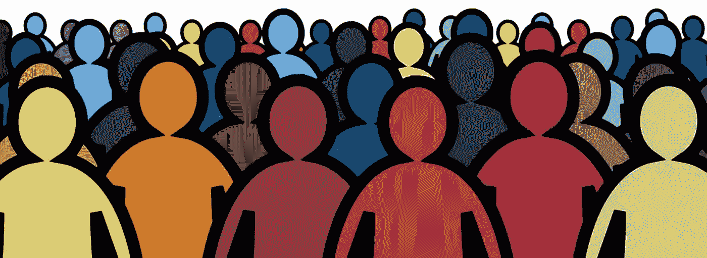

# 让人们相信网页可访问性很重要

> 原文：<https://medium.com/codex/convincing-people-that-web-accessibility-matters-3e1b5925cd91?source=collection_archive---------11----------------------->

**基本上是想说服他们不要那么自恋，因为这不是你的问题，也不是他们的问题，而是所有人的问题。**

包容性只会吓到我们社会中最丑陋的部分。
对于那些只知道特权的人来说，平等就像是迫害。

*请注意，这篇文章是在我目前正在谈判的一个组织中与某些人打交道时写的。在上述工作场所，我遇到了和我在几乎所有工作场所遇到的相同类型的卑鄙无耻的骗子。真正掌权的人* …