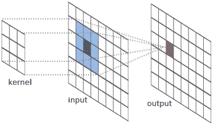

# 计算机视觉中的卷积

> 原文：<https://medium.com/codex/convolution-in-computer-vision-923ba332134f?source=collection_archive---------17----------------------->

深度学习是机器学习的高级版本。它不需要任何人来从中提取特征进行训练。以计算机视觉为例，在深度学习应用于计算机视觉之前，我们仍在使用机器学习技术，如 SVM 或随机森林。这些机器学习技术要求我们从图像中过滤出特征，然后使用这些特征作为分类的参数。这些技术导致大量的计算，因为它通常使用每个像素的特征。在转移到深度学习之后，使用每个像素作为输入节点导致了大量的隐藏节点(输入和输出之间的节点)，使得计算一个标准的 480*480 图像花费如此多的时间。

回旋

除此之外，算法也过拟合。在分类或分割中，当我们移动目标时，算法不再能达到好的精度。

为了处理这个，我们可以使用卷积。计算机视觉中的卷积意味着将图像的信息提取到一个更小的对象，称为过滤器。提取器叫做内核。这是一个 n*n 矩阵，其中 n < image size.

AlexNet Algorithm, the most prominent computer vision. It is using convolution in its algorithm

## Why Should Deep Learning Use Convolution?

*   Reducing number of input nodes
    卷积将对初始图像进行滤波，直到图像小到足以被展平并用于通常的神经网络。
*   在卷积中使用内核滤波容忍像素位置
    的小偏移，这导致算法学习像素颜色信息而不是其位置。
*   利用复杂图像中的相关性
    我们可以利用颜色聚类的相关性之一。在图像中，当一个像素在附近时，它将有可能具有相同的颜色。

## 卷积过程

卷积本身是一个简单的过程，

*   首先，它将使用一个核来过滤图像，这些核通常用 n*n 和深度来定义，以对应图像或过滤器的通道数量。然后它将创建一个称为滤波器的实体，这些滤波器将成为下一个卷积或多级感知器系统的输入。
*   第二，它会用激活函数去线性化数据。由第一步产生的滤波器中的每个新像素将被输入到激活函数中。由激活函数返回的值将直接的内核过滤值替换为线性度较低的值。

卷积基本上创建了一个新的 3d 矩阵，其大小基于内核的数量、内核的宽度、步幅以及处理中使用的填充。

## 程序示例

创建内核

内核只由 1 和-1 组成。但可以是任何数字，通常在学习的过程中会发生变化。

将由内核完成的过滤过程的可视化

当进行卷积时，这些内核将从图像中提取一些特定的特征。当一个简单的矩阵滤波可以提取像物体轮廓、物体对比度和许多东西这样的特征时，感觉就像是魔术一样。

不同的核可以提取不同的特征

我在上面创建的内核也将提取彼此之间不同的特征。这里举一个单通道汽车的例子:

不同输出

## 卷积后发生了什么？

在图像或过滤器被回旋之后，它通常会被汇集。汇集又是一个用 n*n 矩阵提取价值的过程。在汇集中，通常在将汇集矩阵和像素相乘后的产量中的最大值是将在下一步中使用的值。

## 全卷积网络

卷积神经网络通常以多层感知器结束。这些多层感知器将像普通神经网络一样工作。和那些类型的神经网络一样，卷积可以被看作是与神经网络分离的过程。但是在 FCN，卷积本身就是学习的核心过程。

全卷积网络算法

这里，算法架构分为两部分，编码器和解码器。在编码器模块中，系统几乎是相同的，它将提取图像，直到某种程度。

有趣的部分在解码器部分。这里，有两个连接过程，上采样和跳过连接。上采样意味着反卷积，它将增加滤波器的维数。而跳过连接是先前的卷积输出。它们用于给出关于图像中对象的更深层次的信息，因为它们比上采样滤波器拥有更多的信息。

这些过程将产生所需的图像分类或分割。

U-NET，一种 FCN 算法