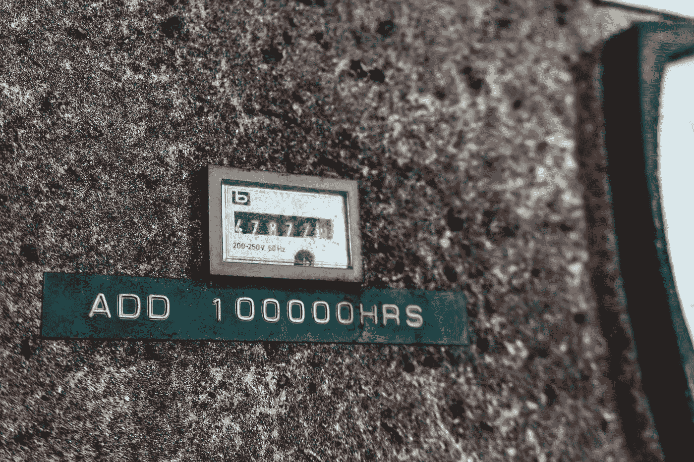

# 铁锈的酷功能(针对老年人)

> 原文：<https://medium.com/codex/cool-features-of-rust-for-old-people-10ba6a0991b6?source=collection_archive---------4----------------------->

## “老人们的铁锈”系列的第二部分

迪安·布瑞尔利在 [Unsplash](https://unsplash.com?utm_source=medium&utm_medium=referral) 上的照片——我需要花更多的时间在生锈上。

我之前的文章[Rust for Old persons](/codex/rust-for-old-people-516fc72b2934)中的评论提到了我没有真正强调 Rust 的任何酷功能。因此，我再次启动了 IDE，翻遍了无数的 Reddit、StackOverflow 和 Quora 论坛线程，列出并编码了我错过的内容(这是很多的)。*警告我是一个相对的 Rust 新手..我* …