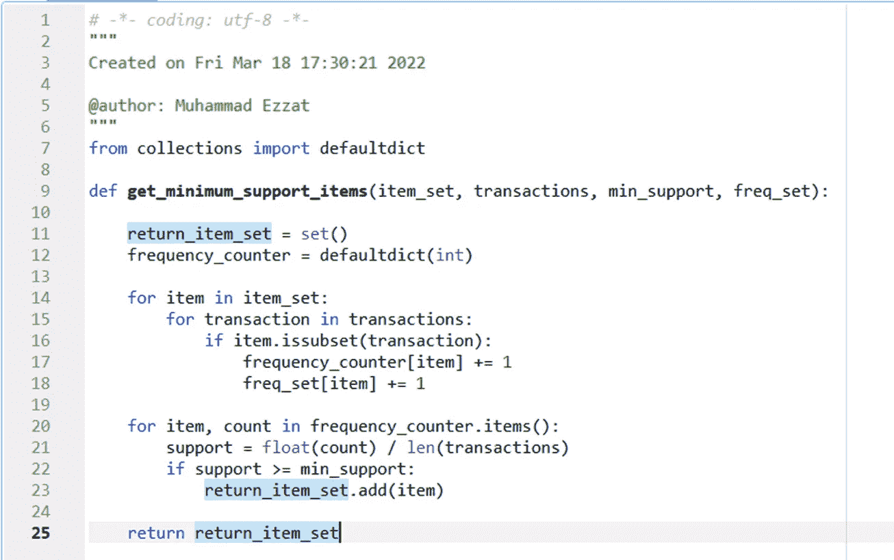
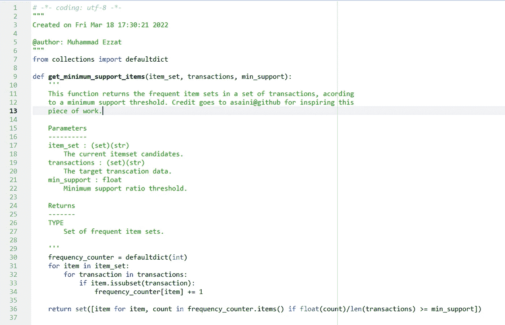

# 不要复制粘贴，这是一个简单有效的技巧，可以加速初学者的学习。

> 原文：<https://medium.com/codex/copy-no-paste-an-easy-powerful-technique-that-will-accelerate-learning-for-beginners-82d340ee2bae?source=collection_archive---------2----------------------->

来源:来自[https://www.pexels.com/](https://www.pexels.com/)的 Nemuel Sereti

**一个介绍**

学习如何解决计算机问题一开始可能会很糟糕。一切似乎都太难了；学习曲线太慢，传统的问题解决网站太抽象，无法将你的知识应用到环境中，你在头脑风暴时挣扎了很久，你的编码风格就像一个三岁的孩子&你最终会将堆栈溢出的代码复制到每个任务中。

今天，我将从四年的强化实践背景中向你揭示一种特殊的技术，我把它放在一起，它可以帮助你加速你的学习曲线，更多地参与应用和知识用例，定义和指导你的头脑风暴，并最终通过不改变你的 Ctrl+C-Ctrl+V 编码仪式来改进你的代码风格。

在继续前进之前，您需要考虑以下几点。首先，这种技术并不特别新颖或“古怪”。这只是我在实践中总结的一系列实践&帮助我提高了解决问题的技能。第二，这不是一个独立的一刀切的技术，你应该建立你的学习技术的军火库，因为这只能是其中的一部分。你必须考虑的第三件事是，尽管这很容易&对你的过程所做的修改并不是很大，但是你需要实践来完善这个序列中的每一个过程。

现在我们已经摒弃了所有虚假的承诺，让我们继续前进。

**人们犯的错误**

你看，不考虑直接将在线代码粘贴到你的项目、任务或工作中的道德问题，盲目粘贴代码会有一些严重的后果，即使它完美地工作&满足每个生产标准。直接粘贴代码对你的大脑提出了一个巨大的挑战，以理解正在发生的事情-如果你甚至愿意理解你刚刚粘贴的内容。想象一下，在一餐中吃下一天所需的所有食物，有时会在一天的混乱中发生，但这永远不是一件可持续的事情。

你不能把早餐、午餐和晚餐放在一张桌子上。你的身体在单位时间内消化一定量食物的能力是有限的。可能会发生的是你的胃会疼痛，你的大脑会停止工作&可能会感觉很糟糕。当你试图一次理解大量代码时，你的大脑会发生这种情况。

编码社区已经产生了许多令人敬畏的平台，在那里你可以找到几乎任何问题的解决方案。如果你找不到解决问题的方法，你可以把你的问题贴出来&如果你正确地表达了你的问题，专家会帮助你的。复制不粘贴技术是基于对这些平台的理性和负责任的使用，以确保你获得稳定的分数，保持你的动力，同时实际学习正在发生的事情，增加你对新想法的能力。

**复制不粘贴技术……一种解决方案。**

回到我们的营养学类比，我们发现将我们的每日比例分成三顿有助于消化和利用摄入的食物。复制不粘贴技术给你带来的一个好处是，你有机会将复制的解决方案分成你大脑容易理解的部分，因此它有助于消化手头的信息&形成对你试图复制的内容的理解。这项技术还有几个额外的好处，我们将在序列的每一步中确定。我们到台阶前吧，因为你看起来很无聊。

**复制不粘贴算法**

1)第一步从您的工作目录开始，您当前在您的项目中面临一个问题。例如实现某个计算。你必须确保你真的明白你要做什么。对手头的任务有一个明确的理解是定义你的问题的关键。

接下来，想象你正试图实现的解决方案是一个功能、方法，甚至是流程图中的一个流程框。这将让你清楚地思考你试图得到的解决方案的输入&和输出。识别数据类型&参数数据结构的形状&返回值是签署代码的关键。

2)在您定义您的问题、您想要的计算形状、输入和输出形状之后。现在，您可以选择任何平台来寻找解决方案。如果不定义我们之前必须定义的属性，就无法正确查找解决方案。

有多个值得信赖的平台可以查询。它们主要在展示形式上有所不同，一些以 QA 的形式展示解决方案，另一些以文章的形式&还有一些允许你以完整项目的形式分享你的工作。挑一个你喜欢搜索的；我个人会用谷歌搜索，所以我会从所有可能的来源得到结果。

3)现在你已经找到了一个非常相似的问题的解决方案，你需要评估你的解决方案需求和在线解决方案之间的距离。更明确地说，您需要了解您必须对该解决方案做多少更改，以便它能够完美地适合您的项目。这些编辑通常会涉及到语言/框架的差异&输入和输出的数据结构。写下所有需要做的改变。

—但是找不到任何相关的解决方案怎么办？
=我们将在文章结尾讨论那件事。

4)像分屏一样将你的编码环境和在线解决方案并排打开。并开始逐行阅读在线解决方案。读一行，然后用你自己的编码方式写出你的解决方案。这将把解决方案分成易于理解的部分，你可以按照自己的速度复制&给自己一个真正的机会来理解你复制的内容。此外，以你的风格编写这些片段不仅会帮助你理解更多，还会帮助你改进你的编码风格。

5)完成复制步骤后，您需要后退一步&将您的代码与在线代码对齐。试着理解呈现在你面前的两种风格的区别。这个练习将在以后对你有所帮助，特别是当你开始在团队中工作时&你必须了解其他人的风格，这将增加你在任何你参加的项目中的贡献率。

6)下一件事是你必须在你的项目/系统中适应你写的解决方案。差异通常存在于组织输入/输出数据的方式或集成的较小算法中(如果您正在处理高级代码)。例如，不是使用两个列表，而是使用一个对/元组列表…或者不是计算汉明距离，而是调用欧几里德距离方法。这些是您可能需要进行的编辑类型，以使在线解决方案适合您的使用情形。另一件你应该花些时间的事情是优化。优化通常适用于这三个领域；精准、高效&风格。有时候你写的解决方案是一个启发式的解决方案。这意味着它不会得到精确的答案，而是在可接受的时间内得到非常接近的结果。在适当的时候，你越接近理想的答案，你的解决方案就越好。

你的解决方案的另一个方面是效率。如果您的项目大规模运行或利用大数据，您将需要考虑效率优化。这些优化机会可以在任何步骤使用更好的算法、使用更有效的数据结构或框架优化中找到。比如你用 python 这样的高级语言编码，有没有考虑过用 JIT 编译来加速你正常的 python 代码？值得一试。

提示:通过用单元测试来验证你的工作，确保所有的编辑&优化最终都有效。

b)加分步！！！在完成所有前面的步骤&好好休息之后，试着记录你的代码。文档是有用的，它们帮助其他人理解你的工作，它们帮助你未来的自己理解你的代码&它们注释你的工作，所以你可以更容易地参考它。如果你决定记录你的代码，要考虑的一件重要的事情是给启发你工作的人荣誉。信用，当信用到期时，意味着诚实、自信和信任。

让我们一起来做吧

1.**观察、理解&定义你的问题。这学期我在学习数据挖掘，其中一个主题是分类数据中的频繁模式挖掘。这个主题有许多不同的应用，其中之一是市场篮分析。目标是从一组事务中，每个事务包含一组项目，我们希望获得频繁出现的项目集。识别这些频繁集的传统方法之一称为 Apriori 算法。

当然，算法有现成的 python 模块。但是出于教育目的，我们打算从头开始实施，或者至少在较低的层次上实施。在本文中，我们将只实现一个步骤，我们希望返回高于最低支持得分的集合。为了更好的理解，请随意查找算法。**

2.**查找您的问题&找到解决方案**
在网上寻找一个实现“复制”的解决方案后，我在 Github 上找到了一个很棒的实现，它来自用户@asaini，他是 Streamlit 的产品经理。他的代码简单直观。让我们看看我们是否可以遵循复制不粘贴的技术，从他的工作中学习，同时也按照我们自己的方式完成我们的任务。

3.**仔细阅读解决方案，理解初始输入&最终输出** [这个](https://github.com/asaini/Apriori/blob/python3/apriori.py)是我们正在查找的页面，我们要复制的方法从第 22 行开始。这里给出的输入是一组条目，一组事务；每笔交易本身就是一组物品的&最小支持阈值。额外的参数与整个算法有关，我们只是实现这个方法。输出应该是一组频繁项目。自己看看代码吧。

第一眼

4.**以自己的风格一步一步复制观察到的解** 我们将从编写函数签名开始，然后定义我们拥有的两个变量。我们称第一个为“return_item_set ”;由于它是函数末尾返回的变量，我们还将定义计数器字典&,我们将其命名为‘frequency _ counter’。以自己的风格命名变量很重要。

然后我们将执行接下来的两个循环(嵌套循环&字典循环)&返回项集。在嵌套循环中，我们计算每个事务中每个项目的出现次数，而另一个循环计算每个项目的支持度&返回最小阈值以上的项目。这是代码的当前外观。

5.**阅读您的解决方案&将其与原始解决方案对齐** 这个说明性示例很简单，我们定义了所需的变量，计算了项目出现次数&并在计算支持度后对其进行了过滤。我们都只退回最低支持阈值以上的项目。当您将该技术应用于更复杂的解决方案时，这一步将变得更加重要。

6.**优化** 我最喜欢的一步之遥！在这里，我们试图将自己的想法加入到算法中。首先，在我们自己的上下文中，我们并不真正需要最后一个给定的参数，所以我们要删除它。我们要做的第二件事是用一个转换成列表的奇特列表理解替换第二个循环。我发现列表理解更容易阅读，而且对于 python 来说也更容易运行。

最后外观

7.记录你的工作
有很多风格来记录你的代码，对我来说，我使用 Numpydoc 风格来记录我的使用 docstrings 的代码。这是代码的最终形式。

**你从复制无粘贴技术中获得了什么**

1.你加快了你的学习曲线；这种技术可以让你真正理解在线解决方案。假设你选择了可靠的、已知可以复制的解决方案，你将能够理解优秀的问题解决者是如何思考的&用多种方式分析他们的思维过程。

2.它将改善你的编码风格。通过从遵循良好实践的人那里复制代码，并知道何时以及如何打破它们，你将开始收集构建你自己的写作风格所需的正确元素。

3.这项技术增强了你的分析思维，这在复制步骤中表现出来。在这些步骤中，我们将代码分成容易理解的部分&一步一步地分析它们的用途。优化步骤也需要加强这种思维；为了改进一个解决方案，你必须恰当地评论它。

4.世界上的大多数问题都已经解决了。像 python 这样的语言拥有指数级增长的用户数量的一个重要原因是编程的声明式风格。这允许人们将已经制作和测试的解决方案集成到他们的代码中。这允许人们解决越来越多的问题，以至于你将会遇到的大多数问题和任务可能已经被解决了，而且很可能已经发布在某个地方了。关键是要学会如何恰当地表述你的问题&查找它。

**弊端**

这个技巧不是一个独立的技巧，你不能在整个学习过程中依赖它。你需要将这种方法融入你的学习计划中。在你的职业生涯中，你将开始面对新的挑战，这些挑战具有一定程度的独创性。你将无法“查找”其他解决方案，即使你可能会获得灵感。你将需要发展你头脑风暴的能力，即使这种技术将在一定程度上帮助你的头脑风暴。但是你必须练习让你的大脑思考一个奇怪的新问题&尝试提出一个解决方案。永远记住，为不同的用例开发一套技术是关键。

**重述**

我们谈到了复制不粘贴技术&它如何帮助加快你的学习速度，我们已经深入了解了该技术的过程并一步一步地应用它。我们讨论了优点和缺点以及如何从这一点开始发展。快乐学习。