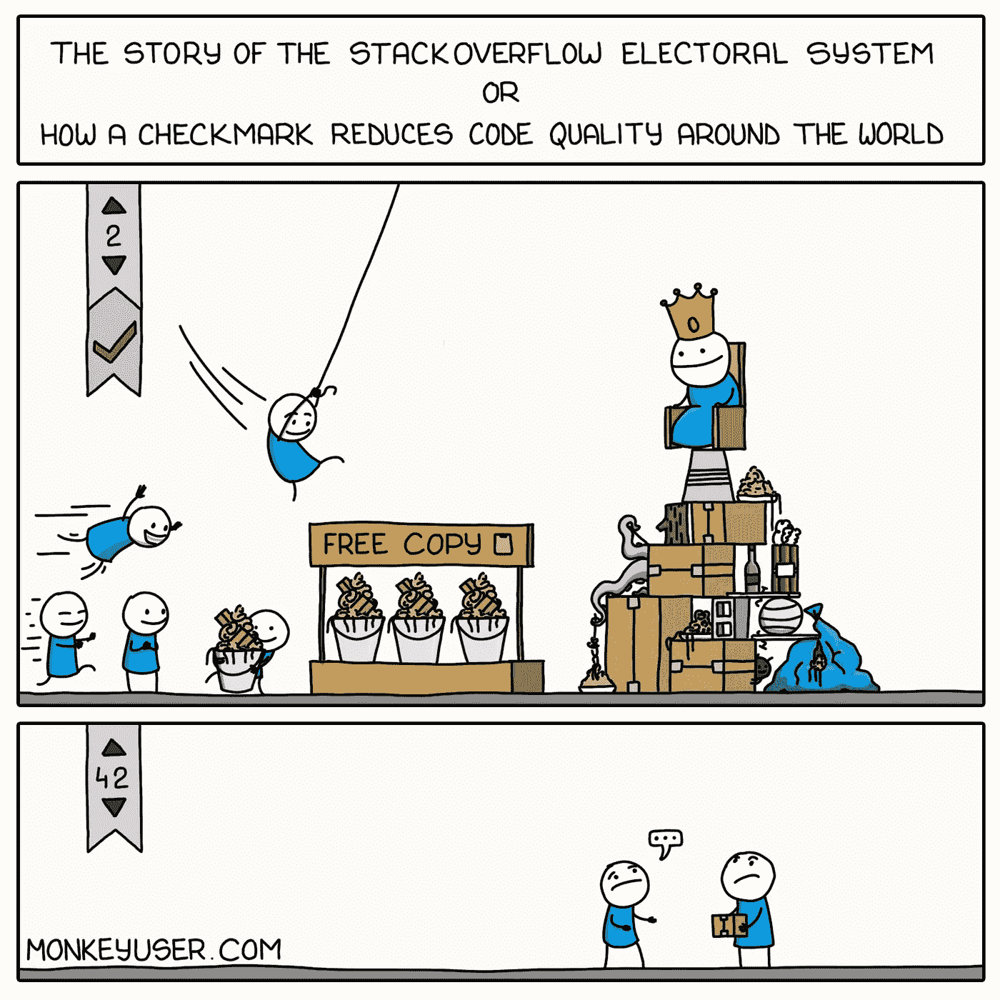

# 复制粘贴开发:如何高效开发软件

> 原文：<https://medium.com/codex/copy-paste-development-how-you-can-develop-software-efficiently-11259dd51dd4?source=collection_archive---------4----------------------->

## 以下是如何复制粘贴，并且不要在代码审查中引起任何争议

[https://www.monkeyuser.com/2020/election/](https://www.monkeyuser.com/2020/election/)

**你复制粘贴代码。我复制粘贴代码。每个人都这样。**

重要的部分是*贴*。这时你就应该介入了。这就是初级、中级和高级的区别。